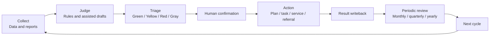
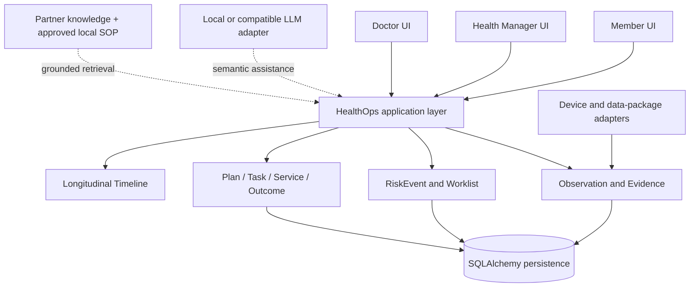

# Executive HealthOps

**Proactive Longitudinal Health Operations Platform for Executives and High-Net-Worth Families**

English | [简体中文](README_zh.md)


[](https://github.com/KaedeharaT/executive-healthops/actions/workflows/ci.yml)

Executive HealthOps connects **health reports, continuous health data, deterministic risk triage, health-manager operations, doctor collaboration, care plans, offline services, and longitudinal health records** into one responsibility-driven workflow. The product is organized around three questions: **What happens next? Who owns it? When must it be completed?**


*The synthetic Portfolio Demo shows a prioritized operational worklist, explicit ownership, due work, and doctor collaboration.*

> **Research / Portfolio Prototype.** This repository demonstrates product and engineering architecture. It is not a medical device, an autonomous diagnosis system, or a production clinical decision-support system.

## Responsibility Loop



The system can detect change, assemble context, prioritize work, and draft low-risk content. Health managers verify and coordinate. Licensed doctors retain diagnosis, prescription, investigation, treatment, and referral decisions. Members authorize, act, and report outcomes. Every meaningful result returns to the health record and the next operating cycle.

## Three Product Views

### Member

Sees current status, today's actions, plan progress, upcoming services, the responsible person, and long-term change—without internal operational or technical details.

### Health Manager

Works from one `Operational Worklist` that brings together risk follow-up, report review, due tasks, doctor dependencies, service delivery, and outcome review. Each item exposes priority, owner, SLA or due date, reason, and next action.

### Doctor

Receives a focused medical-review context: the question requiring judgement, relevant member facts, medications, report evidence, risk context, and actions already taken. The decision returns to the health manager for execution and follow-up.

## Annual Management Cadence

| Cadence | Product responsibility |
|---|---|
| **First month** | Establish the baseline and annual plan from reports, history, medications, health data, lifestyle, and member goals. |
| **Monthly** | Monitor trends, execute tasks, coordinate services, and write back results. |
| **Quarterly** | Compare key indicators, reassess risk, review outcomes, and recalibrate the plan. |
| **Yearly** | Compare annual reports, summarize major events and services, record annual outcomes, and prepare the next-year plan. |

## Key Capabilities

1. **Health Report Intelligence** — parses report content into reviewable findings, observations, and follow-up candidates; AI output does not become a health fact without confirmation.
2. **Evidence Traceability** — links displayed facts to the original document, page, table row, excerpt, device record, or human record when available.
3. **Canonical Health Data** — normalizes report, device, and manual observations while preserving raw provenance and explicit units.
4. **Deterministic Risk Engine** — governed code rules create `RiskEvent` records and explicit insufficient-data/gray states; LLMs do not assign risk.
5. **Operational Worklist** — provides one prioritized operational contract for ownership, SLA, next action, doctor dependencies, and service follow-up.
6. **Health Manager / Doctor Collaboration** — keeps operational ownership with health managers and medical judgement with licensed doctors.
7. **Plan / Task / Service / Outcome** — turns findings into owned actions, tracks delivery, captures evidence and results, and starts the next follow-up step.
8. **Longitudinal Health Timeline** — projects reports, baseline change, risk, medications, important medical events, doctor decisions, plans, services, and outcomes into a long-term record.
9. **Lightweight Integration Center** — lets administrators validate, preview, and confirm CSV, XLSX, ZIP, or JSON data packages without exposing database internals.
10. **Grounded AI & Governed Feedback** — requires traceable sources for user-visible AI explanations and keeps reviewed corrections in an offline, human-approved improvement pipeline.

## Product Experience

### Health Manager Workbench


The workbench answers who needs attention today, why, who owns the next step, and when it is due.

### Member Health Overview


Member context combines confirmed health facts, active problems, plans, tasks, and the next owned action.

### Doctor Review and Evidence


Doctors review an explicit question with linked evidence and return a human medical decision to the operational workflow.

### Longitudinal Health Record


The timeline explains what happened, what evidence supported it, who acted, what was delivered, and what followed.

## Integration Center

The administrator path is **Operations → More → System → Integration & Data**. Structured partner and device files use one guarded flow:

```text
Upload → Validate → Preview → Confirm → Normalize → Persist
```

- Data packages support **CSV, XLSX, ZIP, and JSON**, duplicate protection, member matching, unit/date checks, and an audit record.
- Device batches and future partner APIs converge on the same canonical import and validation layer instead of creating separate business logic.
- The device adapter boundary covers Apple Health, blood pressure, CGM, weight, heart rate, sleep, and activity. Real vendor APIs remain future integrations.
- External medical knowledge is consumed through a Partner Knowledge Adapter. HealthOps retains source validation, citation rendering, usage audit, local-SOP fallback, and no-source refusal rather than copying an entire medical library.

## Offline Service Loop

Professional services follow an owned delivery lifecycle:

```text
Trigger → Review → Decision → Schedule → Delivery → Result → Writeback
```

Service work retains the member, owner, provider when available, appointment, SLA, completion evidence, result, and next step. A completed service returns to the member record, plan, timeline, and follow-up queue when needed.

## Architecture



The business entities are the sources of truth. Dashboards and timelines are projections; UI session state and AI output are not clinical facts. See the [architecture documentation](docs/architecture/README.md) and [BP product alignment](docs/BP_PRODUCT_ALIGNMENT.md).

## Grounded AI and Safety

The configurable LLM interface supports local models and OpenAI-compatible APIs. It may assist with semantic extraction, summarization, drafting, and knowledge explanation. It cannot diagnose, prescribe, stop or change medication, decide referrals, or assign GREEN/YELLOW/RED/GRAY risk.

Safety boundary: **不自动诊断、不开药、不停药、不调整剂量，也不替代医生判断**. A formal Clinical RiskRule requires separate medical review and version governance.

- Member-specific statements require **Fact Evidence**.
- Medical, health, or workflow explanations require approved **Knowledge Evidence**.
- Missing approved knowledge triggers **no-source refusal**, not completion from model memory.
- Clinical risk rules have separate version and review governance; AI feedback cannot create or activate them.
- Human-confirmed corrections may enter a reviewed, de-identified, immutable offline evaluation or prompt-optimization dataset. There is no online learning or automatic deployment.

## Engineering

| Area | Implementation |
|---|---|
| Product UI | Streamlit member center and operations workbench |
| API | FastAPI |
| Persistence | SQLAlchemy and Alembic; isolated SQLite demo, PostgreSQL-ready connection layer |
| AI | Configurable local / compatible LLM interface with evidence-grounded answer contract |
| Integrations | Shared adapters for files, devices, and partner knowledge |
| Quality | pytest regression suite plus Streamlit interaction tests |

## Quick Start

```powershell
git clone https://github.com/KaedeharaT/executive-healthops.git
cd executive-healthops
python -m venv .venv
.\.venv\Scripts\python.exe -m pip install -e ".[dev]"
pwsh -File .\scripts\start_portfolio_demo.ps1 -Rebuild
```

The launcher creates only the isolated `data/portfolio_demo.db` and starts Streamlit at `http://127.0.0.1:8501` and FastAPI docs at `http://127.0.0.1:8000/docs`. Demo members, reports, observations, knowledge, and workflows are synthetic and de-identified.

## Testing

```powershell
.\.venv\Scripts\python.exe -m pytest -q
```

Current v0.9.0 regression suite: **405 passed / 0 failed**.

## Current Limitations

- Formal clinical-rule governance and clinical validation are not complete.
- Real device-vendor APIs and Apple Health real-device verification are pending.
- A real partner knowledge service is not connected in the Portfolio Demo.
- Production Auth/RBAC, TLS, secrets management, and multi-user PostgreSQL deployment are pending.
- Hospital-system integration, payment, and production service-provider connections are outside this prototype.

## Documentation

- [Architecture](docs/architecture/README.md)
- [BP product alignment](docs/BP_PRODUCT_ALIGNMENT.md)
- [AI grounding and citation policy](docs/AI_GROUNDING_AND_CITATION_POLICY.md)
- [AI feedback and offline improvement](docs/AI_FEEDBACK_AND_IMPROVEMENT.md)
- [Knowledge adapter contract](docs/KNOWLEDGE_ADAPTER_CONTRACT.md)
- [Chinese resume project entry](portfolio/RESUME_PROJECT_ENTRY_ZH.md)
- [Portfolio release notes](portfolio/PORTFOLIO_RELEASE_NOTES.md)

## License and Data

The repository contains no real member records, original health reports, databases, uploads, or secrets（仓库不包含真实成员资料、原始健康报告、数据库、上传文件或密钥）. Portfolio data is reproducible synthetic fixture data. Code is released under the [MIT License](LICENSE). Third-party medical sources retain their own licensing and attribution requirements.
