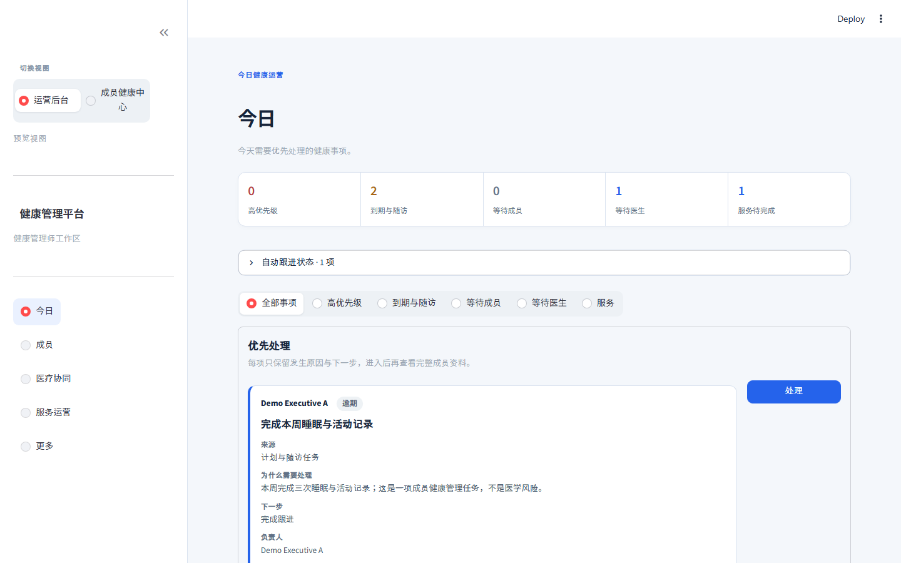
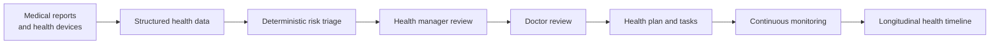
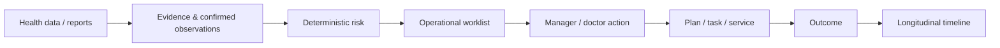
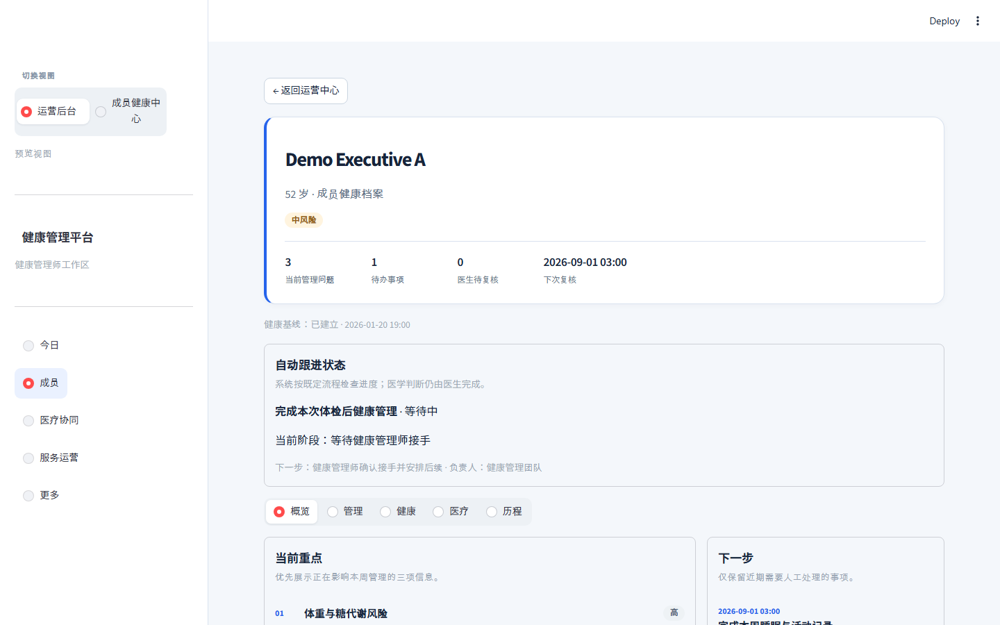
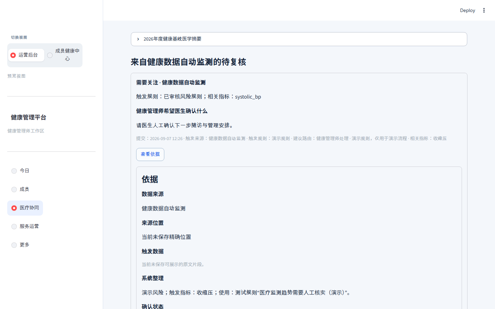
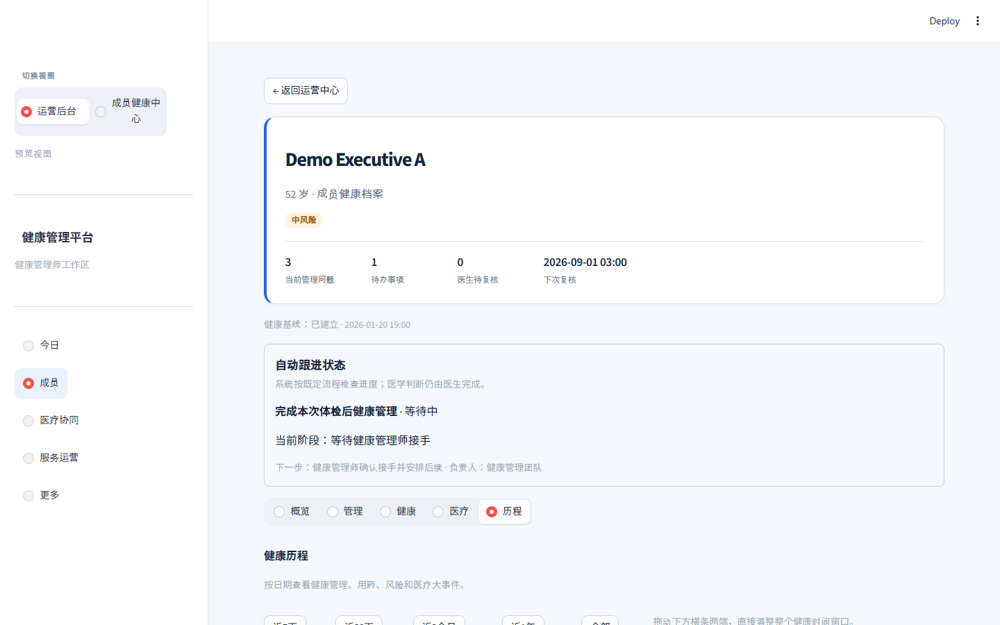
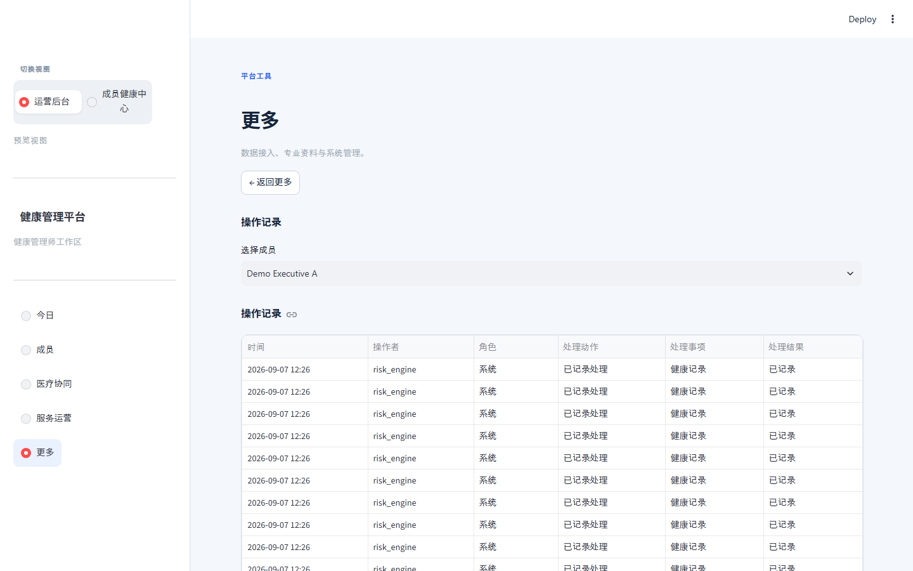
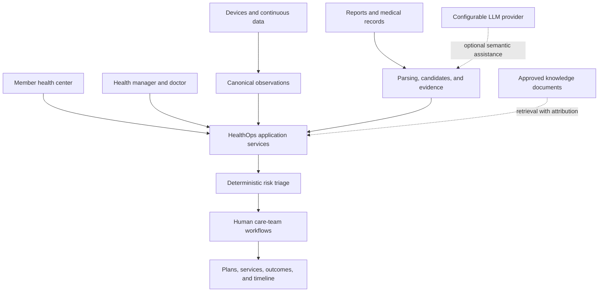

# Executive HealthOps

**AI-assisted longitudinal health management platform for executive healthcare**

企业高管 AI 健康运营平台：将体检报告、连续健康数据、风险分流、健康管理师与医生协同、健康计划和长期健康追踪组织为可追溯的 HealthOps 闭环。

English | [简体中文](README_zh.md)


[](https://github.com/KaedeharaT/executive-healthops/actions/workflows/ci.yml)



*Portfolio Demo health-operations dashboard showing operational priorities, member context, and follow-up workflows.*

> **Research / Portfolio Prototype.** The project demonstrates an accountable health-operations workflow; it is not a medical device, diagnostic system, or production clinical decision-support system.

## From health data to action



Members can see their current state and next step. Health managers can prioritize work and coordinate follow-up. Doctors receive a concise, evidence-linked review context. Every important workflow outcome returns to the member record and longitudinal timeline.

## Core product logic

HealthOps does not stop when a risk is detected. Evidence-backed health data becomes a deterministic `RiskEvent`, prioritized operational work, human-owned actions, doctor review when needed, follow-up, outcomes, and finally a longitudinal health record.



The dashboard and timeline are read-only projections of the underlying workflow records—not competing sources of truth. LLM output can assist interpretation, but it cannot create a risk decision or replace human confirmation.

## Operational efficiency

HealthOps is designed not only to improve continuity of health operations, but also to reduce repetitive coordination work. Report structuring, deterministic prioritization, evidence-linked context, worklists, task tracking, doctor-review context, and longitudinal summaries reduce the time health managers spend assembling information and tracking routine follow-up.

The goal is to enable each health manager to support a larger member portfolio and reduce per-member operational overhead while keeping medical judgement with clinicians. No unverified productivity or ROI claim is made.

## What problem does it solve?

Executive health management commonly separates check-up reports, continuous health signals, human follow-up, care plans, and clinician context. That creates an incomplete health story and makes ownership, evidence, and next actions hard to track.

Executive HealthOps turns these fragmented inputs into a single longitudinal workflow: **report → evidence → baseline → risk → manager → doctor → plan / service → outcome → timeline**.

传统高端健康管理中，体检报告、设备数据、健管跟进与医生判断往往分散。本项目将它们收敛为一条持续、可追溯、有人负责下一步的健康运营链路。

## Key capabilities

- **Medical report intelligence** — structure reports into findings, observations, follow-up items, and human-review queues.
- **Evidence traceability** — connect a displayed conclusion back to its source file, page, table row, or preserved excerpt.
- **Canonical health data** — normalize device and manual records while retaining source provenance outside ordinary product views.
- **Deterministic risk triage** — evaluate governed rules in code, then route work to the appropriate human owner.
- **Human-in-the-loop operations** — make health-manager actions, doctor review, ownership, due dates, and next actions explicit.
- **Longitudinal health timeline** — show what happened, what the team did, and what followed over time.
- **Governed medical knowledge** — support approved knowledge chunks, source attribution, review state, keyword retrieval, and exact used-chunk auditing for grounded AI answers.
- **Health Manager Training Copilot** — practice operational Q&A, synthetic cases, and deterministic rubric-based assessment using only approved training knowledge.
- **Grounded AI explanations** — every user-visible generated explanation must cite actual fact evidence and/or approved Knowledge Center chunks; unsupported answers are withheld rather than completed from model memory.
- **Portfolio demo workflow** — ships with a repeatable, isolated synthetic demo for **Demo Executive A**.

## Product experience

The Portfolio Demo uses a repeatable synthetic member story rather than a collection of disconnected screens.

### Health Manager Dashboard


The workbench surfaces operational priorities, a compact KPI strip, member context, and the next follow-up action in one view.

### Member Overview



Member-level context brings active problems, observations, plan tasks, ownership, and follow-up into a concise health-management record.

### Doctor Review & Evidence Traceability



Doctors receive an evidence-linked review context and make the medical judgement. AI assists information organization; it does not autonomously make medical decisions.

### Longitudinal Health Timeline



The timeline connects check-ups, risks, manager follow-up, doctor review, tasks, plans, and outcomes into a longitudinal record.

### Knowledge Center



Governed medical knowledge supports RAG with source attribution and review status. It is a reference layer, not executable medical logic; direct knowledge-assisted LLM reasoning remains an incremental capability.

## Architecture



Detailed source-level architecture is available in the [architecture docs](docs/architecture/README.md).

## AI and deterministic boundary

AI is used for **information organization, semantic assistance, document understanding, and knowledge retrieval**. It does not autonomously diagnose, prescribe, change medication, or determine risk.

Deterministic application code is responsible for **risk rules, workflow transitions, state management, provenance, and audit behavior**. Health managers coordinate the information flow; doctors retain medical judgement.

The LLM interface is configurable and model-agnostic: local or compatible API providers can be used after validation. Qwen is one locally validated option, not a dependency of the risk engine or workflow layer.

## Engineering

| Layer | Technology / approach |
|---|---|
| Product UI | Streamlit member center and HealthOps workbench |
| API | FastAPI |
| Persistence | SQLAlchemy, Alembic, isolated SQLite demo database |
| Health data | Canonical observations, raw-ingestion provenance, report candidates |
| AI | Configurable LLM interface for optional semantic assistance |
| Knowledge | Governed sources, approved chunks, keyword retrieval, grounded-answer citations, and exact used-chunk audit records |
| Validation | Automated pytest regression suite and Streamlit interaction coverage |

## Safety Boundaries

- The system does not autonomously diagnose, prescribe, stop medication, change dosage, or override clinician decisions（不自动诊断、开药、停药、调整剂量或替代医生决定）.
- LLMs do not determine risk. Formal clinical rules require separate medical review and version governance.
- Portfolio risks are explicitly marked **TEST / demonstration workflow rules**, not Clinical RiskRules.
- MedlinePlus, RxNorm, openFDA, and other public references remain governed knowledge sources; they do not automatically become risk rules or treatment recommendations.
- Apple Health backend and iOS HealthKit bridge source are included, but real-device verification remains pending.

## Current Limitations

This is a portfolio prototype, not production clinical software. Production Auth/RBAC, TLS deployment, PostgreSQL multi-user deployment, formal clinical-rule governance, real hospital integration, and Apple Health real-device verification are outside the current scope.

## Quick Start

### Windows setup

```powershell
python -m venv .venv
.\.venv\Scripts\python.exe -m pip install -e ".[dev]"
```

### Start the isolated Portfolio Demo

Use PowerShell 7 (`pwsh`) for the UTF-8 Chinese product copy in the launcher:

```powershell
pwsh -File .\scripts\start_portfolio_demo.ps1 -Rebuild
```

The launcher builds an isolated `data/portfolio_demo.db`, sets `PORTFOLIO_DEMO=true`, and starts:

- Streamlit: `http://127.0.0.1:8501`
- Local FastAPI docs: `http://127.0.0.1:8000/docs`

It does not modify the normal development database. See [Portfolio release notes](portfolio/PORTFOLIO_RELEASE_NOTES.md) for demo scope and safety details.

### Optional LLM assistance

LLM assistance is optional. The default local path uses Ollama; compatible API providers are also supported only after the relevant privacy review:

```dotenv
LOCAL_LLM_ENABLED=true
LOCAL_LLM_PROVIDER=local
LOCAL_LLM_MODEL=<your-model>
OLLAMA_BASE_URL=http://127.0.0.1:11434
```

For a compatible API provider, set `LOCAL_LLM_PROVIDER=openai_compatible`, `LLM_API_BASE=<provider-base-url>`, `LOCAL_LLM_MODEL=<your-model>`, and (when needed) `LLM_API_KEY` in `.env`. External endpoints remain blocked unless `ALLOW_EXTERNAL_PHI_LLM=true` is explicitly set after privacy review.

## Testing

```powershell
.\.venv\Scripts\python.exe -m pytest -q
```

Current v0.9.0 portfolio regression suite: **350 passed / 0 failed**.

## Portfolio Materials

- [简历项目描述（中文）](portfolio/RESUME_PROJECT_ENTRY_ZH.md)
- [Demo 视频脚本（中文）](portfolio/DEMO_VIDEO_SCRIPT_ZH.md)
- [Demo 数据说明](portfolio/DEMO_DATA_DESCRIPTION.md)
- [Portfolio release notes](portfolio/PORTFOLIO_RELEASE_NOTES.md)
- [Usage-logic audit](docs/USAGE_LOGIC_AUDIT.md)
- [AI grounding and citation policy](docs/AI_GROUNDING_AND_CITATION_POLICY.md)

`scripts/capture_portfolio.ps1` is optional portfolio-development tooling for reproducing local screenshots. It installs Playwright only into `.venv`; it is not an application runtime dependency.

## License and Data

The repository must not contain real member records, original check-up reports, databases, uploads, `.env` files, or tokens. The portfolio database and health records are reproducible synthetic fixtures. 仓库不得提交真实成员资料、原始检查报告、数据库、上传文件、`.env` 或 token。

Code is released under the [MIT License](LICENSE). MedlinePlus, RxNorm, openFDA, WHO ICD-11, and other third-party medical knowledge sources retain their own terms, attribution, and usage requirements.
