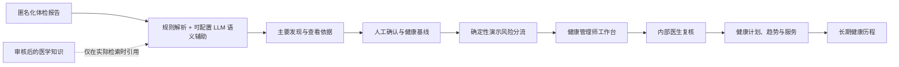
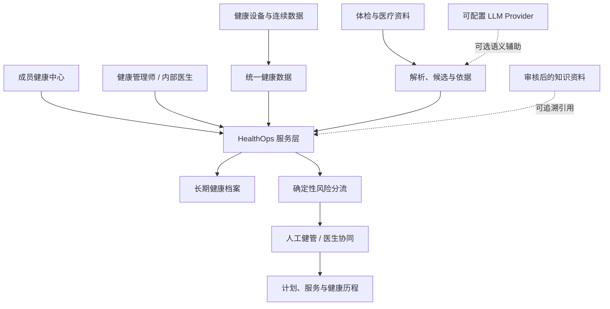

# Executive HealthOps

AI semantic assistance uses a configurable, model-agnostic LLM interface for local
or compatible API providers. Qwen is currently used as one local validation model;
Canonical Health Data, deterministic risk logic, review, and HealthOps workflows do
not depend on it. A provider or model change requires fresh validation.

**AI-assisted longitudinal health operations platform for executive healthcare**

企业高管 AI 健康运营平台（Research / Portfolio Prototype）


Executive HealthOps 将体检报告、连续健康数据、确定性风险分流、健康管理师与医生协同、健康计划及长期健康历程整合为一套可追溯的 HealthOps 闭环。

AI 只用于信息整理、报告语义辅助和知识检索；风险由确定性规则执行；健康管理师负责管理与信息流；医生保留医学判断权。

## What problem does it solve?

Executive health management often leaves examination reports, continuous health signals, human follow-up and clinician context in separate places. The result is an incomplete, difficult-to-audit longitudinal story.

Executive HealthOps turns those inputs into a continuous workflow: members see their current status and next step; health managers see who needs attention today; clinicians receive structured, evidence-linked context.

传统高端健康管理中，体检报告分散、健康数据持续增加、健管需要人工整理、医生缺少结构化上下文、干预效果也难以长期追踪。本项目将这些信息组织为持续、可追溯的健康运营闭环。

## Key capabilities

- 多格式体检报告结构化与人工确认
- 可配置大语言模型语义辅助（支持本地或兼容 API；非诊断、非处方）
- Evidence Traceability：结果 → 文件 / 页码 / 表格 / 原始片段
- Canonical Health Data 与连续健康数据趋势
- Deterministic Risk Engine 与 TEST / CLINICAL 治理边界
- 健康管理师工作台与内部医生复核
- Longitudinal Health Timeline
- Governed Medical Knowledge Center：来源、审核、Chunk 检索与引用审计

## Portfolio Demo

默认故事围绕匿名化成员 **Demo Executive A**：



### Start on Windows

One-time setup:

```powershell
python -m venv .venv
.\.venv\Scripts\python.exe -m pip install -e ".[dev]"
```

Then start the isolated demo:

```powershell
./scripts/start_portfolio_demo.ps1 -Rebuild
```

LLM assistance is optional. To enable it, configure the provider, model, and endpoint in `.env`:

```dotenv
LOCAL_LLM_ENABLED=true
LOCAL_LLM_PROVIDER=local
LOCAL_LLM_MODEL=<your-model>
OLLAMA_BASE_URL=http://127.0.0.1:11434
# For a compatible API instead: LOCAL_LLM_PROVIDER=openai_compatible and LLM_API_BASE=...
```

Ollama is one local deployment option. External endpoints remain disabled for health data unless `ALLOW_EXTERNAL_PHI_LLM=true` is explicitly set after privacy review.

启动脚本会创建独立的 `data/portfolio_demo.db`，设置 `PORTFOLIO_DEMO=true`，并启动：

- Streamlit：`http://127.0.0.1:8501`
- FastAPI Docs：`http://127.0.0.1:8000/docs`

它不会修改正常开发数据库。更详细的演示范围见 [Portfolio release notes](portfolio/PORTFOLIO_RELEASE_NOTES.md)。

## Architecture



详细的当前代码架构与边界见 [architecture docs](docs/architecture/README.md)。

## Engineering

| Layer | Technology |
|---|---|
| Product UI | Streamlit |
| API | FastAPI |
| Persistence | SQLAlchemy, Alembic, SQLite demo database |
| Data | Canonical observations, raw-ingestion provenance, report candidates |
| AI | Configurable local or compatible-API LLM (optional semantic assistance) |
| Validation | pytest regression suite |

## Safety Boundaries

- 不自动诊断、开药、停药、调整剂量或替代医生决定。
- LLM 不决定风险；正式风险规则需单独医学审核和版本治理。
- 作品集中的风险均为明确标记的 TEST / 演示工作流规则，不是 Clinical RiskRule。
- MedlinePlus、RxNorm、openFDA 等公开资料按需查询、保留来源与审核状态；不会自动变成风险规则或治疗建议。
- Apple Health 后端与 iOS HealthKit bridge 源码已准备，但真机验证仍待完成。

## Current Limitations

这是作品集原型，不是医疗器械、生产临床决策支持系统或真实医院接口。尚未实现生产级 Auth/RBAC、TLS 部署、PostgreSQL 多用户部署、临床规则治理和 Apple Health 真机验证。

## Portfolio Materials

- [简历项目描述（中文）](portfolio/RESUME_PROJECT_ENTRY_ZH.md)
- [Demo 视频脚本（中文）](portfolio/DEMO_VIDEO_SCRIPT_ZH.md)
- [Demo 数据说明](portfolio/DEMO_DATA_DESCRIPTION.md)
- [Portfolio Release Notes](portfolio/PORTFOLIO_RELEASE_NOTES.md)
- [API documentation](http://127.0.0.1:8000/docs)（本地运行后）

## Testing

请运行：

```powershell
pytest -q
```

当前 v0.9 作品集发布验收：**316 passed / 0 failed**。发布前始终要求 0 failures。

## License and Data

仓库不得提交真实成员资料、原始检查报告、数据库、上传文件、`.env` 或 token。作品集演示数据库与所有健康资料均由可重复的匿名化 / synthetic fixture 构建。
