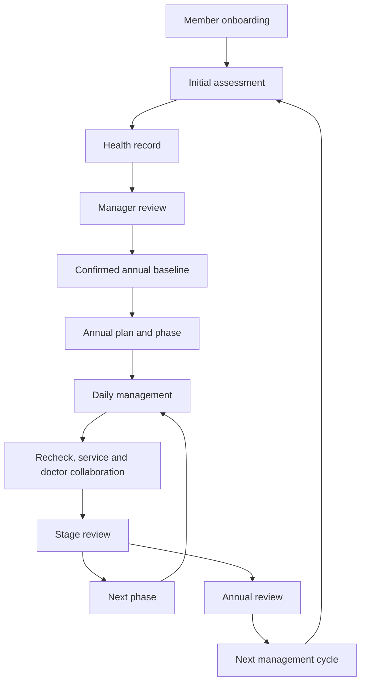
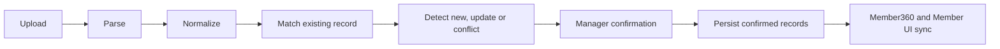
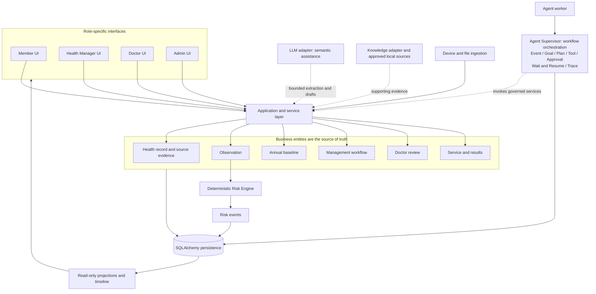

# Executive HealthOps

**Agent-assisted longitudinal health management workbench for members, health managers, doctors, and operations teams**

English | [简体中文](README_zh.md)

[](https://github.com/KaedeharaT/executive-healthops/actions/workflows/ci.yml)


Executive HealthOps turns fragmented health reports, questionnaires, measurements, care tasks and medical reviews into a continuous, human-governed health-management workflow.

**Health managers work from Today + Member360.** The system brings pending human actions to Today; Member360 holds the complete member workspace. Agents organize source material, prepare reviews and resume confirmed workflows. Doctors retain medical judgment.

> **Research / Portfolio Prototype · Synthetic Demo Data.** This is not a medical device, an autonomous diagnosis or prescription system, or a production clinical decision-support system. All screenshots and demo member records use synthetic data.


*The current Chinese-language UI. These screenshots come from real Streamlit + Chromium sessions, not interface mockups.*

## Product at a glance

| Product question | Current implementation |
|---|---|
| What needs a person now? | Today combines confirmations, doctor returns, rechecks, follow-ups, services and annual-management work. |
| Where is the complete member context? | Member360 connects the health record, current management, medical collaboration and history. |
| What does the Agent take over? | Organizing supported documents, matching existing records, preparing review context, drafting follow-up actions and continuing after human decisions. |
| What is the annual reference? | A confirmed annual baseline remains separate from later measurements and current health. |
| How far does this go today? | Executable assessment, document-ingestion and post-checkup workflows, with persisted records, human gates, member-facing views and regression tests. |

The core unit of work is an owned next action with a member, reason and due date. A report, doctor decision or service result becomes useful when the team can see what follows and record its completion. The prototype demonstrates that operational loop; it does not establish clinical effectiveness.

## How the product is used

Health managers have two everyday starting points: **Today (今日工作)** to find work, and **Members (会员) → Member360** to find a person. Annual Management, Medical Collaboration and Services provide cross-member views leading back to the same member or business detail.

Today gathers report confirmations, Agent approval gates, submitted initial assessments, doctor returns, rechecks, follow-ups, services, annual-management matters and other tasks. Each row answers **who, what happened, what the system has done, what needs doing now, who owns it and when it is due**. Selecting a row opens the relevant action. Search, owner and work filters narrow the queue; the default view also retains future arrangements.

The health-management assistant is visible inside Today. Active workflows and recent completions are separated. Staff continue a pending confirmation from its workflow rather than search for separate Report, Risk, Task or Agent modules.

Members use **Home, Health, Plan, Services and History**. Doctors use **Awaiting my judgment (待我判断)** and **History (历史)**. Administrators inspect system status, automation, integrations, rules and knowledge. Role switching is a demo preview, not authentication.

## Longitudinal care workflow


```mermaid
flowchart TD
    A[Member onboarding] --> B[Initial assessment]
    B --> C[Health record]
    C --> D[Manager review]
    D --> E[Confirmed annual baseline]
    E --> F[Annual plan and phase]
    F --> G[Daily management]
    G --> H[Recheck, service and doctor collaboration]
    H --> I[Stage review]
    I --> J[Next phase]
    J --> G
    I --> K[Annual review]
    K --> L[Next management cycle]
    L --> B
```

This is the supported human-led lifecycle, not a claim that one Agent autonomously runs the entire year. Annual plans, phases, logs, rechecks, services and stage reviews provide the business structure. The bounded Agent paths below assist document intake and post-checkup work within that structure.

## Member360

Member360 is the **single complete member workspace for the care team**. Its header keeps the annual cycle, responsible manager, current phase, member concerns, professional priorities and next step in view. Cross-member navigation opens this same workspace rather than a second member detail page.

| Visible tab | What the team does there |
|---|---|
| **Overview / 概览** | Review the phase, priorities, indicator previews, open work, recent logs and assistant progress. |
| **Health Record / 健康档案** | Start or continue the initial assessment, import documents, inspect reports, measurements, baseline and history. |
| **Management / 管理** | Work through the annual plan, phases, management items, logs, rechecks and stage review. |
| **Medical / 医疗** | Follow medical questions, doctor reviews and consultation context. |
| **History / 历程** | Inspect the longitudinal record and results of earlier work. |


*Member concerns remain distinct from professional priorities. Indicator previews link to the shared health-data view.*

## Initial health assessment

The first block in **Member360 → Health Record** is **Initial Health Assessment (初始健康评估)**. Its ten information sections cover basic details, family history, personal medical history, surgery/hospitalization, allergies, current and recent medication/supplements, lifestyle, environmental exposure, member concerns and targeted symptom assessment. The wizard presents these sections plus a final submission step.

Managers can start an assessment, save a draft, continue later, review submitted answers and request supplementation. Submission places the assessment in Today for confirmation. Medical questions retain the doctor-review gate. Completed assessments show confirmation information, concerns and professional priorities, with routes to view or amend the existing assessment.

The health record reads the same answers. Questionnaire statements and symptom scores do not become diagnoses, prescriptions or formal risk levels through submission or manager review. Imported material can prefill a draft with source references; unfilled sections still require attention.


## Agent-assisted health-record ingestion

The manager path is **Members → Member360 → Health Record → ＋ 导入健康资料**. Three document types reuse the existing supervisor, documents, extraction candidates and business records:

| Input | Implemented behavior |
|---|---|
| **Health checkup report** | Extract supported measurements, normalize indicators and units, compare existing observations and prepare confirmation. |
| **Health questionnaire** | Map native structured questionnaire fields deterministically; organize supported text and prefill the existing assessment draft. |
| **Historical health record** | Organize supported history, medication, surgery and profile fields, retaining source material and original dates when supplied. |



```mermaid
flowchart LR
    U[Upload] --> P[Parse]
    P --> N[Normalize]
    N --> M[Match existing record]
    M --> C[Detect new, update or conflict]
    C --> H[Manager confirmation]
    H --> W[Persist confirmed records]
    W --> S[Member360 and Member UI sync]
```

Text-bearing PDF, Word, spreadsheets, text and native questionnaire files reuse existing readers. Free-form text may use the configured LLM. Returned fields and evidence must be verifiable in the source; knowledge retrieval cannot manufacture member facts. Images and scans without a usable text layer are retained for manual handling when reliable extraction is unavailable.

The review compares existing content, proposed content, source and status. Consistent information is not inserted again. Conflicts require adopting new information, retaining the current record or deferring confirmation; deferral creates follow-up work. A medical question can use the existing doctor-review flow, after which the **same import workflow** returns to manager confirmation.


Confirmation writes accepted records and preserves provenance: document, excerpt, extraction method, confidence, confirmer, confirmation time and target record. Same-member file hashes prevent duplicate imports; measurement checks compare indicator, date, unit and value across files. Repeated confirmation does not recreate the records.

**Automation replaces preparation work:** reading supported reports, extracting indicators, organizing questionnaires/history, matching fields, comparing records, finding conflicts, prefilling assessments, preparing doctor context and drafting later actions. **People retain responsibility:** managers verify sources, resolve conflicts, coordinate communication and submit medical questions; doctors make medical decisions. Historical medication extraction records a source statement, not a new prescription.

Member360 and the Member UI read the same confirmed records. Unconfirmed import candidates are excluded from the member's formal archive. Confirmed measurements feed the existing health-data series; import completion does not overwrite the annual baseline.


## Visible bounded Agent workflow

The post-checkup assistant handles a concrete care-team sequence:

```text
New checkup report → Agent preparation → Manager confirmation
→ Doctor review when required → Doctor submits → Original Agent resumes
→ Follow-up action drafts → Manager confirmation
→ Management items / Recheck / Follow-up → Workflow complete
```

The assistant assembles findings, existing health context, available baseline/history and approved supporting knowledge. It prepares a medical question when needed. A doctor's submitted decision resumes the original goal; the manager checks action content, owners and dates before arrangements are created through existing services.

Completion means that confirmed arrangements and the next responsible step have been created. It does **not** mean a future recheck has happened or the member's health problem has resolved. Those results belong to subsequent management work.

The run view explains **why it started, what it has done, where it is now, whom it awaits, what comes next and what it created**. Business activity comes from recorded events, successful tools, confirmations and doctor decisions. Ordinary member, manager and doctor pages do not expose prompts, token counts, tool calls, raw JSON or chain-of-thought. Technical execution traces belong to administrator views; activity summaries are not model reasoning transcripts.


*This synthetic acceptance run created three management items, one recheck and one follow-up, with zero service requests. Counts describe this run, not a fixed output template.*

The supervisor persists events, goals, plan steps, tools, approvals and waiting state. A lightweight worker continues eligible work. Human gates, responsibility routing, duplicate protection, bounded retry and manual escalation constrain execution. These are specific workflow policies inside one supervisor, not a general multi-agent clinical team.

## Health baseline & trends

**Annual Baseline ≠ Current Health.** The confirmed baseline is the reference at the start of an annual cycle. Later accepted measurements update current health and comparisons while preserving that historical reference. Corrections use traceable amendments. A baseline value is not automatically a medical target.

The shared series view supports **weight, BMI, blood pressure, glucose, HbA1c, LDL-C, ALT, heart rate, steps, exercise time, active calories, sleep duration, deep sleep, REM sleep and awake time** when records exist. The current synthetic demo provides these fifteen selectable groups; availability depends on the member's data.

Filters select indicator and time range. The summary shows the latest value within that range, confirmed annual baseline where available, change relative to baseline and measurement time. Charts and source details preserve units and dates; missing baselines remain explicit.


Two points are a **historical comparison**, not a long-term trend. The demo's HbA1c and ALT examples have two points. Multi-point series support longitudinal viewing over their recorded interval. Empty or single-point windows explain the lack of data instead of drawing an empty trend. Observed change is not proof that a service caused improvement.

## Health manager / doctor collaboration

Doctors enter **Awaiting my judgment** and revisit completed decisions in **History**. A review provides the explicit question, relevant data and trends where available, report evidence, history, medications and actions already taken. Imported-record reviews retain the original document and extracted source text.


The doctor supplies medical judgment. The Agent and manager organize execution: continuing the waiting workflow, preparing drafts, confirming ownership, arranging rechecks or follow-ups and recording results. The manager does not need to search for the returned decision or create a replacement Agent run.

## Management workflow

An **annual plan** establishes the period, responsible manager and focus. **Phases** describe current work and its review point. **Management items** make execution concrete with an owner, status and date. **Management logs** record contacts, services and results; saving a log can prepare the next task for confirmation.

**Rechecks** track confirmation, booking, execution, report return and review. **Services** track arrangements, delivery and results. **Stage reviews** collect evidence and a decision before continuing or moving to the next phase. Results return to member history and management context instead of ending in an isolated note. Staff use Today for pending actions and Member360 for the whole cycle.

## Architecture


```mermaid
flowchart TB
    subgraph UI[Role-specific interfaces]
        MU[Member UI]
        HU[Health Manager UI]
        DU[Doctor UI]
        AU[Admin UI]
    end
    MU --> APP[Application and service layer]
    HU --> APP
    DU --> APP
    AU --> APP
    subgraph DOMAIN[Business entities are the source of truth]
        HR[Health record and source evidence]
        OB[Observation]
        BA[Annual baseline]
        MW[Management workflow]
        DR[Doctor review]
        SV[Service and results]
    end
    APP --> HR
    APP --> OB
    APP --> BA
    APP --> MW
    APP --> DR
    APP --> SV
    DOMAIN --> DB[(SQLAlchemy persistence)]
    DB --> PV[Read-only projections and timeline]
    PV --> UI
    AS[Agent Supervisor: workflow orchestration<br/>Event / Goal / Plan / Tool / Approval<br/>Wait and Resume / Trace] -. invokes governed services .-> APP
    AS --> DB
    WK[Agent worker] --> AS
    LLM[LLM adapter: semantic assistance] -. bounded extraction and drafts .-> APP
    KN[Knowledge adapter and approved local sources] -. supporting evidence .-> APP
    IN[Device and file ingestion] --> APP
    OB --> RE[Deterministic Risk Engine]
    RE --> RF[Risk events]
    RF --> DB
```

The UI and FastAPI routes call application services. Business records hold health facts and results; read-only projections assemble role views. Agent state describes orchestration. LLM output remains a proposal until applicable checks and human gates succeed. Neither is a parallel clinical record. Risk rules execute independently of LLM text.

## Safety boundaries

| Participant | Responsibility | Boundary |
|---|---|---|
| **Agent / LLM** | Coordination; supported extraction, source matching, summaries and drafts | Cannot assign formal risk, diagnose, prescribe, change medication or bypass required review. |
| **Health manager** | Verify sources, resolve conflicts, confirm actions, coordinate and follow up | Confirmation does not turn self-report into a medical diagnosis. |
| **Doctor** | Medical judgment and medical decisions | Decisions retain a human source; execution returns to the care team. |
| **Deterministic Risk Engine** | Formal risk events from eligible observations and governed rules | No LLM-generated risk level or automatic rule modification; clinical validation remains incomplete. |

**不自动诊断、不开药、不停药、不调整剂量，也不替代医生判断。** Every formal Clinical RiskRule requires separate medical review and version governance.

Fact evidence describes what is known about a member; knowledge evidence supports interpretation. Grounded explanations require eligible approved sources and validated citations. Without sufficient approved knowledge, the system refuses unsupported explanation. Extraction instead cites the original material. Human feedback can enter a reviewed, de-identified offline evaluation pipeline; there is no online learning or automatic model deployment.

## Engineering

| Area | Repository implementation |
|---|---|
| Runtime and UI | Python 3.11+, Streamlit, Altair charts |
| API and services | FastAPI; shared commands and read-only projections |
| Persistence | SQLAlchemy, Alembic migrations, isolated SQLite demo |
| PostgreSQL readiness | Configurable SQLAlchemy connection layer; driver setup and production verification remain required |
| Agent execution | Database-backed supervisor and lightweight Agent worker |
| Language and knowledge | Local/OpenAI-compatible LLM adapter; partner knowledge adapter and approved local fallback |
| Ingestion | Document readers, indicator/unit normalization, device adapters; administrative CSV/XLSX/ZIP/JSON package validation and confirmation |
| Verification | pytest, Streamlit AppTest, Chromium/Playwright scripts and screenshot acceptance records |

Browser QA is separate from the pytest CI job. Optional Playwright tooling is not installed by the default development extra.

## Quick Start

Use **Windows, Python 3.11+ and PowerShell 7 (pwsh)**. Run from the repository root:

```powershell
git clone https://github.com/KaedeharaT/executive-healthops.git
cd executive-healthops
python -m venv .venv
.\.venv\Scripts\python.exe -m pip install -e ".[dev]"
pwsh -File .\scripts\start_portfolio_demo.ps1 -Rebuild
```

The launcher builds **data/portfolio_demo.db**, applies migrations, records workflow responsibility and starts three background processes:

| Process | Local entry |
|---|---|
| Streamlit | <http://127.0.0.1:8501> |
| FastAPI / API reference | <http://127.0.0.1:8000/docs> |
| Agent worker | scripts/run_agent_worker.py, using the same isolated database |

**-Rebuild** resets the disposable synthetic demo. Omit it to check and reuse a compatible demo; outdated fixtures may be rebuilt. Add **-NoBrowser** to suppress opening a browser. Ports 8501 and 8000 must be free; occupied ports are rejected before database preparation. Services run without visible terminal windows. Stop the complete demo process tree with `pwsh -File .\scripts\stop_platform.ps1 -Instance portfolio`.

The normal platform launcher is `pwsh -File .\scripts\start_platform.ps1` (stop with `pwsh -File .\scripts\stop_platform.ps1`). Logs are under `.runtime/logs/<instance>/`; PID records are under `.runtime/processes/<instance>.json`. Closing the browser does not stop background services. Use the stop script; `-All` stops all recorded service groups. See [background services and QA](docs/background-services/README.md) for lifecycle and Before/After capture commands.

Enter the operations workbench, inspect Today, then select a member to open Member360. In Health Record, open the assessment or import a synthetic document. Use the role switch to inspect the doctor queue or member-facing result. Seeded workflows demonstrate manager and doctor waits. Deterministic extraction and workflow paths can run without a live model; free-form semantic extraction needs a configured LLM or falls back to manual handling. See [.env.example](.env.example) for configuration.

## Testing

**Latest full regression: 703 passed / 0 failed.** Rechecked against the current application code on 2026-09-27 in an isolated checkout. This is engineering regression evidence, not clinical validation.

```powershell
.\.venv\Scripts\python.exe -m pytest -q
```

Use a disposable checkout: an existing migration test rebuilds that checkout's synthetic portfolio database. Coverage includes ingestion confirmation/provenance, duplicate protection, assessment states, doctor wait/resume, action creation, risk separation, baseline preservation and UI contracts. Acceptance documents also record real Chromium journeys. CI installs the package, builds synthetic data and runs pytest on Python 3.11.

## Current Limitations

- Images and pure scanned reports have no reliably configured production OCR path. Unreadable files, unavailable semantic services and unverifiable extraction require manual handling; originals remain available.
- Clinical rules and management logic have not completed formal clinical validation. This is not a validated clinical service.
- Device adapters, imports and Apple Health bridge code exist; real vendor APIs and real-device validation remain limited or pending. Historical data does not prove a live connection.
- The demo does not connect a real partner medical knowledge service or provide a complete clinical RAG library. Approved local sources and adapter contracts demonstrate the boundary.
- Role previews and service-level gates do not provide production authentication/RBAC. TLS, secrets operations, multi-user PostgreSQL deployment and production hardening remain unfinished.
- The worker is lightweight; distributed scheduling, failover and production operational guarantees are not delivered.
- Dedicated Stage/Recheck Agents, general multi-agent orchestration, hospital integrations, payments and live service-provider connections are not shipped capabilities. Stage and recheck workflows remain human-led.

## Documentation

| Evidence / reference | Purpose |
|---|---|
| [Current product acceptance](docs/product-logic-v5/ACCEPTANCE.md) | Today, Member360, doctor navigation and care-team journeys |
| [Health-record ingestion](docs/profile-intake-agent.md) | Three inputs, conflicts, confirmation, doctor return and member sync |
| [Initial assessment](docs/intake-assessment-entry-verification.md) | Draft, continuation, review and record integration |
| [Visible assistant workflow](docs/assistant-visibility.md) | Business activity, human waits and completion output |
| [Agent routing acceptance](docs/agent-dashboard-v2/verification.md) | Responsibility routing and run visibility |
| [Health-trend verification](docs/health-trend-ui-verification.md) | Indicator coverage and sparse-data behavior |
| [Architecture reference](docs/architecture/README.md) | Service/entity background; its older navigation audit predates the current UI, so use the acceptance links above for navigation |
| [AI grounding](docs/AI_GROUNDING_AND_CITATION_POLICY.md) | Fact/knowledge evidence, citations and refusal |
| [AI feedback](docs/AI_FEEDBACK_AND_IMPROVEMENT.md) | Reviewed offline improvement and risk-rule separation |
| [Knowledge adapter](docs/KNOWLEDGE_ADAPTER_CONTRACT.md) | Partner contract, approved fallback and usage audit |

## License & Data

Code is released under the [MIT License](LICENSE). Fixtures and selected screenshots use **Synthetic Demo Data**. Real member records, original private reports, databases, uploads and secrets do not belong in Git（不提交真实成员资料、原始私人报告、数据库、上传文件或密钥）. Third-party sources retain their own licensing and attribution requirements.
