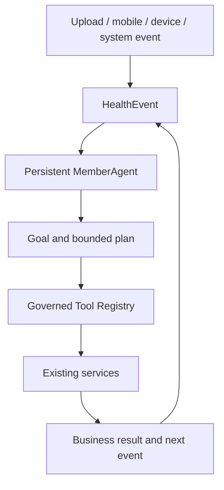
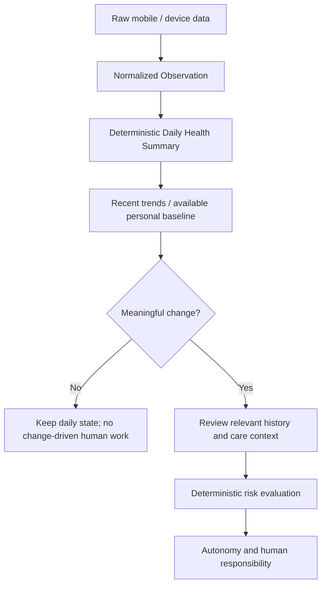
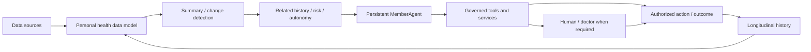

# Executive HealthOps

**AI-native longitudinal health management platform**

[中文文档](README_zh.md)

HealthOps brings a member's reports, measurements, goals, care actions and doctor decisions into one continuing workspace. Health managers see **what changed, what needs their attention and what happens next**.

**Research / portfolio prototype. All examples and screenshots below use synthetic/demo members, not real patient records.** The current interface is Chinese-language.

## What it is

The platform supports ongoing health management with accountable people and persistent records. It is not an AI doctor, chatbot, one-off checkup analyzer or dashboard alone.

**Multi-source data → personal health data model → summaries and changes → persistent member assistant → risk and responsibility routing → action → outcome → longitudinal history.**

## Product workflow

1. Create a member and assign the responsible health manager.
2. Open **Members → Member360 → Health Record (健康档案) → Upload Health Materials (上传健康资料)**.
3. Let the assistant organize supported materials. Resolve uncertain facts, conflicts and essential missing information; optional omissions do not block the whole assessment.
4. Confirm the management goal, then the management plan. These are separate human confirmations.
5. Work mainly from **Today (今日工作)** on matters that actually need a person.
6. Open **Member360 → History (历程)** to review changes, interventions, doctor decisions and observed results.

Member360 retains five tabs: **Overview, Health Record, Management, Medical, History**. Annual Management, Services and Medical Collaboration lead into the same business records. Member removal uses safe archival: active work stops while history remains.


One upload entrance handles supported reports, questionnaires and historical materials. Intake retains evidence, prefills the existing assessment and separates **organized, needs confirmation, conflict, essential information missing**. Existing readers support text-bearing PDF, Word, spreadsheets and supported text/structured inputs. Unreadable scans or unsupported evidence need human handling; reliable OCR for arbitrary documents is not claimed.


## AI-native operating model

Business events start and continue work. Managers do not have to prompt a chatbot to restart the process.


```mermaid
flowchart TD
    A[Upload / mobile / device / system event] --> B[HealthEvent]
    B --> C[Persistent MemberAgent]
    C --> D[Goal and bounded plan]
    D --> E[Governed Tool Registry]
    E --> F[Existing services]
    F --> G[Business result and next event]
    G --> B
```

Raw device measurements follow storage and normalization paths. They do **not** each invoke an LLM or wake the member assistant. Significant summarized changes and actionable business events enter the care loop.

The assistant shows the current step, completed preparation, whom it awaits and the next action. Waiting for a person stops its activity animation. Technical execution records remain in administrator views.


## Personal health data model

Identity, health history, medication facts, lifestyle, reports, questionnaires, observations, annual baselines, goals, phases, communication, doctor reviews and service results have dedicated records and links.

| Layer | Current behavior |
|---|---|
| Raw | Preserve uploaded material and supported original ingestion payloads, values and timestamps. |
| Normalized | Map canonical metrics, convert supported units, deduplicate and assess quality. |
| Confirmed / governed | Separate accepted observations from unconfirmed extraction candidates. Device facts may be rule-governed; this does not mean doctor-confirmed. |
| Correction / provenance | Candidate revisions and observation supersession preserve previous values, corrections, source references and confirmation information. Legacy missing provenance stays explicit. |
| Time / context | Multi-point Observation, Health Record, annual baseline, goal/metric requirements and versioned daily summaries support longitudinal comparisons. Quality is separate from health risk. |

The synthetic example preserves **original 83.6 kg → mistaken extraction 86.3 kg → confirmed correction 83.6 kg**. Correcting the current fact does not erase the extraction error.

### State change before human interruption


```mermaid
flowchart TD
    A[Raw mobile / device data] --> B[Normalized Observation]
    B --> C[Deterministic Daily Health Summary]
    C --> D[Recent trends / available personal baseline]
    D --> E{Meaningful change?}
    E -->|No| F[Keep daily state; no change-driven human work]
    E -->|Yes| G[Review relevant history and care context]
    G --> H[Deterministic risk evaluation]
    H --> I[Autonomy and human responsibility]
```

Python aggregates usable observations; an LLM is not the summary calculator. Recalculation retains revisions and change events are deduplicated. Configured trend/management rules, confirmed target progress and applicable formal risk rules determine changes; there is no universal learned clinical threshold.

For sleep changes, the selector bounds context to relevant sleep/activity records, available baseline, applicable goal, recent management notes and relevant doctor opinions. It does not load the entire member history. The UI reports the **actual recorded dates and checks**, including when no related records were found.

Normal days show a recent health overview. Key events show **what changed → records checked → handling decision → who was needed**. **View evidence (查看依据)** expands detailed comparisons, records and sources and links to the existing trend view. Small numerical fluctuations do not automatically become human tasks.

## Human in/on/out of the loop

| Level | User meaning | Responsibility |
|---|---|---|
| GREEN · Out of the loop | Normal follow-up | Approved low-risk operations may proceed automatically; the covered green path records progress without adding human work. |
| YELLOW · On the loop | Needs attention | Prepare evidence first; involve the manager when confirmation or communication is needed. Actual routing rules can also require a doctor. |
| RED · In the loop | Priority human handling | Prepare evidence and hand off to the accountable manager, doctor or escalation route. Medical judgment and closure retain human responsibility. |

**Formal risk comes from deterministic rules. An LLM cannot set or downgrade it.** Workflow status and missing data do not substitute for formal risk. Goals, plans, conflicting facts and medical decisions retain their respective human gates.


## Persistent MemberAgent and governed tools

Each participating member has one durable MemberAgent identity. Completing a goal does not delete it. Plans, tool receipts and waits survive process restarts, including **WAITING_MANAGER, WAITING_DOCTOR, WAITING_MEMBER and WAITING_TIME**. Matching human results or due-time events continue the original goal.

The planner uses bounded workflow templates and allowed tools, not unrestricted medical autonomy. Post-checkup management, profile intake, management setup, daily care, natural-language follow-up results and stage review reuse the supervisor and services. Completion requires business outputs or a recorded no-action decision, not just generated prose.

The model has no unrestricted SQL/business-write interface: **Agent → governed tools → service adapters → business records**. Permissions, autonomy checks, idempotency keys and audit receipts constrain execution. Natural-language results retain the raw note and structured candidates; mentioning a doctor does not turn a manager's opinion into a formal doctor decision.

## Goal-driven management

Managers confirm what the member wants to improve before approving the plan. Supported goal families include weight, blood pressure, glucose, lipids, sleep, activity, lifestyle, follow-up and custom goals.

The **Metric Requirement Registry** maps goals to existing metrics, distinguishing core, supporting and optional requirements and source capabilities. Completeness guides focused data collection rather than demanding every field. Mappings are code-defined, with requirement snapshots on goals; a fully governed semantic-authoring system is not yet implemented.

Goals and plans reuse annual programs, phases and existing follow-up/recheck/service tools. Numeric progress is deterministic; non-numeric goals do not receive invented improvement percentages.


## Longitudinal health timeline

**Entry: Members → select member → Member360 → History (历程).**

The read-only projection combines baselines, state snapshots, important changes, care actions, doctor decisions, outcomes and current state. An ordered main spine groups care episodes, with health-state and care-action lanes inside each group. Connectors are straight/right-angle lines in the existing restrained style.

Episode relationships reference existing business objects instead of duplicating clinical data. Unsupported results remain pending/insufficient; later improvement does not prove intervention causality. **Timeline is member history, not Agent Trace or a mature Care Memory system.**


**Xiaoming (小明)** is an implemented, explicitly marked synthetic member. Its idempotent service-based seeder demonstrates 12 months, confirmed goals, device observations, summary changes, manager/doctor handoffs, recheck, phase review, two linked care episodes and correction history. Seeding is explicit, never a startup reset. See the [demo guide](docs/ai-native/XIAOMING_SYNTHETIC_DEMO.md).

## What compounds over time

The assets are personal longitudinal facts, health history, confirmed goals, human/doctor decisions, interventions, observed outcomes, corrections, provenance and member-specific context. Models, retrieval engines and device adapters are replaceable implementation choices.

These structures are an accumulation foundation; synthetic tests do not prove a real-world data moat or clinical effectiveness. **Governed Care Memory and reusable individual response patterns remain gaps.** Existing sourced hints and episode-derived candidate experience are not permanent medical facts.

## Architecture


```mermaid
flowchart LR
    A[Data sources] --> B[Personal health data model]
    B --> C[Summary / change detection]
    C --> D[Related history / risk / autonomy]
    D --> E[Persistent MemberAgent]
    E --> F[Governed tools and services]
    F --> G[Human / doctor when required]
    F --> H[Authorized action / outcome]
    G --> H
    H --> I[Longitudinal history]
    I --> B
```

Streamlit provides role workspaces; FastAPI exposes business/integration endpoints; a separate worker continues eligible work and summary batches. SQLAlchemy and Alembic persist state; SQLite is the default. Bounded language tasks use an optional **local/configurable LLM provider**, including a compatible-API adapter. External health-data transmission is disabled by default.

Knowledge support is **partial**: approved-document ingestion, keyword retrieval, source/version metadata and provider adapters exist. A mature, clinically curated medical RAG library is not claimed. Confirmed member data, deterministic rules and existing services remain the foundation. Knowledge must not fill in unobserved member facts.

## Safety boundaries

HealthOps does not autonomously diagnose disease, prescribe or change medication, make treatment decisions, override deterministic risk or replace physicians. A medication fact is not a prescription; symptoms and questionnaires are not diagnoses.

Human responsibility is explicit. Demo role switching is not production authentication. Use synthetic data publicly; never commit credentials, databases, private uploads or real health records.

## Engineering and testing

Python 3.11+, SQLAlchemy/Alembic, FastAPI, Streamlit and pytest. Full local suite on 2026-10-04: **1221 passed / 0 failed**. This is regression testing, not clinical validation. Real Chromium acceptance is documented in [latest evidence](docs/images/change-review/README.md) and [workspace screenshots](docs/images/ui-cleanup/README.md).

```powershell
.venv\Scripts\python.exe -m pytest -q
```

Tests disable local-model inference and use an isolated synthetic database under `.runtime/`, not the user's database.

## Quick start — Windows

Prerequisites: Git, Python 3.11+ and Windows PowerShell or PowerShell 7 (`pwsh`). Run from the repository root.

```powershell
git clone https://github.com/KaedeharaT/executive-healthops.git
cd executive-healthops
py -3 -m venv .venv
.venv\Scripts\python.exe -m pip install -e ".[dev]"
```

For a **new checkout only**, create the synthetic database once. This command refuses to overwrite an existing demo. Git ships no database file.

```powershell
.venv\Scripts\python.exe scripts\build_portfolio_demo.py
```

Optionally add Xiaoming to that existing synthetic database; the seeder is idempotent and backs it up first:

```powershell
.venv\Scripts\python.exe scripts\seed_xiaoming_demo.py --database data\portfolio_demo.db
```

Start the existing demo:

```powershell
.\start_healthops.bat
# Equivalent with PowerShell 7:
pwsh -File .\scripts\start_portfolio_demo.ps1
```

The launcher starts FastAPI, worker and Streamlit, checks readiness, then opens the browser. It reclaims only verified project-owned leftovers; external port owners are reported, not killed. Keep the launcher running. Ctrl+C/launcher exit releases owned processes; `stop_healthops.bat` is the explicit stop entrance.

Open [HealthOps](http://127.0.0.1:8501), [Streamlit health](http://127.0.0.1:8501/_stcore/health) or [API docs](http://127.0.0.1:8000/docs).

On the demo landing page, select **Enter HealthOps Operations (进入 HealthOps 运营后台)** to open the manager workspace.

**Existing installations:** startup does not seed, rebuild or migrate. The portfolio default is `data/portfolio_demo.db`. Select another existing database explicitly if needed:

```powershell
pwsh -File .\scripts\start_portfolio_demo.ps1 -DatabasePath .\executive_health_ai.db
```

Schema maintenance is separate and requires a backup. Do not pass `-Rebuild` to the launcher. See [.env.example](.env.example) for optional model/integration settings; actual secrets belong only in ignored local configuration. Deterministic workflows require no particular model brand.

## Current limitations

| Area | Current boundary |
|---|---|
| Care Memory | Sourced hints and candidate experience exist; lifecycle, conflict resolution, refresh and personalized learning are incomplete. |
| Intervention → outcome | Explicit links work in supported flows and demos; coverage across all services and attribution remain incomplete. Correlation is not causation. |
| Goal/metric semantics | Code mappings and snapshots exist; multi-goal evolution and centralized semantic/rule authoring need further governance. |
| Knowledge/RAG | Approval and basic retrieval exist; a mature clinical corpus and validated medical RAG are not established. |
| Mobile/wearables | Apple Health import/sync API and Swift HealthKit bridge source exist. Live-device rollout, signing, consent and validation remain deployment work. Health Connect/provider adapters do not mean universal live vendor connections. |
| Authentication/RBAC | Internal gates and selected integration-token checks exist; demo role switching is not production identity, tenant isolation or comprehensive authorization. |
| Scale | SQLite is the local default. PostgreSQL configuration exists, but production migration, load, reliability and operations need separate validation. |
| Clinical integration | Production hospital/EHR integration and clinical effectiveness are not established by synthetic demos. |

## Documentation

- [User flow](docs/ai-native/USER_FLOW.md) and [runtime architecture](docs/ai-native/FINAL_ARCHITECTURE.md)
- [Goal → metric → data](docs/ai-native/GOAL_DATA_LOOP.md)
- [Longitudinal data and provenance](docs/ai-native/LONGITUDINAL_HEALTH_DATA.md)
- [Autonomy and responsibility](docs/ai-native/AUTONOMY_POLICY.md)
- [Longitudinal timeline](docs/ai-native/LONGITUDINAL_TIMELINE.md)
- [Xiaoming synthetic demo](docs/ai-native/XIAOMING_SYNTHETIC_DEMO.md)
- [Historical strategic audit](docs/strategic-audit/HEALTHOPS_MOAT_AUDIT.md) — findings at its recorded earlier commit, not current data counts

## License

[MIT](LICENSE).
