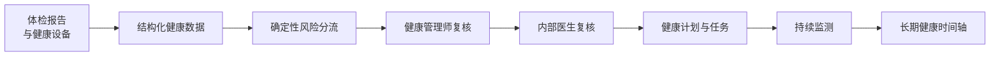
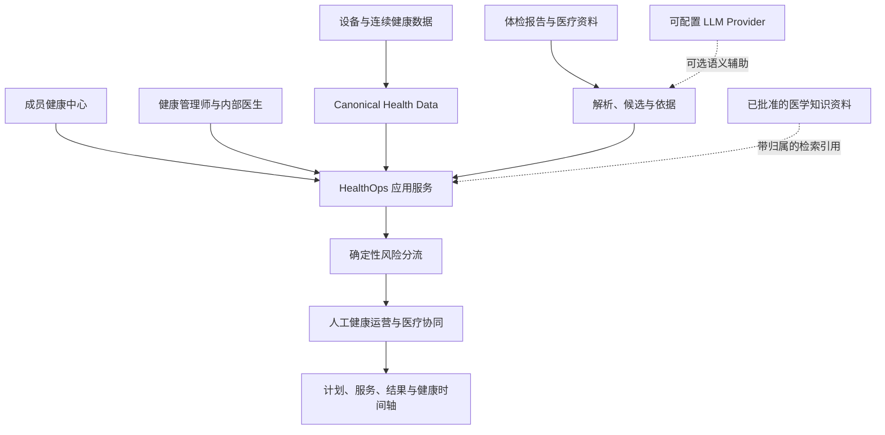

# Executive HealthOps

**面向企业高管的 AI 辅助长期健康运营平台**

将体检报告、连续健康数据、确定性风险分流、健康管理师与医生协同、健康计划和长期健康追踪，收敛为一套可追溯、有人负责下一步的 HealthOps 闭环。

[English](README.md) | 简体中文


[](https://github.com/KaedeharaT/executive-healthops/actions/workflows/ci.yml)

> **Research / Portfolio Prototype（研究与作品集原型）**：本项目用于展示可追责的健康运营工作流，不是医疗器械、诊断系统或生产级临床决策支持系统。

## 从健康数据到行动



成员能看到当前情况与下一步；健康管理师能按优先级推进事项；医生能获得精炼、带依据的复核上下文。重要处理结果会回流成员档案与长期健康时间轴。

## 解决什么问题？

高端健康管理中，体检报告、设备数据、人工跟进、服务安排、健康计划和医生判断往往分散在不同位置。结果是健康故事不连续，责任人、依据和下一步难以追踪。

Executive HealthOps 将这些输入组织为一条长期工作流：**报告 → 依据 → 基线 → 风险 → 健管 → 医生 → 计划 / 服务 → 结果 → 时间轴**。

它关注的不是把医疗数据简单堆在一起，而是让每个需要处理的问题都有清晰的来源、负责人、状态和后续动作。

## 核心能力

- **体检报告结构化**：将报告整理为主要发现、观测指标、复查事项和人工审核队列。
- **Evidence Traceability（依据追溯）**：从展示结论回到来源文件、页码、表格行或保留的原始片段。
- **Canonical Health Data（统一健康数据）**：规范化设备与手工记录；底层保留来源追溯，日常界面保持产品语言。
- **LLM 语义辅助**：用于信息整理、文档理解、语义辅助和知识检索，不替代医学判断。
- **Deterministic Risk Engine（确定性风险引擎）**：由受治理的代码规则执行分流，并将事项路由给合适的人。
- **Human-in-the-loop（人工在环）**：明确健康管理师动作、医生复核、负责人、期限与下一步。
- **长期健康时间轴**：串联发生了什么、团队如何处理、后续结果如何变化。
- **受治理的医学知识库 / RAG**：支持来源、审核状态、知识分块、关键词检索、引用和实际使用记录。
- **可重复的 Portfolio Demo**：使用隔离的 synthetic 数据库，围绕匿名成员 **Demo Executive A** 展示完整故事。

## 产品体验

作品集演示围绕一条连贯路径，而不是一组互不相干的页面：

1. 查看匿名体检报告，并打开“查看依据”追溯原始内容。
2. 确认健康基线，查看明确标注为演示的风险分流。
3. 展示健康管理师工作列表、内部医生复核与随后的跟进。
4. 查看计划任务、服务进度、阶段结果和长期健康时间轴。
5. 打开医学知识中心，展示经批准的资料如何作为可解释参考，而不是可执行医疗规则。

## 系统架构（Architecture）



更详细的源码层架构请见 [架构文档](docs/architecture/README.md)。

## AI 与确定性逻辑边界

AI 用于**信息整理、语义辅助、文档理解和医学知识检索**。它不自主诊断、不处方、不停药、不调整剂量，也不决定风险等级。

确定性应用代码负责**风险规则、工作流状态流转、状态管理、来源追溯和审计行为**。健康管理师负责协调信息与后续动作，医生保留医学判断权。

LLM 接口是可配置、模型无关的：完成相应验证后可使用本地或兼容 API Provider。Qwen 是本地验证过的一个选项，但风险引擎与工作流层不依赖某个特定模型。

## 工程实现（Engineering）

| 层级 | 技术与实现方式 |
|---|---|
| 产品界面 | Streamlit 成员健康中心与 HealthOps 运营工作台 |
| API | FastAPI |
| 持久化 | SQLAlchemy、Alembic、隔离 SQLite 演示数据库 |
| 健康数据 | Canonical Observations、原始摄取追溯、报告候选项 |
| AI | 可配置 LLM 接口，用于可选语义辅助 |
| 知识库 | 来源治理、已批准 Chunk、关键词检索、引用使用记录 |
| 质量保障 | pytest 自动化回归测试与 Streamlit 交互覆盖 |

## 安全边界（Safety Boundaries）

- 系统不会自动诊断、开药、停药、调整剂量或替代医生决定。
- LLM 不负责风险决策；正式临床规则需要独立的医学审核与版本治理。
- 作品集风险会明确标记为 **TEST / 演示工作流规则**，不是 Clinical RiskRule。
- MedlinePlus、RxNorm、openFDA 等公开资料属于受治理的知识来源，不会自动变成风险规则或治疗建议。
- Apple Health 后端和 iOS HealthKit Bridge 源码已包含，但真实设备验证仍待完成。

## 当前限制（Current Limitations）

这是作品集原型，不是生产临床软件。生产级 Auth/RBAC、TLS 部署、PostgreSQL 多用户部署、正式临床规则治理、真实医院接口和 Apple Health 真机验证均不在当前范围内。

## 快速开始（Quick Start）

### Windows 环境准备

```powershell
python -m venv .venv
.\.venv\Scripts\python.exe -m pip install -e ".[dev]"
```

### 启动隔离的 Portfolio Demo

```powershell
./scripts/start_portfolio_demo.ps1 -Rebuild
```

启动脚本会构建隔离的 `data/portfolio_demo.db`，设置 `PORTFOLIO_DEMO=true`，并启动：

- Streamlit：`http://127.0.0.1:8501`
- 本地 FastAPI 文档：`http://127.0.0.1:8000/docs`

它不会修改正常开发数据库。演示范围和安全说明见 [Portfolio 发布说明](portfolio/PORTFOLIO_RELEASE_NOTES.md)。

### 可选的 LLM 语义辅助

LLM 语义辅助是可选能力。完成相应隐私评估后，可在 `.env` 中配置本地或兼容 Provider：

```dotenv
LOCAL_LLM_ENABLED=true
LOCAL_LLM_PROVIDER=local
LOCAL_LLM_MODEL=<your-model>
OLLAMA_BASE_URL=http://127.0.0.1:11434
```

除非完成隐私审查后显式设置 `ALLOW_EXTERNAL_PHI_LLM=true`，否则健康数据不会发送到外部端点。

## 测试（Testing）

```powershell
.\.venv\Scripts\python.exe -m pytest -q
```

当前 v0.9.0 Portfolio 回归套件：**325 passed / 0 failed**。

## 作品集资料（Portfolio Materials）

- [简历项目描述（中文）](portfolio/RESUME_PROJECT_ENTRY_ZH.md)
- [Demo 视频脚本（中文）](portfolio/DEMO_VIDEO_SCRIPT_ZH.md)
- [Demo 数据说明](portfolio/DEMO_DATA_DESCRIPTION.md)
- [Portfolio 发布说明](portfolio/PORTFOLIO_RELEASE_NOTES.md)
- [使用逻辑审计](docs/USAGE_LOGIC_AUDIT.md)

## 许可证与数据（License and Data）

仓库不得提交真实成员资料、原始检查报告、数据库、上传文件、`.env` 或 token。作品集数据库和健康资料均由可重复构建的 synthetic fixture 生成。

代码依据 [MIT License](LICENSE) 发布。MedlinePlus、RxNorm、openFDA、WHO ICD-11 及其他第三方医学知识来源仍适用各自的许可、归属和使用条款。
