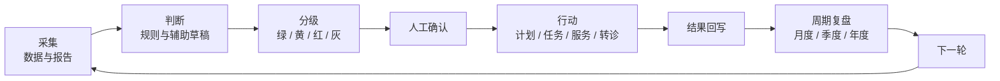
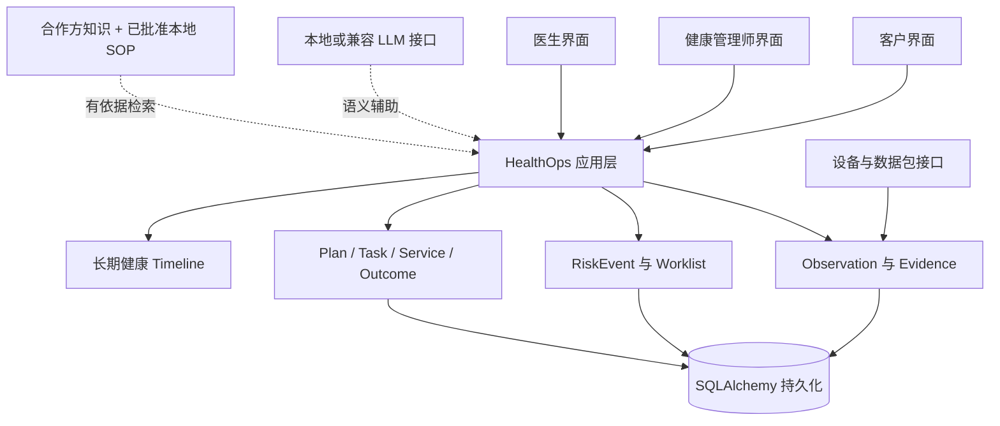

# Executive HealthOps

**企业家主动式持续健康管理平台**

[English](README.md) | 简体中文


[](https://github.com/KaedeharaT/executive-healthops/actions/workflows/ci.yml)

Executive HealthOps 把**体检、连续健康数据、确定性风险分级、健管跟进、医生协作、健康计划、线下服务和长期健康时间轴**串成一条以责任为核心的全年健康管理闭环。产品始终回答三个问题：**下一步是什么？由谁负责？什么时候完成？**


*匿名 Portfolio Demo 展示统一优先队列、明确责任人、到期事项和医生协作。*

> **Research / Portfolio Prototype（研究与作品集原型）**：本仓库用于展示产品与工程架构，不是医疗器械、自动诊断系统或生产级临床决策支持系统。

## 七步责任闭环



系统负责发现变化、组织上下文、形成优先级和生成低风险草稿；健康管理师负责核对、跟进和协调；持证医生保留诊断、处方、检查、治疗与转诊判断；客户负责授权、执行和反馈。所有重要结果都会回到健康档案，并进入下一轮管理。

## 三类产品视角

### 客户 / Member

看到当前状态、今天要做什么、计划进度、下一次服务、负责人和长期变化，不接触内部运营或技术字段。

### 健康管理师 / Health Manager

从统一的 `Operational Worklist` 处理风险跟进、报告审核、到期任务、医生依赖、服务交付和结果复盘。每个事项都明确优先级、负责人、SLA 或截止时间、处理原因与下一步。

### 持证医生 / Doctor

只接收需要医学判断的问题，并查看相关成员事实、当前用药、报告依据、风险上下文和健管已完成动作。医生结论返回健管工作流继续执行和随访。

## 全年管理周期

| 周期 | 产品责任 |
|---|---|
| **首月** | 整合报告、既往史、用药、健康数据、生活方式和客户目标，建立基线与年度计划。 |
| **每月** | 监测趋势、执行任务、协调服务并回写结果。 |
| **每季度** | 对比关键指标、重新评估风险、复盘阶段结果并校准计划。 |
| **每年** | 对比年度体检、汇总重大事件与服务、记录年度结果并制定下一年度计划。 |

## 核心能力

1. **体检报告结构化**：将报告整理成可审核的发现、健康观测和复查候选；未经人工确认的 AI 结果不会成为正式健康事实。
2. **依据追溯**：在可用时把展示事实连接回原始文件、页码、表格行、原始片段、设备记录或人工记录。
3. **统一健康数据**：规范报告、设备与人工录入的观测数据，同时保留原始来源和明确单位。
4. **确定性风险引擎**：由受治理的代码规则创建 `RiskEvent`，并支持数据不足或灰色状态；LLM 不决定风险等级。
5. **统一运营工作台**：用同一套业务契约呈现负责人、SLA、下一步、医生依赖和服务跟进。
6. **健管与医生协同**：运营责任归健康管理师，医学判断归持证医生。
7. **计划 / 任务 / 服务 / 结果**：把问题转成有人负责的行动，追踪交付，保留完成依据和结果，并启动下一步随访。
8. **长期健康时间轴**：将报告、基线变化、风险、用药、重要医疗事件、医生判断、计划、服务和 Outcome 投影为长期健康记录。
9. **轻量集成与数据中心**：管理员可以用业务语言检查、预览并确认 CSV、XLSX、ZIP 或 JSON 数据包，不接触数据库细节。
10. **有依据的 AI 与反馈治理**：用户可见 AI 解释必须有真实来源；人工纠错只进入离线、受审核、需人工批准的改进流程。

## 产品体验

### 健康管理师工作台


工作台直接回答今天先处理谁、为什么处理、下一步由谁负责，以及什么时候到期。

### 成员健康总览


成员上下文汇总已确认健康事实、当前问题、计划、任务和下一项责任动作。

### 医生复核与依据


医生围绕明确问题查看相关依据，并把人工医学判断返回运营闭环。

### 长期健康档案


时间轴说明什么时候发生了什么、依据是什么、谁处理、交付了什么，以及后来发生了什么。

## 集成与数据中心

管理员入口为：**运营后台 → 更多 → 系统 → 集成与数据**。合作方和设备提供的结构化文件统一经过受控流程：

```text
上传 → 检查 → 预览 → 确认 → 标准化 → 写入
```

- 数据包支持 **CSV、XLSX、ZIP 和 JSON**，具备重复保护、成员匹配、单位/日期检查和导入审计。
- 设备批量文件与未来合作方 API 最终进入同一套标准化导入与验证层，不重复建设业务逻辑。
- 设备接口边界覆盖 Apple Health、血压、CGM、体重、心率、睡眠和活动；真实厂商 API 属于后续集成。
- 外部医学知识通过 Partner Knowledge Adapter 消费。HealthOps 负责来源校验、引用展示、使用审计、本地 SOP 回退和无来源拒答，不复制完整外部医学知识库。

## 线下服务闭环

专业服务使用明确的责任交付流程：

```text
触发 → 核对 → 决策 → 安排 → 交付 → 结果 → 回写
```

服务事项保留客户、负责人、可用时的服务方、预约时间、SLA、完成依据、结果和下一步。服务完成后回到成员档案、计划和时间轴，必要时创建后续任务。

## 系统架构



业务实体是真实来源。Dashboard 和 Timeline 是投影；UI 状态与 AI 输出都不是临床事实。详见[架构文档](docs/architecture/README.md)与 [BP 产品对齐说明](docs/BP_PRODUCT_ALIGNMENT.md)。

## 有依据的 AI 与安全边界

可配置 LLM 接口支持本地模型和 OpenAI-compatible API。AI 可以辅助语义提取、摘要、草稿和知识解释，但不能诊断、处方、停药或改药、决定转诊，也不能给出 GREEN / YELLOW / RED / GRAY 风险等级。

- 涉及成员事实的内容必须有 **Fact Evidence（事实依据）**。
- 涉及医学、健康或流程解释的内容必须有已批准的 **Knowledge Evidence（知识依据）**。
- 没有足够的已批准知识时执行 **No-source refusal（无来源拒答）**，不使用模型记忆补全。
- 临床风险规则采用独立版本和审核治理；AI 反馈不能创建或启用规则。
- 人工确认的纠错可在审核和去标识化后进入不可变的离线评测或 Prompt 优化数据集；系统不在线学习，也不自动部署模型。

## 工程实现

| 领域 | 实现 |
|---|---|
| 产品界面 | Streamlit 成员健康中心与运营工作台 |
| API | FastAPI |
| 持久化 | SQLAlchemy、Alembic；隔离 SQLite 演示库与 PostgreSQL-ready 连接层 |
| AI | 可配置本地 / 兼容 LLM 接口与有依据回答契约 |
| 集成 | 文件、设备和合作方知识共用清晰 Adapter 边界 |
| 质量 | pytest 回归套件与 Streamlit 交互测试 |

## 快速开始

```powershell
git clone https://github.com/KaedeharaT/executive-healthops.git
cd executive-healthops
python -m venv .venv
.\.venv\Scripts\python.exe -m pip install -e ".[dev]"
pwsh -File .\scripts\start_portfolio_demo.ps1 -Rebuild
```

启动脚本只创建隔离的 `data/portfolio_demo.db`，并启动 Streamlit（`http://127.0.0.1:8501`）和 FastAPI 文档（`http://127.0.0.1:8000/docs`）。演示成员、报告、观测、知识和工作流全部是可重复生成的匿名合成数据。

## 测试

```powershell
.\.venv\Scripts\python.exe -m pytest -q
```

当前 v0.9.0 回归套件：**405 passed / 0 failed**。

## 当前限制

- 正式临床规则治理与临床验证尚未完成。
- 真实设备厂商 API 与 Apple Health 真机验证仍待接入。
- Portfolio Demo 尚未连接真实合作方知识服务。
- 生产级 Auth/RBAC、TLS、密钥管理和 PostgreSQL 多用户部署尚未完成。
- 医院系统、支付和生产服务商连接不在当前原型范围内。

## 文档

- [架构文档](docs/architecture/README.md)
- [BP 产品对齐](docs/BP_PRODUCT_ALIGNMENT.md)
- [AI 依据与引用策略](docs/AI_GROUNDING_AND_CITATION_POLICY.md)
- [AI 反馈与离线改进](docs/AI_FEEDBACK_AND_IMPROVEMENT.md)
- [知识适配器契约](docs/KNOWLEDGE_ADAPTER_CONTRACT.md)
- [中文简历项目描述](portfolio/RESUME_PROJECT_ENTRY_ZH.md)
- [Portfolio 发布说明](portfolio/PORTFOLIO_RELEASE_NOTES.md)

## 许可证与数据

仓库不包含真实成员资料、原始健康报告、数据库、上传文件或密钥。Portfolio 数据全部由可重复构建的 synthetic fixture 生成。代码依据 [MIT License](LICENSE) 发布；第三方医学来源仍适用各自的许可与归属要求。
