# Executive HealthOps

**面向会员、健康管理师、医生和运营团队的 Agent 辅助持续健康管理工作台**

[English](README.md) | 简体中文

[](https://github.com/KaedeharaT/executive-healthops/actions/workflows/ci.yml)


Executive HealthOps 将体检报告、健康问卷、长期健康数据、健管任务、医生判断和服务执行组织成一条可持续推进、有人负责、可追溯的健康管理闭环。

**健管每天从「今日工作 + Member360」开始。** 系统把待人工处理的事项送到今日工作，Member360 提供完整会员工作空间。Agent 负责整理资料、准备复核材料，并在人工确认后继续流程；医学判断由医生负责。

> **Research / Portfolio Prototype（研究与作品集原型）· Synthetic Demo Data（合成演示数据）**。本项目不是医疗器械、自主诊断系统、自主处方系统或生产级临床决策支持系统。全部截图和演示会员资料均使用合成数据。

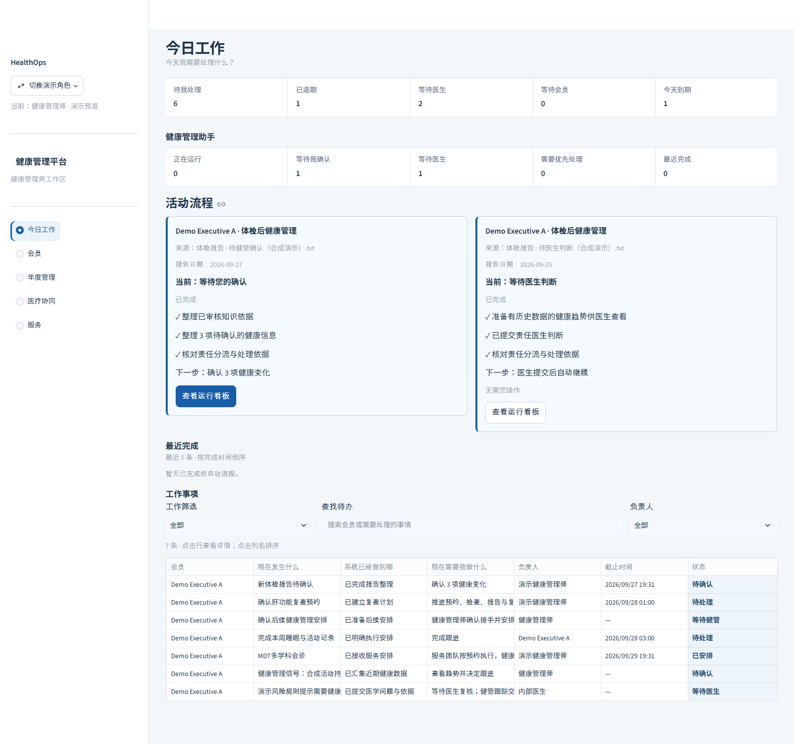

*当前中文界面。本文截图来自真实 Streamlit + Chromium 浏览器运行，并非界面效果图。*

## 产品一览

| 使用者关心的问题 | 当前实现 |
|---|---|
| 现在什么事需要人处理？ | 今日工作汇集确认事项、医生返回、复查、随访、服务和年度管理工作。 |
| 去哪里了解一个会员的完整情况？ | Member360 连接健康档案、当前管理、医疗协同和历程。 |
| Agent 替人做什么？ | 整理支持的资料、匹配现有记录、准备复核上下文、起草后续行动，在人工决定后继续流程。 |
| 年度参考起点是什么？ | 已确认年度基线，与后续测量和当前健康状态分开保留。 |
| 实际做到什么程度？ | 初始评估、健康资料导入、体检后管理均有可执行流程，包含正式记录、人工关卡、成员端展示与回归测试。 |

工作的基本单位是一个有会员、原因、负责人和截止时间的下一步。报告、医生意见或服务结果进入系统后，团队能够知道后面该做什么，并记录完成情况。本原型展示这条工作闭环，不代表已经证明临床有效性。

## 产品怎么使用

健康管理师有两个日常起点：从**今日工作**找事，从**会员 → Member360**找人。年度管理、医疗协同和服务提供跨会员视角，点击后仍进入同一个会员空间或事项详情。

今日工作统一汇集报告确认、Agent 人工关卡、已提交初评、医生返回、复查、随访、服务、年度管理事项及其他待办。每行回答：**谁、发生了什么、系统做到哪、现在需要做什么、负责人、截止时间**。点击即可进入相应处理入口；搜索、负责人和工作筛选帮助缩小范围，默认列表也保留已安排的远期事项。

健康管理助手直接出现在今日工作中，活动流程与最近完成记录分开展示。健管从待确认流程继续处理，不必自行寻找报告、风险、任务或 Agent 模块。

成员端使用**首页、健康、计划、服务、历程**；医生使用**待我判断、历史**；管理员查看系统状态、自动化运行、数据集成、规则与知识。角色切换只是演示预览，不是身份认证。

## 持续健康管理闭环

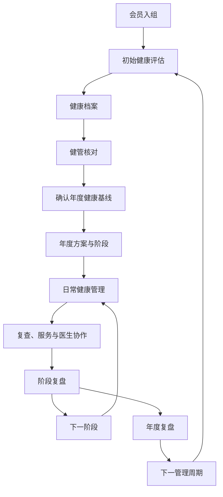
```mermaid
flowchart TD
    A[会员入组] --> B[初始健康评估]
    B --> C[健康档案]
    C --> D[健管核对]
    D --> E[确认年度健康基线]
    E --> F[年度方案与阶段]
    F --> G[日常健康管理]
    G --> H[复查、服务与医生协作]
    H --> I[阶段复盘]
    I --> J[下一阶段]
    J --> G
    I --> K[年度复盘]
    K --> L[下一管理周期]
    L --> B
```

这是当前支持的、由人负责推进的管理周期，并不表示一个 Agent 已能自主完成全年管理。年度方案、阶段、日志、复查、服务与阶段复盘构成业务基础；下文的有限范围 Agent 流程在其中辅助资料导入和体检后管理。

## Member360

Member360 是**健管团队唯一完整的会员工作空间**。顶部持续展示年度周期、责任健管、当前阶段、会员本人关注、专业管理重点与下一步。跨会员页面打开的也是同一个空间，不再另建一份会员详情。

| 当前可见页签 | 团队在这里做什么 |
|---|---|
| **概览** | 查看阶段、管理重点、指标预览、开放事项、最近日志与助手进展。 |
| **健康档案** | 开始或继续初始评估、导入资料，查看报告、测量、基线与健康史。 |
| **管理** | 推进年度方案、阶段、管理事项、日志、复查与阶段复盘。 |
| **医疗** | 跟进医学问题、医生复核与会诊资料。 |
| **历程** | 查看长期健康记录和以往工作结果。 |

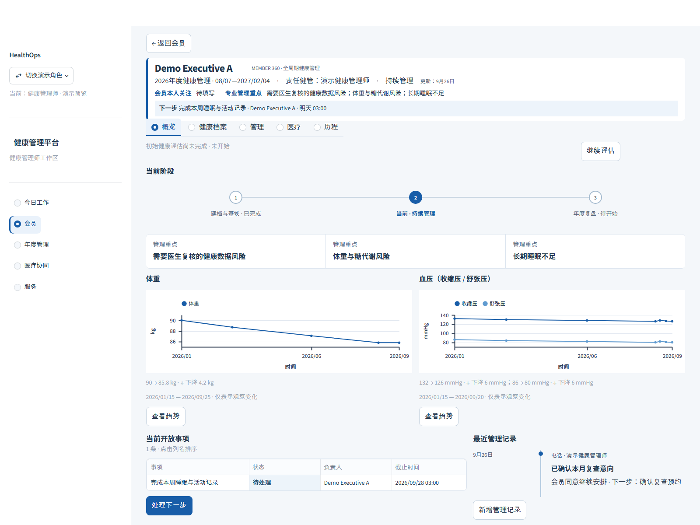

*会员本人关注与专业管理重点分开展示；指标预览可进入共用的健康数据页。*

## 初始健康评估

**Member360 → 健康档案**的第一个固定入口是**初始健康评估**。十个资料部分包括基础资料、家族史、个人病史、手术/住院、过敏、当前及最近用药/营养补充、生活方式、环境暴露、会员关注和专项症状评估。向导在这些内容后另设确认提交步骤。

健管可以开始评估、保存草稿、继续填写、审核已提交回答或退回补充。提交后，今日工作出现对应确认事项；需要医学判断的问题保留医生审核关卡。完成后可查看确认信息、本人关注和专业管理重点，也可查看或补充修正原评估。

健康档案读取同一份评估回答。问卷自述和症状分数不会因为提交或健管确认就变成诊断、处方或正式风险等级。导入资料可以带来源预填草稿，尚未填写的部分仍需继续补充。

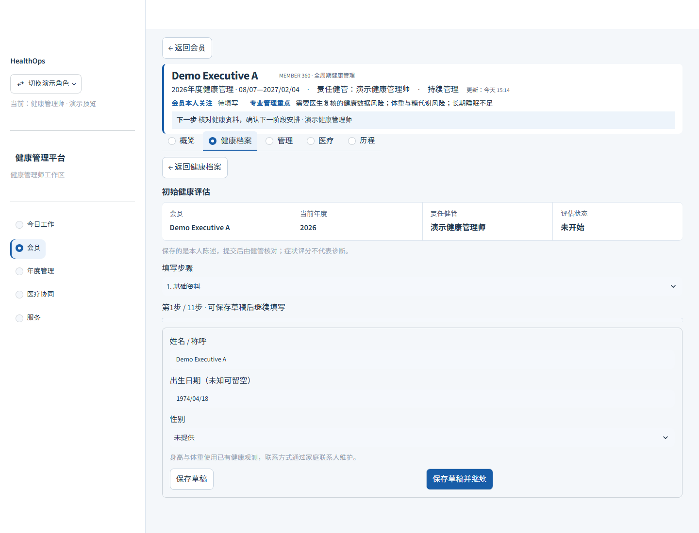

## Agent 辅助健康资料导入

健管路径为：**会员 → Member360 → 健康档案 → ＋ 导入健康资料**。当前支持三类资料，复用既有 Agent 调度、文档、提取候选和业务记录：

| 资料类型 | 当前行为 |
|---|---|
| **体检报告** | 提取支持的测量值，标准化指标与单位，比对现有测量，准备健管确认。 |
| **健康问卷** | 原生结构化问卷按固定字段映射；整理支持的文本，预填已有初始评估草稿。 |
| **历史健康档案** | 整理支持的病史、用药、手术和健康资料字段，保留来源及原文提供的日期。 |

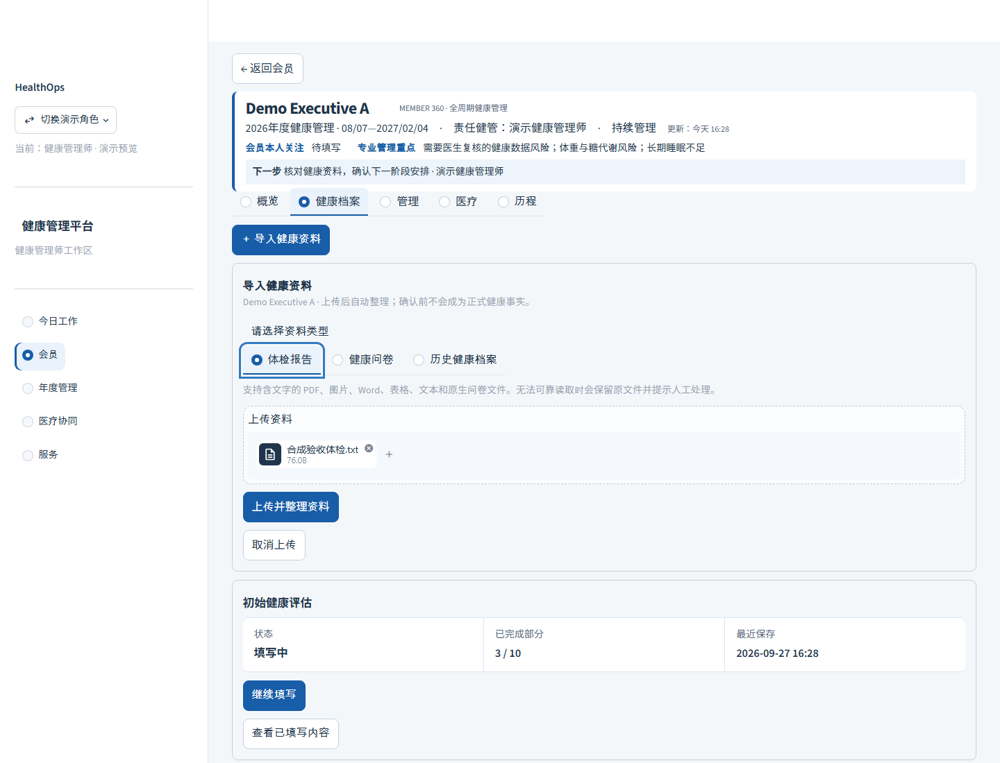


```mermaid
flowchart LR
    U[上传] --> P[解析]
    P --> N[标准化]
    N --> M[与现有档案匹配]
    M --> C[识别新增、更新与冲突]
    C --> H[健管确认]
    H --> W[正式入档]
    W --> S[Member360 与成员端同步]
```

含文字的 PDF、Word、表格、文本和原生问卷复用现有读取能力。自由格式文本可调用已配置的大语言模型（LLM），但返回字段和依据必须能够在原文核实；知识检索不能生成会员事实。图片和没有可用文字层的扫描件，在无法可靠识别时保留原件并转人工处理。

确认页并排展示现有内容、本次资料、来源和状态。一致资料不重复写入；冲突须选择采用新资料、保留当前记录或暂不确认，暂缓会建立后续待办。医学问题可进入现有医生复核流程，医生返回后仍由**同一个导入流程**等待健管确认。

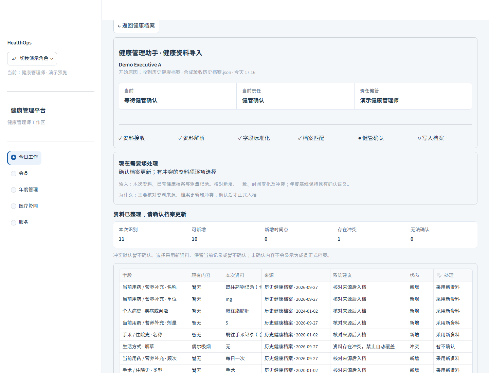

确认后写入接受的记录，并保留文档、原文依据、提取方式、置信度、确认人、确认时间和目标记录。同会员相同文件通过文件摘要防止重复导入；不同文件的测量还按指标、日期、单位和值核对。重复确认不会重复创建记录。

**自动化替代资料准备工作：**读取支持的报告、提取指标、整理问卷与历史档案、匹配字段、比较已有记录、发现冲突、预填初评、准备医生资料、起草后续行动。**人工承担责任：**健管核对来源、处理冲突、沟通协调和提交医学问题，医生负责医学判断。历史用药提取只记录有来源的陈述，不创建新处方。

Member360 和成员端读取同一份已确认记录。未确认导入候选不进入成员正式档案；确认后的测量进入已有健康数据序列，导入完成不会覆盖年度基线。

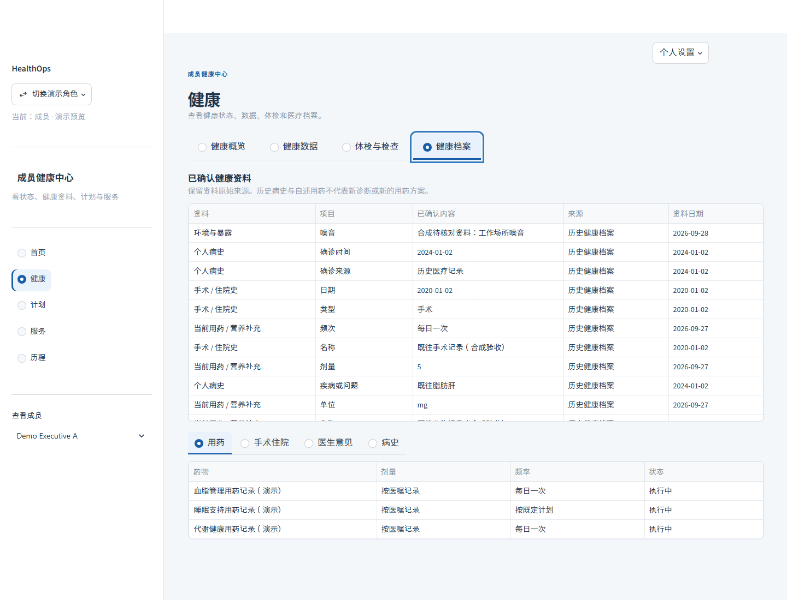

## 可见、有边界的 Agent 工作流

体检后健康管理助手完成一条具体的团队协作流程：

```text
新体检报告 → Agent 整理 → 健管确认
→ 必要时医生复核 → 医生提交 → 原 Agent 自动继续
→ 后续行动草稿 → 健管确认
→ 管理事项 / 复查 / 随访 → 本次流程完成
```

助手汇集报告发现、已有健康资料、可用基线与历史数据，以及已审核知识依据；必要时准备医学问题。医生提交判断后，原流程继续，健管核对行动内容、负责人和日期，再通过现有业务服务建立安排。

“完成”表示已建立确认后的安排和下一责任节点，**不表示未来复查已经执行，也不表示会员健康问题已经解决**。这些结果仍需在后续管理中记录。

运行看板说明：**为什么启动、已经做了什么、当前做到哪、等待谁、下一步是什么、最终创建了什么**。工作记录来自已记录事件、成功操作、人工确认与医生意见。普通成员、健管和医生页面不展示提示词、Token、工具调用、原始 JSON 或思维链；技术执行记录仅在管理员页面查看，业务进度说明不是模型推理过程。

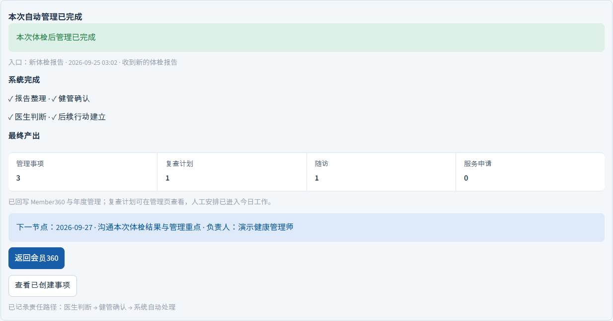

*这次合成验收流程实际创建了 3 项管理事项、1 项复查、1 项随访、0 项服务申请。数量属于该次运行，不代表固定产出模板。*

Agent 调度器保存事件、目标、计划步骤、工具执行、确认和等待状态，轻量后台工作进程继续推进满足条件的工作。人工关卡、责任分流、防重复、有限重试和人工升级约束执行范围。这些是同一调度器中的具体流程规则，并非通用多 Agent 临床团队。

## 年度健康基线与健康趋势

**年度基线 ≠ 当前健康状态。** 已确认基线是年度管理起点的参考，后续有效测量更新当前状态及比较结果，同时保留历史基线。事实修正使用可追溯更正记录；基线值也不自动等于医学目标值。

共用指标序列在有记录时展示**体重、BMI、血压、血糖、糖化血红蛋白（HbA1c）、低密度脂蛋白胆固醇（LDL-C）、丙氨酸氨基转移酶（ALT）、心率、步数、运动时间、活动消耗、睡眠时长、深度睡眠、快速眼动睡眠和清醒时间**。当前合成演示提供这十五组可选指标，实际可选范围取决于会员资料。

可按指标和时间范围筛选。摘要显示所选范围内最近值、已有的确认年度基线、相对基线变化和测量时间。图表及来源详情保留单位、日期；缺少基线会明确提示。

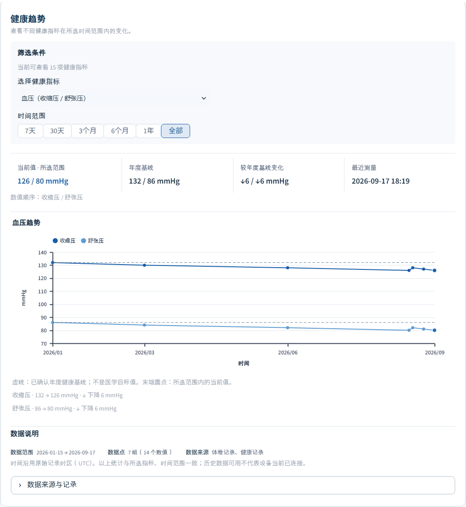

只有两个时间点时称为**历史比较**，不称长期趋势。当前演示的 HbA1c 和 ALT 各有两个点；多点序列才在其实际记录期间展示连续变化。没有数据或只有一个点时解释数据不足，不绘制空趋势。观察到变化也不能证明某项服务导致了改善。

## 健管与医生协作

医生从**待我判断**进入问题，在**历史**查看已完成判断。复核资料包含明确问题、相关指标及可用趋势、报告依据、病史、用药与已采取行动；导入资料复核保留原文和原始文件入口。

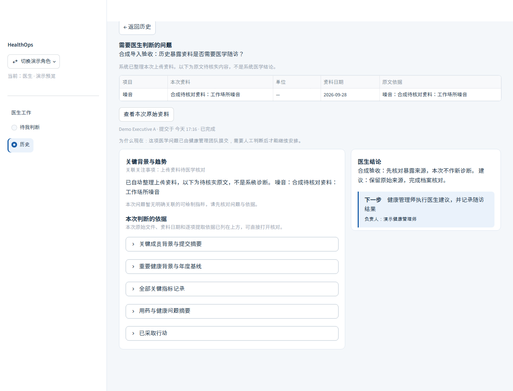

医生负责医学判断。Agent 与健管组织后续执行，包括继续等待中的流程、准备行动草稿、确认责任、安排复查或随访并记录结果。健管不需要重新寻找返回意见，也不需要新建替代 Agent 流程。

## 管理流程

**年度方案**明确周期、责任健管和重点；**阶段**说明当前工作与复盘节点；**管理事项**落实负责人、状态和日期；**管理日志**记录联系、服务和结果，保存时可准备下一待办供确认。

**复查**跟踪确认、预约、执行、报告返回与复核；**服务**记录安排、交付和结果；**阶段复盘**汇集证据与决定，再继续本阶段或进入下一阶段。结果回到会员历程和管理上下文，不止于一条孤立备注。工作人员用今日工作处理待办，用 Member360 查看完整周期。

## 系统架构

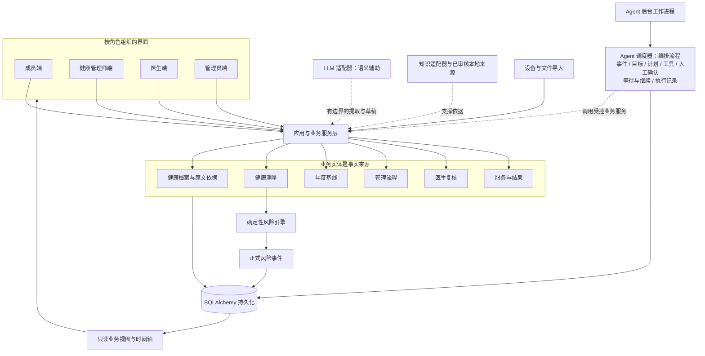
```mermaid
flowchart TB
    subgraph UI[按角色组织的界面]
        MU[成员端]
        HU[健康管理师端]
        DU[医生端]
        AU[管理员端]
    end
    MU --> APP[应用与业务服务层]
    HU --> APP
    DU --> APP
    AU --> APP
    subgraph DOMAIN[业务实体是事实来源]
        HR[健康档案与原文依据]
        OB[健康测量]
        BA[年度基线]
        MW[管理流程]
        DR[医生复核]
        SV[服务与结果]
    end
    APP --> HR
    APP --> OB
    APP --> BA
    APP --> MW
    APP --> DR
    APP --> SV
    DOMAIN --> DB[(SQLAlchemy 持久化)]
    DB --> PV[只读业务视图与时间轴]
    PV --> UI
    AS[Agent 调度器：编排流程<br/>事件 / 目标 / 计划 / 工具 / 人工确认<br/>等待与继续 / 执行记录] -. 调用受控业务服务 .-> APP
    AS --> DB
    WK[Agent 后台工作进程] --> AS
    LLM[LLM 适配器：语义辅助] -. 有边界的提取与草稿 .-> APP
    KN[知识适配器与已审核本地来源] -. 支撑依据 .-> APP
    IN[设备与文件导入] --> APP
    OB --> RE[确定性风险引擎]
    RE --> RF[正式风险事件]
    RF --> DB
```

界面与 FastAPI 接口调用业务服务。业务记录保存健康事实和结果，只读视图汇集各角色需要的信息。Agent 状态描述流程进度；LLM 输出在通过相应检查与人工关卡前仍是候选。二者均不是第二套临床档案，风险规则独立于模型文本执行。

## 安全边界

| 参与者 | 负责什么 | 边界 |
|---|---|---|
| **Agent / LLM** | 流程协调、支持范围内的提取、来源匹配、摘要与草稿 | 不决定正式风险，不诊断、开药、调整用药或绕过必要审核。 |
| **健康管理师** | 核对来源、处理冲突、确认行动、协调与跟进 | 健管确认不会把会员自述变成医学诊断。 |
| **医生** | 医学判断与医学决定 | 判断保留人工来源，后续执行交回健管团队。 |
| **确定性风险引擎** | 根据合格测量与受治理规则生成正式风险事件 | 不使用 LLM 风险等级，不自动修改规则；临床验证仍未完成。 |

**不自动诊断、不开药、不停药、不调整剂量，也不替代医生判断。** 每条正式临床风险规则（Clinical RiskRule）均需独立医学审核与版本治理。

会员事实依据说明“已知什么”，知识依据支撑解释。带依据的生成说明需要合格、已审核来源和有效引用；缺少足够知识时拒绝无依据解释。资料提取则引用原始内容。人工反馈可进入审核、去标识化后的离线评测流程，不进行在线学习或自动模型部署。

## 工程实现

| 范围 | 仓库中的实现 |
|---|---|
| 运行环境与界面 | Python 3.11+、Streamlit、Altair 图表 |
| 接口与业务服务 | FastAPI、共用业务命令与只读视图 |
| 持久化 | SQLAlchemy、Alembic 迁移、隔离 SQLite 演示库 |
| PostgreSQL 适配准备 | 可配置 SQLAlchemy 连接层；仍需驱动配置与生产验证 |
| Agent 执行 | 数据库保存的调度状态与轻量后台工作进程 |
| 模型与知识 | 本地/OpenAI 兼容 LLM 适配器、合作方知识适配器与已审核本地回退 |
| 数据接入 | 文档读取、指标和单位标准化、设备适配器；管理员 CSV/XLSX/ZIP/JSON 数据包校验与确认 |
| 验证 | pytest、Streamlit AppTest、Chromium/Playwright 脚本与截图验收记录 |

浏览器验收与 pytest 持续集成任务分开执行。默认开发依赖不会安装可选的 Playwright 工具。

## 快速开始

使用 **Windows、Python 3.11+ 与 PowerShell 7（pwsh）**，从仓库根目录运行：

```powershell
git clone https://github.com/KaedeharaT/executive-healthops.git
cd executive-healthops
python -m venv .venv
.\.venv\Scripts\python.exe -m pip install -e ".[dev]"
pwsh -File .\scripts\start_portfolio_demo.ps1 -Rebuild
```

启动脚本建立 **data/portfolio_demo.db**，执行迁移、补齐流程责任记录，并启动三个后台进程：

| 进程 | 本地入口 |
|---|---|
| Streamlit | <http://127.0.0.1:8501> |
| FastAPI / 接口文档 | <http://127.0.0.1:8000/docs> |
| Agent 工作进程 | scripts/run_agent_worker.py，连接同一个隔离演示库 |

**-Rebuild** 会重建可丢弃的合成演示库。不带此参数时检查并复用兼容演示，过期演示数据可能被重建；增加 **-NoBrowser** 可不自动打开浏览器。8501 和 8000 端口必须空闲，脚本会拒绝占用端口。使用后停止对应演示 Python 进程。

进入运营后台查看今日工作，再选择会员打开 Member360。在健康档案中打开评估或导入合成资料，通过角色切换查看医生队列或成员端结果。种子数据提供等待健管和等待医生的流程。固定规则提取与流程路径可不依赖在线模型；自由文本语义提取需要已配置 LLM，否则转人工处理。配置示例见 [.env.example](.env.example)。

## 测试

**最新全量回归：703 passed / 0 failed。** 2026-09-27 在隔离检出副本中针对当前业务代码重新验证。这是工程回归证据，不是临床验证。

```powershell
.\.venv\Scripts\python.exe -m pytest -q
```

请使用可丢弃的检出副本：现有迁移测试会重建该副本的合成演示数据库。覆盖包括导入确认与来源、防重复、初评状态、等待医生与继续、行动建立、风险边界、基线保留及界面约定。验收文档另记录真实 Chromium 使用路径。持续集成使用 Python 3.11，安装项目、建立合成数据并执行 pytest。

## 当前限制

- 图片和纯扫描报告尚无可靠配置的生产 OCR 路径。无法读取、语义服务不可用或提取结果无法核实时转人工，保留原文件。
- 临床规则与管理逻辑未完成正式临床验证，本项目不是已验证的临床服务。
- 已有设备适配器、文件导入与 Apple Health 桥接代码；真实厂商接口和真机验证仍有限或待完成。历史数据可见不表示设备实时连接。
- 演示未连接真实合作方医学知识服务，也不提供完整临床检索增强知识库；已审核本地来源与适配器约定用于展示边界。
- 角色预览和业务权限关卡不等于生产级身份认证与访问控制。TLS、密钥运维、多用户 PostgreSQL 部署和生产加固尚未完成。
- 工作进程仍是轻量实现，未交付分布式调度、故障转移和生产运行保障。
- 独立阶段 Agent、复查 Agent、通用多 Agent 编排、医院集成、支付与真实服务商连接均非已交付能力。已有阶段与复查流程仍由人负责推进。

## 文档

| 验收或参考 | 内容 |
|---|---|
| [当前产品使用逻辑验收](docs/product-logic-v5/ACCEPTANCE.md) | 今日工作、Member360、医生导航与团队使用路径 |
| [健康资料导入](docs/profile-intake-agent.md) | 三类资料、冲突、确认、医生返回和成员同步 |
| [初始评估入口](docs/intake-assessment-entry-verification.md) | 草稿、续填、审核和档案联动 |
| [助手工作可视化](docs/assistant-visibility.md) | 业务记录、人工等待与完成出口 |
| [Agent 责任分流验收](docs/agent-dashboard-v2/verification.md) | 责任路径与运行过程展示 |
| [健康趋势验收](docs/health-trend-ui-verification.md) | 真实指标范围与稀疏数据表现 |
| [架构参考](docs/architecture/README.md) | 服务与实体背景；其中旧导航审计早于当前界面，最新入口以上述验收为准 |
| [AI 依据与引用](docs/AI_GROUNDING_AND_CITATION_POLICY.md) | 会员事实、知识依据、引用与拒答 |
| [AI 反馈](docs/AI_FEEDBACK_AND_IMPROVEMENT.md) | 经审核的离线改进与风险规则隔离 |
| [知识适配器](docs/KNOWLEDGE_ADAPTER_CONTRACT.md) | 合作方约定、本地回退与使用审计 |

## 许可与数据

代码采用 [MIT License](LICENSE)。演示资料与精选截图均为 **Synthetic Demo Data（合成演示数据）**。真实成员资料、原始私人报告、数据库、上传文件或密钥不应提交到 Git。第三方来源保留其自身许可与署名要求。
