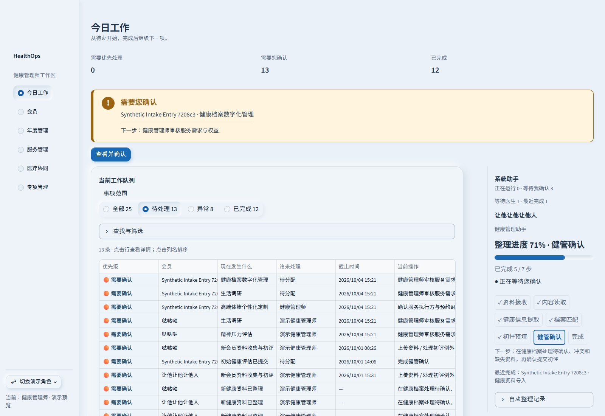
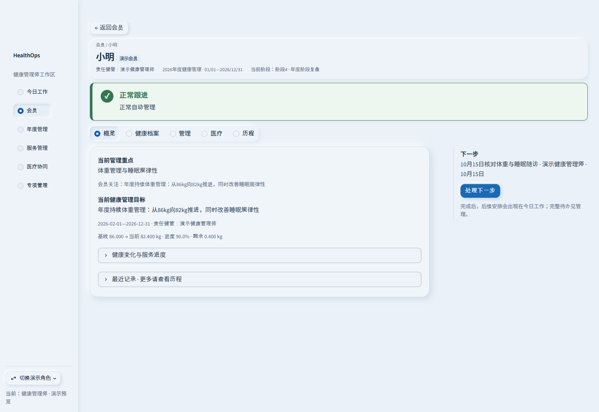
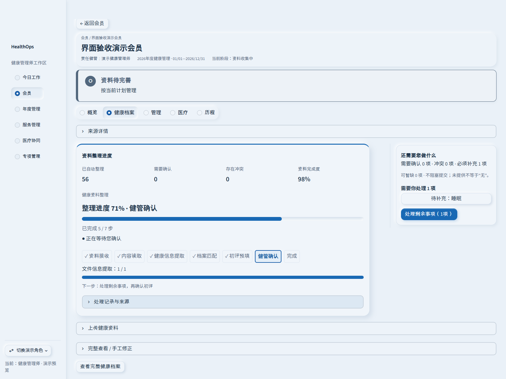
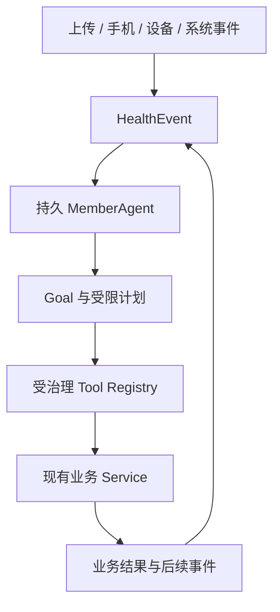
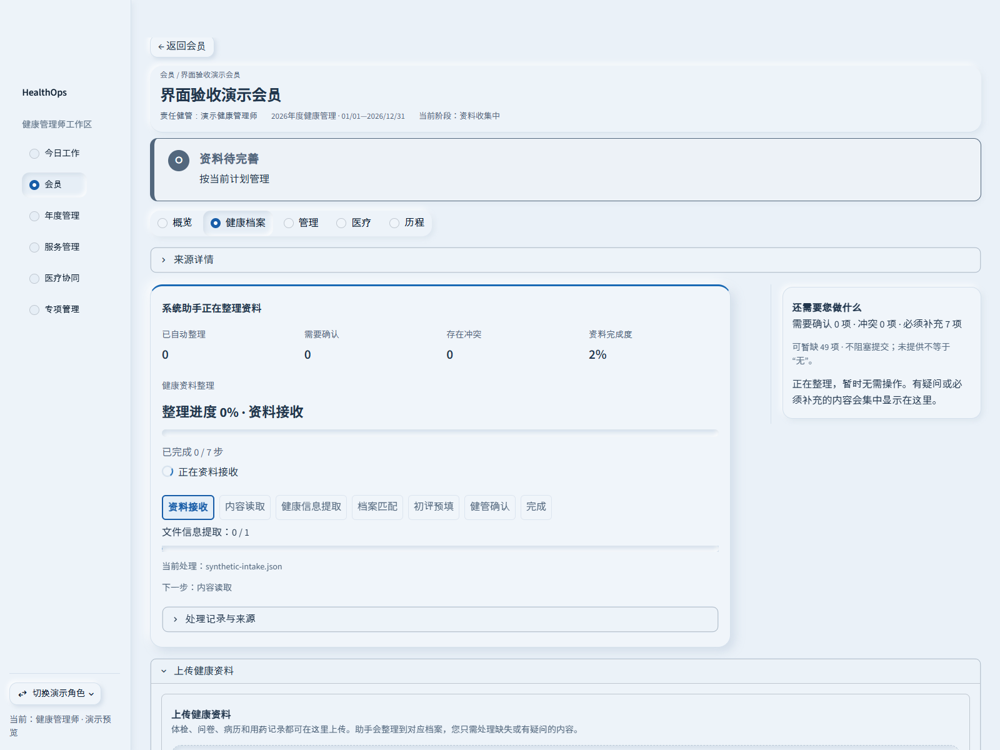
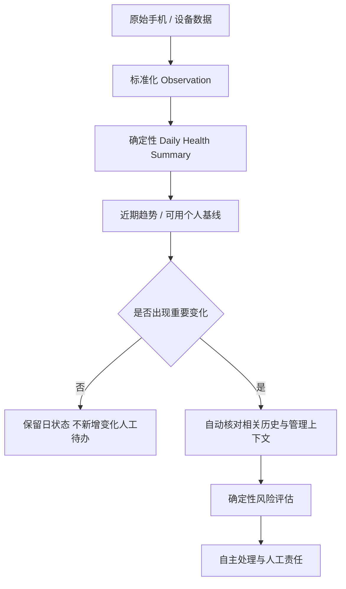
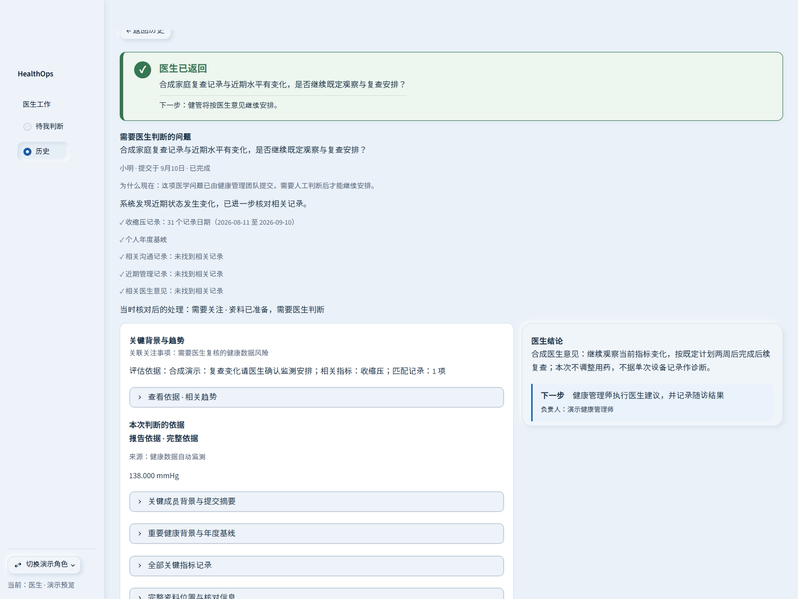
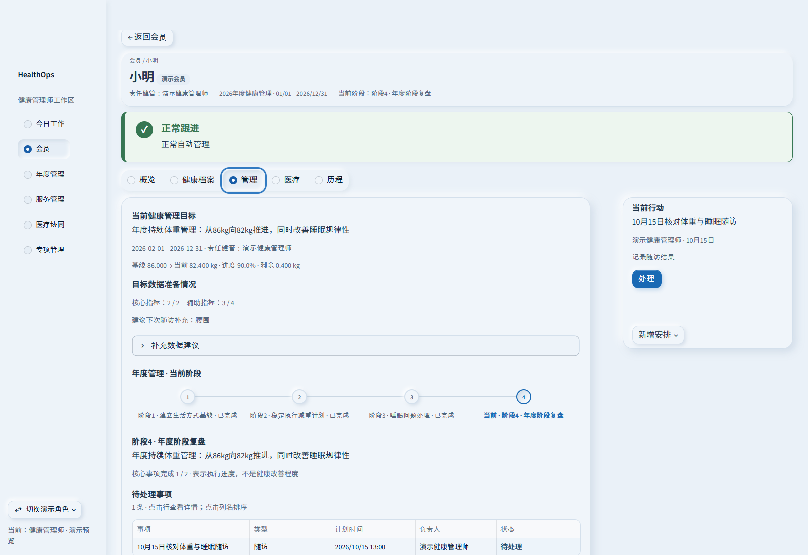
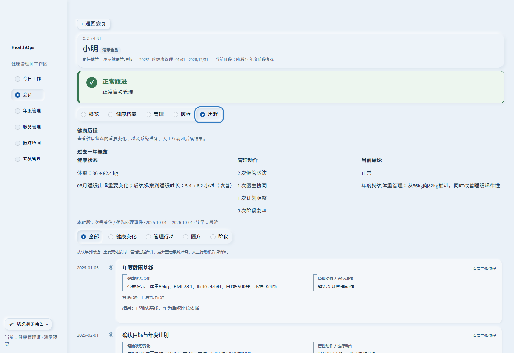
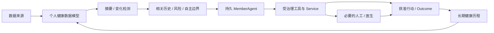

# Executive HealthOps

**AI Native 会员全周期健康管理平台**

[English](README.md)

HealthOps 把会员的报告、测量、目标、管理行动和医生决定组织到同一个持续管理空间。健管看到的是 **发生了什么变化、现在需要做什么、下一步是什么**。

**研究与作品集原型。下文示例和截图均为 synthetic/demo 合成演示会员，不是真实患者资料。** 当前产品界面为中文。

## 平台定位

平台支持有明确责任人、有持续记录的长期健康管理。它不是 AI 医生、聊天机器人、一次性体检分析工具，也不只是健康数据看板。

**多源健康数据 → 个人健康数据模型 → 摘要与变化 → 持久会员助手 → 风险与责任分流 → 行动 → 结果 → 长期健康历程。**

## 产品怎么使用

1. 新建会员，指定责任健管。
2. 打开 **会员 → Member360 → 健康档案 → 上传健康资料**。
3. 助手自动整理支持的材料。健管处理事实不确定、冲突和必须补充的信息；可选信息缺失不阻塞整个初评。
4. 先确认管理目标，再确认管理计划，分别保留人工确认。
5. 日常主要从 **今日工作** 处理真正需要人的事项。
6. 在 **Member360 → 历程** 查看变化、干预、医生决定和后续观察结果。

Member360 固定五个页签：**概览、健康档案、管理、医疗、历程**。年度管理、服务和医疗协同进入同一组业务记录。会员删除采用安全归档：停止当前工作，保留历史。





统一上传入口处理支持的报告、问卷和历史材料。初评保留依据，预填已有评估，区分 **已自动整理、需要确认、存在冲突、仍需补充**。现有读取器支持文本型 PDF、Word、表格及支持的文本/结构化输入。无法读取的扫描件或缺少可靠依据的材料需要人工处理；不声称已具备任意文档的可靠 OCR。



## AI Native 如何运作

业务事件启动和继续工作，健管无需向聊天机器人重新下指令来恢复流程。


```mermaid
flowchart TD
    A[上传 / 手机 / 设备 / 系统事件] --> B[HealthEvent]
    B --> C[持久 MemberAgent]
    C --> D[Goal 与受限计划]
    D --> E[受治理 Tool Registry]
    E --> F[现有业务 Service]
    F --> G[业务结果与后续事件]
    G --> B
```

原始设备测量先存储和标准化，**不会每条调用 LLM，也不会每条唤醒会员助手**。摘要中的重要变化和可处理的业务事件才进入管理闭环。

助手看板显示当前步骤、已完成准备、正在等谁和下一步。等待人工时停止运行动画。技术执行记录保留在管理员视图。



## 个人健康数据模型

基础身份、健康史、用药事实、生活方式、报告、问卷、指标、年度基线、目标、阶段、沟通、医生判断及服务结果分别有记录和关联。

| 数据层 | 当前行为 |
|---|---|
| Raw 原始层 | 保留上传材料及支持的接入原始载荷、数值与时间。 |
| Normalized 标准化层 | 映射标准指标，转换支持的单位，去重并判断质量。 |
| Confirmed / Governed 事实层 | 正式观察数据与未确认候选分开；设备事实可以通过规则治理，不等于医生逐条确认。 |
| 修正 / 来源 | 候选修订和指标替代关系保留旧值、修正、来源及确认信息。旧数据缺少来源时如实说明。 |
| 时间 / 上下文 | 多时间点 Observation、Health Record、年度基线、目标指标要求和版本化日摘要支持长期比较。数据质量与健康风险分开。 |

合成示例保留 **原文83.6kg → 错误提取86.3kg → 人工修正并确认83.6kg**。修正当前事实不会无痕删除原提取错误。

### 先发现状态变化，再决定是否找人


```mermaid
flowchart TD
    A[原始手机 / 设备数据] --> B[标准化 Observation]
    B --> C[确定性 Daily Health Summary]
    C --> D[近期趋势 / 可用个人基线]
    D --> E{是否出现重要变化}
    E -->|否| F[保留日状态 不新增变化人工待办]
    E -->|是| G[自动核对相关历史与管理上下文]
    G --> H[确定性风险评估]
    H --> I[自主处理与人工责任]
```

Python 聚合可用 Observation，LLM 不负责计算摘要。重新计算保留修订，变化事件去重。已配置趋势/管理规则、确认目标的进展和适用正式风险规则约束变化检测；不存在通用的、自动学习出来的医学阈值。

以睡眠变化为例，选择逻辑限定读取相关睡眠与活动记录、可用基线、适用目标、近期管理记录和相关医生意见，不加载整个会员历史。界面显示 **实际留存的日期范围与核对项目**，也说明没有找到相关记录。

平时先显示最近健康概况。关键事件显示 **发生什么变化 → 核对哪些记录 → 处理结论 → 需要谁**。点击 **查看依据** 后才展开详细比较、记录和来源，并可进入已有趋势页。单次数值小幅波动不会自动变成人工待办。

## Human in/on/out of the loop

| 分级 | 普通用户看到什么 | 责任边界 |
|---|---|---|
| GREEN · Out of the loop | 正常跟进 | 已批准的低风险运营可自动推进；已覆盖绿色路径记录进度，不新增人工待办。 |
| YELLOW · On the loop | 需要关注 | 先准备依据，确需确认或沟通时再找健管；真实分流规则也可能要求医生。 |
| RED · In the loop | 需要优先处理 | 准备依据并交责任健管、医生或升级处置流程；医学判断与关闭仍保留人工责任。 |

**正式风险来自确定性规则，LLM 不能设置或降低风险。** 工作流状态和资料缺失不能代替正式风险。目标、计划、冲突事实和医学判断分别保留相应人工关卡。



## 持久 MemberAgent 与受治理工具

每位参与管理的会员有一个持久 MemberAgent 身份，Goal 完成后身份仍存在。计划、工具执行凭据和等待状态跨进程重启保留，包括 **WAITING_MANAGER、WAITING_DOCTOR、WAITING_MEMBER、WAITING_TIME**。匹配的人工结果或到期事件继续原 Goal。

Planner 使用受限流程模板和允许工具，不是自由行动的自主医疗 Agent。体检后管理、资料导入、管理建立、日常跟进、自然语言随访结果和阶段复盘复用调度与服务。完成依据是业务结果或明确的不行动决定，不只是生成文字。

模型没有任意 SQL 或直接业务写库接口，路径为 **Agent → 受治理工具 → Service 适配 → 业务记录**。权限、自主边界、幂等键和审计凭据约束执行。自然语言结果保留原文与结构化候选；提到医生不会把健管意见变成正式医生决定。

## 目标驱动管理

健管先确认会员希望改善什么，再批准计划。当前目标类型涵盖体重、血压、血糖、血脂、睡眠、活动、生活方式、随访及自定义目标。

**Metric Requirement Registry** 将目标映射到已有指标，区分核心、辅助、可选要求和来源能力。数据准备度帮助聚焦补充，不要求填写全部字段。映射由代码定义，目标保存要求快照；完整的可治理语义编辑体系尚未实现。

目标和计划复用年度方案、阶段及已有随访/复查/服务工具。数值进度确定性计算；非数值目标不虚构改善百分比。



## 纵向健康历程

**入口：会员 → 点击会员 → Member360 → 历程。**

只读投影汇集基线、状态快照、重要变化、管理行动、医生决定、结果与当前状态。有序主轴按 Care Episode 分组，每组内部区分健康状态和管理行动两条轨道；使用直线和直角折线，保留当前克制风格。

事件关系引用已有业务对象，不复制临床数据。缺少依据的结果显示待观察/数据不足；后续改善不证明干预因果。**Timeline 是会员历程，不是 Agent Trace 或成熟 Care Memory。**




**小明**是已实现、明确标识的合成会员。幂等 Seeder 通过业务服务演示12个月、确认目标、设备观察、摘要变化、健管/医生交接、复查、阶段复盘、两个关联 Care Episode 和修正历史。Seed 明确执行，不随启动重置。详见[演示说明](docs/ai-native/XIAOMING_SYNTHETIC_DEMO.md)。

## 长期积累的核心资产

资产是个人纵向事实、健康历史、确认目标、人工/医生决定、干预、观察结果、修正、来源和会员特定上下文。模型、检索引擎和设备适配器是可替换的实现选择。

这些结构提供积累基础；合成测试不能证明真实数据护城河或临床效果。**可治理 Care Memory 与可复用个体响应模式仍是缺口。** 已有来源提示和事件候选经验，不是永久医学事实。

## 架构


```mermaid
flowchart LR
    A[数据来源] --> B[个人健康数据模型]
    B --> C[摘要 / 变化检测]
    C --> D[相关历史 / 风险 / 自主边界]
    D --> E[持久 MemberAgent]
    E --> F[受治理工具与 Service]
    F --> G[必要的人工 / 医生]
    F --> H[获准行动 / Outcome]
    G --> H
    H --> I[长期健康历程]
    I --> B
```

Streamlit 提供角色工作区；FastAPI 提供业务/接入端点；独立 worker 继续符合条件的工作并批处理摘要。SQLAlchemy 与 Alembic 保存状态，SQLite 为默认数据库。有限语言任务可选用 **本地/可配置 LLM provider**，包括兼容 API 适配。默认禁止向外部发送健康数据。

知识能力为 **部分基础设施**：已有审批资料导入、关键词检索、来源/版本元数据和 provider 适配，不代表成熟临床医学 RAG 知识库。确认会员数据、确定性规则和现有服务仍是运行基础。不能用知识补造会员事实。

## 安全与医学边界

HealthOps 不自主诊断疾病、开药或调整用药、制定治疗决定、覆盖确定性风险，也不替代医生。用药事实不等于处方；症状和问卷不等于诊断。

人工责任明确。演示角色切换不是生产身份认证。公开演示使用合成数据，禁止提交凭据、数据库、私人上传材料或真实健康记录。

## 工程与测试

Python 3.11+、SQLAlchemy/Alembic、FastAPI、Streamlit、pytest。2026-10-04 本地完整测试：**1221 项通过 / 0 项失败**。这是回归测试，不是临床验证。真实 Chromium 验收见[最新证据](docs/images/change-review/README.md)和[工作区截图](docs/images/ui-cleanup/README.md)。

```powershell
.venv\Scripts\python.exe -m pytest -q
```

测试禁用本地模型推理，使用 `.runtime/` 下隔离合成数据库，不使用用户数据库。

## 快速开始 — Windows

需要 Git、Python 3.11+ 和 Windows PowerShell 或 PowerShell 7（`pwsh`）。在仓库根目录运行。

```powershell
git clone https://github.com/KaedeharaT/executive-healthops.git
cd executive-healthops
py -3 -m venv .venv
.venv\Scripts\python.exe -m pip install -e ".[dev]"
```

**仅首次新检出**时创建一次合成库。已有 Demo 时此命令拒绝覆盖。Git 不分发数据库文件。

```powershell
.venv\Scripts\python.exe scripts\build_portfolio_demo.py
```

可选向该既有合成库加入小明；Seeder 幂等，执行前备份：

```powershell
.venv\Scripts\python.exe scripts\seed_xiaoming_demo.py --database data\portfolio_demo.db
```

启动已有 Demo：

```powershell
.\start_healthops.bat
# PowerShell 7 等价入口：
pwsh -File .\scripts\start_portfolio_demo.ps1
```

Launcher 启动 FastAPI、worker、Streamlit，检查就绪后打开浏览器。只回收已核实属于项目的残留进程；外部端口占用会提示，不会误杀。保留启动窗口；Ctrl+C/退出 Launcher 释放所属进程。`stop_healthops.bat` 是显式停止入口。

访问 [HealthOps](http://127.0.0.1:8501)、[Streamlit健康检查](http://127.0.0.1:8501/_stcore/health) 或 [API文档](http://127.0.0.1:8000/docs)。

在演示首页点击 **进入 HealthOps 运营后台**，即可打开健管工作区。

**已有安装：**启动不 seed、重建或迁移。Portfolio 默认库为 `data/portfolio_demo.db`，如需其他既有库，明确选择：

```powershell
pwsh -File .\scripts\start_portfolio_demo.ps1 -DatabasePath .\executive_health_ai.db
```

Schema 维护单独执行且须备份。不要向 Launcher 传 `-Rebuild`。可选模型/接入设置见 [.env.example](.env.example)，真实凭据仅写入忽略的本地配置。确定性工作流不要求指定模型品牌。

## 当前限制

| 方向 | 当前边界 |
|---|---|
| Care Memory | 有来源提示和候选经验；生命周期、冲突解决、刷新与个体学习尚不完整。 |
| 干预 → 结果 | 已支持流程和演示有显式关联；全服务覆盖与归因不完整，相关不等于因果。 |
| 目标/指标语义 | 有代码映射和快照；多目标演进、集中语义/规则编辑仍需治理。 |
| 知识/RAG | 有审批与基础检索；成熟临床知识库和经验证的医学 RAG 尚未建立。 |
| 手机/设备 | 有 Apple Health 导入/同步 API 和 Swift HealthKit Bridge 源码。真机部署、签名、授权与验证仍需完成；Health Connect/provider 适配器不等于所有厂商已真实在线连接。 |
| 认证/RBAC | 有内部责任关卡和部分接入 token 检查；演示角色切换不是生产身份、多租户隔离或完整权限控制。 |
| 规模 | 本地默认 SQLite；有 PostgreSQL 配置入口，但生产迁移、负载、可靠性与运维需单独验证。 |
| 医疗集成 | 合成演示不代表已建立生产医院/EHR 接入或临床有效性。 |

## 文档

- [使用流程](docs/ai-native/USER_FLOW.md)与[运行架构](docs/ai-native/FINAL_ARCHITECTURE.md)
- [目标 → 指标 → 数据](docs/ai-native/GOAL_DATA_LOOP.md)
- [长期数据与来源](docs/ai-native/LONGITUDINAL_HEALTH_DATA.md)
- [自主边界与责任](docs/ai-native/AUTONOMY_POLICY.md)
- [纵向历程](docs/ai-native/LONGITUDINAL_TIMELINE.md)
- [小明合成演示](docs/ai-native/XIAOMING_SYNTHETIC_DEMO.md)
- [历史战略审计](docs/strategic-audit/HEALTHOPS_MOAT_AUDIT.md)——针对文中记录的较早提交，不代表当前数据数量

## 许可证

[MIT](LICENSE)。
