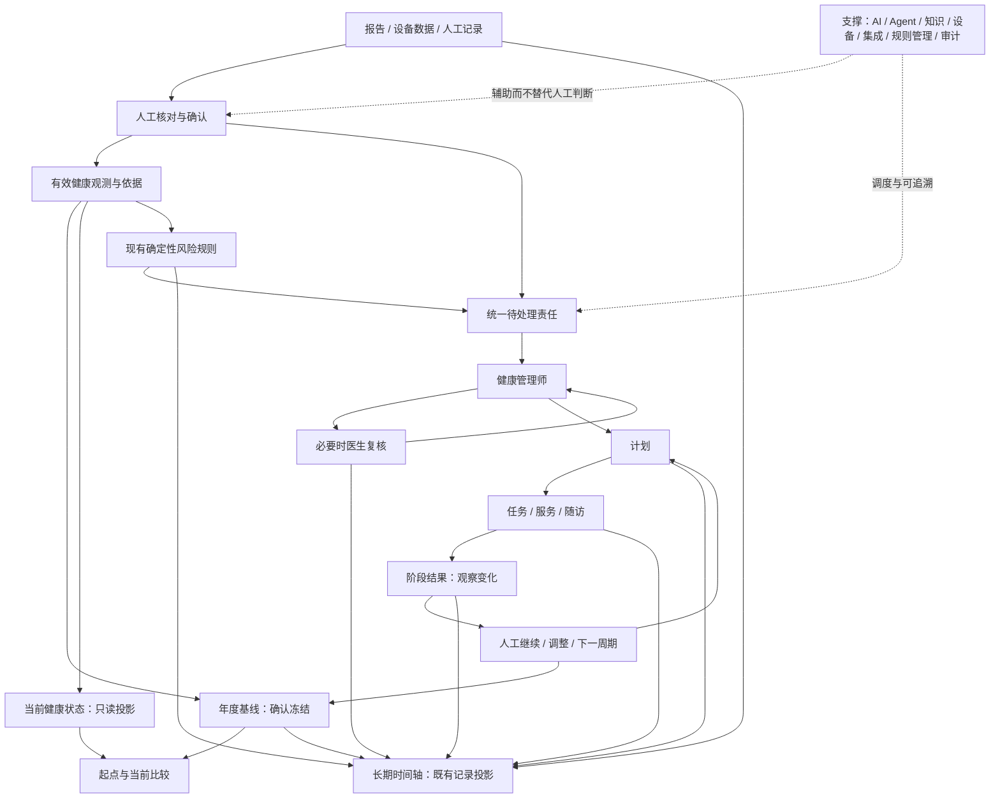

# Product Object Relationships

```mermaid
flowchart TD
  R[报告 / 设备数据 / 人工记录] --> C[人工核对与确认]
  C --> O[有效健康观测与依据]
  O --> B[年度基线：确认冻结]
  O --> H[当前健康状态：只读投影]
  B --> D[起点与当前比较]
  H --> D
  O --> K[现有确定性风险规则]
  K --> W[统一待处理责任]
  C --> W
  W --> M[健康管理师]
  M --> Q[必要时医生复核]
  Q --> M
  M --> P[计划]
  P --> T[任务 / 服务 / 随访]
  T --> U[阶段结果：观察变化]
  U --> N[人工继续 / 调整 / 下一周期]
  N --> P
  N --> B
  R & B & K & Q & P & T & U --> L[长期时间轴：既有记录投影]
  S[支撑：AI / Agent / 知识 / 设备 / 集成 / 规则管理 / 审计] -.辅助而不替代人工判断.-> C
  S -.调度与可追溯.-> W
```

箭头表示读取/人工业务衔接，不表示自动覆盖或自动诊断。Baseline与Current并列比较；Current永不覆写已确认Baseline。Work Item、Current、Timeline均不是新事实表。下一年度基线由已有人工确认流程建立。
