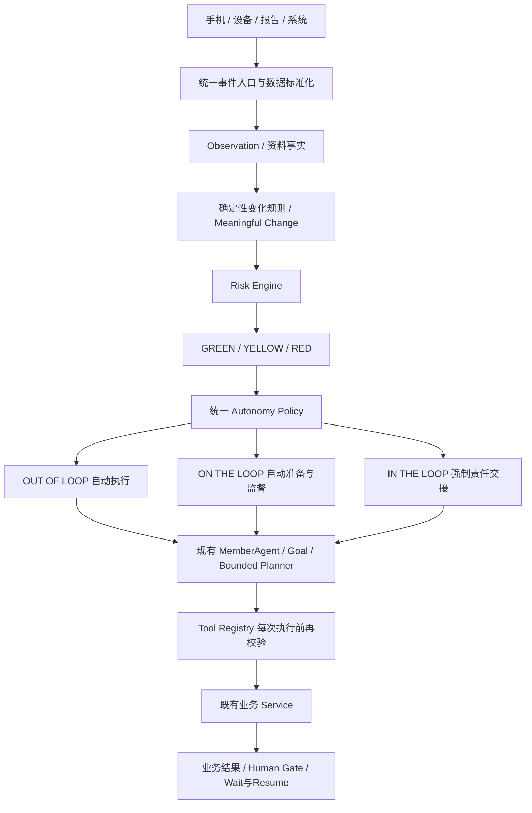

# 确定性风险驱动的自主权限

本轮基线：`0fb17b87d4db47f0fcca09618184690faf033e4c`。
备份：`backup/pre-autonomy-policy-refactor`。不修改风险阈值，不引入模型分级或第二套运行时。

## 健管实际会看到什么

| 正式风险 | 自主模式 | 自动做什么 | 何时找人 |
|---|---|---|---|
| GREEN | Out of the loop | 核对资料、当前阶段、既有安排与医生结果；完成批准范围内的运营核对，记录结果 | 工具本身要求批准、输入不足或重试耗尽时 |
| YELLOW | On the loop | 先核对来源、既有安排和医生结果；准备可追溯的处理上下文 | 需要联系会员、确认安排、解决冲突或管理判断时 |
| RED | In the loop | 仍可读取证据、整理历史、按规则准备医生复核 | 责任分流明确为健管、医生或优先人工；高影响推进被阻止 |

GREEN 不代表所有既有人工作业都可以取消。电话沟通、医生判断、阶段确认仍保留本来的责任。系统不能声称已经打过电话。只有确属系统核对、关联有效已确认方案的任务才能自动关闭。

未产生正式风险的资料初评，继续走原有有来源预填与例外处理；没有 RiskEvent 不等于已经评估为 GREEN。提取置信度不能代替正式风险。

## 简单架构

原始测量只标准化入 Observation，不直接评估每条风险、不调用模型、不唤醒 Agent。聚合变化事件去重后，以归属该会员的最新真实测量调用现有 Risk Engine；Risk Engine 自己检查单位、上下文、审核规则及时间窗。事件保存评估回执，重复投递不重复评估或创建 Goal。

## 权限与来源

统一 `AutonomyPolicy` 输出 AUTO_EXECUTE、AUTO_WITH_OVERSIGHT、REQUIRE_MANAGER、REQUIRE_DOCTOR 或 BLOCK。工具声明 AUTO_SAFE、AUTO_GOVERNED、MANAGER_REQUIRED、DOCTOR_REQUIRED、FORBIDDEN。原有权限是下限；风险级别不能绕过权限。

- 正式风险从当前会员持久化的未关闭 RiskEvent 读取，多个事件取最高级别；不读取模型回复中的 `risk_level` 或 confidence。
- 工具执行结果不能改风险等级。没有注册诊断、处方、改药、任意 SQL 工具。
- `request_doctor_review` 是资料交接工具，不是诊断工具。只有确定性责任分流为 DOCTOR，或现有明确健管批准，才可执行；复用 RiskOperationsService 和 DoctorReview。
- GREEN 自动创建随访须关联该会员当前年度有效、已有人工批准或医生来源的 ManagementPlan；否则仍需本步骤明确人工批准。在输入里写“已批准”无效。批准记录绑定原 PlanStep，不会重启后丢失或授权到其它工具。
- `execute_approved_plan_check` 只接受既有系统责任任务、指定核对来源和真实批准方案。复用 TaskTransitionService，不自动完成电话沟通或风险任务。
- `start_next_phase` 仍需健管；未解决 RED 时不能借此推进下一阶段。
- 旧体检流程的健管批准可跨医生等待保留。后续提醒执行前验证同 Goal 的批准记录、PlanStep 中绑定的医生单，以及已确认的医生结果，不借用其它会员或无关流程的批准。

## 有限推进与人工队列

复用 DAILY_CARE 的有限计划：核对当前阶段 → 核对开放事项 → 核对医生意见 → 决定等待对象或完成。没有自由规划或新增 worker。

GREEN 核对有明确“无需进一步人工行动”结果时完成 Goal，长期 MemberAgent 保留。已批准系统核对到期时可以自动完成实际任务并留下来源与结果。

YELLOW 完成安全准备后才等待健管。RiskEvent 自己就是唯一人工事项；不再为同一风险重复创建“核对变化”Task。后台准备重试期间不提前展示普通 YELLOW 待办。

RED 使用 ResponsibilityRouter，按确定性事件中的规则路由选择 MANAGER、DOCTOR 或 ESCALATE。RED 不一律等于医生，也不一律显示紧急拨号。既有紧急路由保留；医生路由清楚显示等待医生。

医生返回通过 SYSTEM HealthEvent 找回绑定的原 Goal，校验原等待的医生单再 resume。医生服务产生实际后续任务，Agent 等健管执行。风险不会因医生摘要、模型文案或 Goal 的变化而自动降级。

风险关闭继续由既有服务记录原因、结果、时间、操作者及原始证据。YELLOW/RED 的 NEW、ACKNOWLEDGED、IN_REVIEW、ESCALATED_TO_DOCTOR、FOLLOW_UP、CLOSED 等状态继续复用。人工关闭后，既有 worker 对原等待做续行核对并完成 Goal，不另开目标。

## 失败和恢复

每次关键 Tool 调用保存 `autonomy_decision`：风险引用、风险等级、自主模式、工具、决定、原因码、责任角色、策略版本、风险规则版本。工具结果引用与执行时间仍使用现有 `tool_execution` Trace。没有思维链。

权限等待不是故障，不计入失败重试。自动执行异常使用现有最大重试配置与持久化下一检查时间；超过上限生成明确人工注意事项。风险已有人工责任时复用它，避免再造任务。进程重启不会丢失决策、原 Goal、医生单或等待对象。

文件解析、LLM、网络请求和长计算不得持有 SQLite 写事务。资料解析继续使用现有分离执行协议；新增策略评估只读，审计写入在外部执行完成后进行。

## UI与验收

仍为原有六个健管导航、Member360 五个 Tab、Soft Neumorphism 和表格工作区。

- 今日工作：RED 优先；复用筛选增加“需关注”；右侧仅一行自动管理概况。
- Member360：简短管理状态。RED 替换当前行动，显示负责人和等待对象，隐藏无关快捷安排。
- 管理员自动化运行：原工具表增加自主权限；查看最近决策、版本和过去24小时运行计数。
- 普通页面不展示 Goal、Tool、策略 ID 或事件 JSON。

自动验收使用已完成入组的合成会员和明确标记为 TEST 的非临床规则，不修改正式数据库。GREEN / YELLOW / RED 的新增人工事项分别为 **0 / 1 / 1**。100 条设备原始测量写入 100 条 Observation，唤醒 **0** 次；同一窗口变化事件唤醒 **1** 次，形成 **1** 个目标。

真实 Chromium 验收从首页点击进入会员及各 Tab，覆盖今日工作、“需关注”筛选、三种管理状态、当前责任动作、医疗、医生和管理员自动化。截图与验收记录位于 `docs/images/autonomy-policy/`。

测试覆盖：风险模式、工具权限下限、模型无法设置/降低风险、准备先于交接、单一人工事项、RED优先排序、医生原目标续行、批准计划检查、失败重试上限、持久化策略版本、授权关闭续行、原始设备零唤醒。保留原有 Intake、统一事件、长期 MemberAgent、医生边界与业务回归测试。

补充边界：风险评估发生在变化事件唤醒会员前；外部输入不能伪造风险评估回执。尚无年度方案时也不能丢弃正式风险。GREEN 不需要的人工关卡明确标记跳过，不伪造人工批准。普通非风险任务保留原有逾期优先排序，只有正式 RED 获得强优先。

医生端真实点击“提交判断”后，隔离数据库验证：原 Goal 数量仍为 1，状态转为 WAITING_MANAGER，RED 保持不变，新增原 Goal 的 resume Trace。详见 `docs/images/autonomy-policy/doctor-return.json`。

旧医生结果不解除新风险：每个 Goal 保持原风险和医生单的绑定；工具策略仍读取会员当前最高未关闭风险。新 RED 的医生单必须得到它自己的判断，不能复用旧事项的意见作为放行依据。

## 最终验收结果

2026-10-01，最终代码全量 `pytest -q --tb=short`：**1037 passed / 0 failed**（13 条依赖弃用等警告）。新增自主策略回归与既有 YELLOW 闭环定向检查：33 passed / 0 failed。

真实 Chromium 151.0.7922.34、1440×900：三种风险会员、今日工作筛选、Member360 概览/管理/医疗、医生提交、管理员决策视图均通过。医生提交后原 Goal 恢复，未创建第二个目标。GREEN/YELLOW/RED 新增人工事项为 0/1/1。

正式本地服务已加载本轮代码，保留原数据库；Streamlit 8501 和 FastAPI 8000 健康检查均为 200，worker 正常。Chromium 再次打开 8501 并点击今日工作，无页面异常。无新增一级菜单，未修改视觉 Token，未 push。
