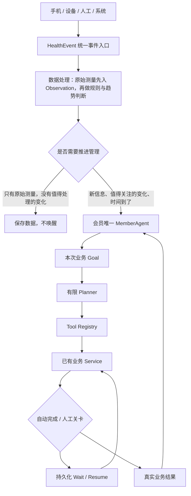

# 会员长期健康管理运行主干

基线：`387e663a172e297d96cf7d47c0a4bc27c9e42907`。沿用既有 V7 信息架构、Soft / Restrained Neumorphism、数据库、业务服务、Agent supervisor、worker 和本地模型客户端。

## 事件与会员身份

- 每会员只有一个持久化 MemberAgent。入组服务自动建立，不存在用户手工启动入口。
- HealthEvent 是统一入口；MANUAL、MOBILE、DEVICE、SYSTEM 共用会员绑定和幂等规则。
- 资料、医生结果、工作结果、事项完成、时间到期都回到事件入口。原医生流程按明确的 review/goal 关联恢复，不猜测最近目标。
- 统一上传优先完善初评。已经完成初评来源核对、包含测量候选的体检文件继续交给既有体检后流程；正式测量仍由原报告确认服务处理。
- 原始测量只经过标准化写入已有 RawData / Observation。固定规则窗口满足条件后才形成一个 Meaningful Change。LLM 不接收逐条设备流，也不决定正式风险。

## 有限计划与工具

原 Profile Intake / Post-checkup 继续使用原策略。新增有限的到期核对、结果整理、阶段复盘模板，复用原 AgentPlan / AgentPlanStep。

计划最多 12 步，只允许模板中的工具和顺序。人工关卡不可被计划草稿删除。规则明确的恢复、到期和阶段汇总不调用模型。自由文本结果使用现有 LocalLLMClient；本轮没有第二套模型配置。

注册表统一暴露会员档案、测量、年度基线、阶段、开放事项、日志、服务与医生意见读取，以及管理事项、随访、复查、服务申请、管理日志、事项完成、医生请求和阶段推进服务。

| 责任等级 | 约束 |
|---|---|
| READ_ONLY | 只读业务资料；调用审计不改变医疗事实 |
| AUTO_WRITE | 有业务来源的内部跟进、日志等有限操作 |
| MANAGER_CONFIRM | 正式安排、处理结果确认、阶段推进必须有健管确认 |
| DOCTOR_REQUIRED | 医学决定保留在 DoctorReview，不能由自动工具代做 |

历史医生请求工具仍保留其既有较严格的健管审批规则，不因本轮降低权限。没有诊断、处方、改药、自由 SQL、风险降级工具。知识工具默认未启用，不产生虚构检索或引用。

Agent 策略通过注册表调用 Service 写业务数据。Goal、Plan、租约、Trace 的数据库操作属于运行时状态持久化，不是绕过 Service 写健康档案。

## 等待、到期和恢复

WAITING_MANAGER / WAITING_DOCTOR / WAITING_MEMBER / WAITING_TIME / WAITING_INPUT 均持久化。等待不占 worker，恢复检查事件类型和原事项来源。待人状态停止 spinner。

现有 worker 查询已到期的随访、复查、预约与阶段，不对全量会员调用模型。时间事件以事项和实际到期时间去重；改期后的旧事件不能重复安排工作。到期 Goal 关联原事项，Today 不新增第二条同义待办。

自然语言整理使用租约与所有权令牌。提交租约后释放数据库事务，再调用模型；结果写入前核对令牌。崩溃后租约到期可重新执行，取消或接管后的旧结果不能回写。连续执行异常达到上限后停止并保留人工核对入口。

工具的成功结果、业务写入和幂等记录同事务提交。显式幂等键不能被不同输入复用；未显式提供的历史幂等写工具按计划和输入摘要去重。失败回滚不保留半套业务副作用。

## 自然语言结果与医学边界

当前事项只填写一次原文。助手提取有逐字依据的生活方式候选及原文明确提到的后续日期、项目。没有日期不会猜日期，没有提及的事实不会补成“无”。

相对日期以会员所在时区的记录日期为准。只有日期而没有时刻的管理安排使用该时区上午 9 点，再标准化为 UTC 保存；不依据服务器所在日期推断。原文没有随访意图时，不能把复查额外改写成一条随访。

保存前显示准备更新的日志、候选和安排，由健管确认。生活方式候选保留为来源绑定的工作资料，**不会静默覆盖正式健康档案**。复查意向只有能关联明确的医生复查建议时才建立正式复查；否则建立核对医疗依据的协调事项。风险与医学判断继续走现有流程。

## 三层记忆与审计

1. 事实：直接读取 HealthAssessment、Observation 及既有健康档案，不复制到新记忆表。
2. 工作：读取当前 Goal、步骤、等待信息和工具结果引用。
3. 长期运营上下文：在既有 Trace 保存带日志来源与时间的夜班、出差、联系困难等运营提醒，不能当作医学事实。

管理员在既有“自动化运行”查看身份、流程、事件、工具、等待恢复和模型状态。普通业务页面只显示中文触发原因、当前步骤、所需人工动作与下一步。Trace 不记录隐藏思维链。

## 设备适配边界

`MeasurementEnvelope` 定义会员、来源、厂商记录标识、指标、值、单位、带时区的发生时间。Adapter 负责身份绑定和厂商格式转换，然后调用 `ingest_measurement`，进入同一个 HealthEvent / Observation 链路。

未实现真实厂商连接、Apple Health、RAG、聊天、多 Agent 协作和商业模块。生产身份鉴权仍沿用项目既有边界，本地角色切换仅用于演示。

## 验证入口

- `scripts/eval_ai_native.py`：核心运行时回归集。
- `tests/test_ai_native_completion.py`：工具、计划、等待、结果解析、幂等、事务、设备和阶段闭环。
- `tests/test_health_event_runtime.py`：事件入口、身份唯一、原医生目标恢复及历史兼容。
- `scripts/qa_ai_native_*.py`：隔离合成数据库的真实 Chromium 故事。

本地 checkpoint：`backup/ai-native-phase-b`、`backup/ai-native-phase-c`、`backup/ai-native-phase-d`、`backup/ai-native-phase-e`、`backup/ai-native-phase-f`。正式 Demo 数据库保留，不重建。
