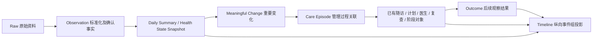

# 纵向健康管理时间轴

入口：**会员 → 点击会员 → Member360 → 历程**。

V2 基线 HEAD：`ea6c2faa5808476ad07bb3c70d2fd2a321e56b5f`。备份分支：`backup/pre-longitudinal-timeline-v2`。没有新增一级菜单或 Member360 Tab；保留现有 Soft / Restrained Neumorphism。

## 从数据到历程



**Timeline != Memory**：时间轴展示已经留存的状态、变化、行动和结果，不自动形成长期推断或个人响应模式。

**Timeline != Trace**：时间轴回答“会员发生了什么”；Trace 回答“系统如何执行”。普通页面不展示内部标识、工具调用、提示词或 JSON。管理员原有 Trace 能力保留。

## 数据职责与复用

| 对象 | 实现与来源 |
|---|---|
| HealthStateSnapshot | 只读类型化投影，复用 HealthAssessment 版本、DailyHealthSummary / DailySummaryRevision、有效 Observation、当前目标及阶段；没有复制原始测量的新表 |
| TimelineEntry | 统一时间、类型、两轨、状态、目标/阶段/管理过程关联、来源和详情定位；页面不直接查询各业务表 |
| CareEpisode | 轻量引用投影，不复制任务、意见或结果。优先沿已有 RiskEvent → Task → ManagementLog / DoctorReview → RecheckPlan 关系连接 |
| 显式补充关联 | `link_care_episode` 将经过责任人确认的类型化引用追加到现有 HealthEvent，类型为 CARE_EPISODE_LINK；保留版本和前版引用，无自动化事件类别，不唤醒会员 Agent |
| Outcome | 使用真实 OutcomeEvaluation；既有结果服务接受可选 `care_trigger_id`，记录结果时同时保存明确关联 |

关联服务核对同一会员、正式医生意见状态、责任角色与归档保护。重复相同引用不产生新版本。不按日期相近或同一年度计划推断干预因果。历史无明确关联时，保持独立结果或“结果待观察”。

快照支持年度基线、每日摘要、重要变化、阶段复盘、医生决定和当前状态。每日摘要通过 `daily_snapshot` 读取原有确定性结果，普通日常摘要不进入主节点。时间轴不触发每日计算，不扫描 Raw，不调用 LLM。

## 展示规则

- 默认最近365天、最多10个重要事件组，日期在左、垂直主轴在中、内容在右。当前状态始终最后。所有连接为CSS水平/垂直实线和90°分支，无SVG曲线、Bezier或弯曲虚线。
- 筛选只有全部、健康变化、管理行动、医疗、阶段。查看更早记录逐次扩展历史范围。
- 有效年度基线、重要变化、正式医生意见、阶段复盘、结果和当前状态可见；普通 Observation、原始设备记录、每日无变化摘要不会单独铺成主节点。
- 初始评估与年度基线分别命名，草稿医生意见不展示。风险流程关闭写成“风险事项已关闭”，不声称指标恢复。
- 当前状态通过逐指标索引查询获得最新有效值，注明记录日期；与同单位年度基线比较，目标进度复用确定性 `progress`；近7日睡眠来自每日摘要的有记录天数均值，缺测不补零。
- 当前状态保留实际开放风险。即使睡眠观察值有所改善，未经责任流程关闭的关注事项仍显示“需关注”。
- 详情包括当时状态、当前/前值/均值/年度基线、触发依据、关联目标、已留存的自动处理、人工及医生记录、后续结果、数据来源。
- 查看指标趋势切到原有“健康档案 → 健康数据”，不增加图表实现或新入口。
- 无足够数据时只显示等待资料逐步形成历程的空状态。

## 来源与历史真实性

变化节点读取产生变化时的日摘要版本，保留原事件比较值；不使用今天重算的数值冒充当时值。来源详情可查看原测量文字、确认值和保留的修正前记录。已有医生确认记录和正式用药记录才具有医疗来源归属；不从健管自由文字推断医生调整用药。

历史用药的未留存剂量变更、未版本化计划的旧内容、未记录的会员反馈，无法从今天的当前值可靠重建。投影不会补造这些历史。正式用药计划的开始/结束日期可形成节点；没有明确变更记录时不推断剂量调整。

结果结论只使用已经明确记录的改善、稳定、恶化、数据不足等状态。尚无结果则显示“结果待观察”。观察结果与行动的关联是管理过程关系，**不是干预疗效的因果证明**。

后续结果还受发生时间约束：9月1日的睡眠改善可关联8月的随访，但不能算作9月15日医生决定的后续结果。该医生节点仍显示“结果待观察”，先前改善仍保留在同一事件组的有日期观察结果中，不归因为后来的医生决定。

## 性能与权限

读取已有摘要、事实和业务对象，不重新聚合原始设备流。每类业务对象最多读取最近 500 条，并提示截断；主轴默认展示10个重要事件组，优先重要变化、年度基线、观察结果与当前状态；“查看更早记录”继续显示同一窗口内未展示的组，再扩展历史范围。单指标最新值采用索引查询；原始来源仅在展开详情时按引用读取。

本次没有数据库迁移、没有正式 Demo 重建。关系补录属于原有业务服务权限边界；查看时间轴不写入业务数据。构建结果与详情均按会员验证，不能通过其他会员的引用读取来源。

## V1 隔离 QA 与复现（历史记录）

`scripts/seed_longitudinal_timeline_qa.py` 只允许在项目 `.runtime` 下创建**不存在**的数据库文件，拒绝正式路径和覆盖。数据是明确通过模型和业务服务写入的合成记录，没有 LLM 故事生成。

```powershell
.venv/Scripts/python.exe scripts/seed_longitudinal_timeline_qa.py --database .runtime/timeline-review.db
$env:DATABASE_URL='sqlite:///file:D:/executive_health_ai/.runtime/timeline-review.db?mode=ro&uri=true'
$env:LOCAL_LLM_ENABLED='false'
$env:PORTFOLIO_DEMO='true'
.venv/Scripts/python.exe -m streamlit run streamlit_app.py --server.port 8511 --server.address 127.0.0.1 --server.headless true
```

先确保 QA 端口空闲。打开后从会员列表选择“纵向历程验收会员”，点击“历程”。另有“历程空状态验收会员”。这个临时实例采用数据库只读连接，不启动 worker。

故事从 2025年10月基线开始，至 2026年10月当前状态；默认视图显示本年度关键记录，更早记录可展开上一年度基线。包括目标确认、计划确认、执行阶段、体重结果、睡眠 YELLOW、健管随访、计划调整、睡眠恢复的观察结果、医生意见、复查安排与阶段复盘。规则标记为隔离 QA 的 TEST 数据，不是临床标准。

截图位于 `docs/images/longitudinal-timeline/`，对应概览、重要变化、管理行动、医生决定、结果、当前状态和空状态。真实 Chromium 从会员列表逐级进入，未使用内部深链接，验证筛选、节点、返回与既有趋势导航。

## V1 回归验证（历史记录）

新增测试覆盖顺序、两轨、重要变化、普通原始记录不成主节点、年度基线、当前状态、目标/风险/随访/医生/阶段/结果关联、待观察、原始来源、只读查询、无需 LLM、日摘要版本、空状态、草稿医生保护、跨会员与角色校验、关系幂等与版本、历史范围、筛选和唯一入口。

旧 V4 数据服务测试保留；3 项 Member360 UI 测试更新为新规格的五类筛选、重跑状态保持及节点展开详情。

```powershell
.venv/Scripts/python.exe -m pytest tests/test_longitudinal_timeline.py tests/test_goal_data_loop.py tests/test_health_timeline_v4.py tests/test_health_timeline_v2.py tests/test_timeline_risk_indicator_separation.py tests/test_baseline_timeline_fix.py tests/test_longitudinal_health_operations.py tests/test_longitudinal_health_intelligence.py tests/test_observation_driven_risk.py tests/test_yellow_risk_operations.py tests/test_vnext_timeline_navigation.py -q
```

验收使用相关回归集合，不以历史全部测试结果冒充本轮执行结果。

最终相关回归：**151 passed / 0 failed**（1条既有测试客户端弃用提示）。Chromium：`151.0.7922.34`。

正式数据库 SHA-256 与工作前记录一致：

- `data/portfolio_demo.db`：`4c5c0d5e67bead4e0f5595f604998aa8000dbeb4a6adc6e09d521bc777c7fa78`
- `executive_health_ai.db`：`f17e079a5c750cb60bbe6341b2781713839dd610d330a177221ce2fac10c2c97`


## V2：为什么按 Care Episode 展示

普通事件日志把睡眠下降、打电话、调整计划、结果返回拆成四个孤立点。
同一管理事件则回答“为什么介入、系统准备了什么、谁作出决定、后来观察到什么”。
V2 继续使用同一个 `LongitudinalTimelineProjection`：`build` 保留原始 TimelineEntry / Snapshot 合约，
`groups` 依据现有 CareEpisode 关联分组，`group_details` 读取有来源的过程详情，`overview` 进行确定性统计。
没有复制业务数据，没有新增表、Memory表或UI专用演示节点。

独立显示年度基线、重要健康变化事件、目标与计划确认、阶段里程碑、独立观察结果、当前状态。
同一事件的随访、医生意见、复查、计划调整和结果进入组内，不再重复占主轴。
没有明确关联的结果保留为独立观察结果，不按时间接近或相同目标强行关联。
只有旧沟通记录的会员使用一个“历史管理记录”组，不把日志伪装为重要健康变化。

## Summary → Meaningful Change → Drill-down

稳定日的Daily Summary留在数据层，不成为主节点，不新增Agent唤醒或LLM调用。
确定性Change Detector已经产生的变化才进入重要事件组。
展开后读取产生变化时的Summary版本和保存的受控lookback，不用今天的数据重写当时判断。
回溯天数、活动、个人基线、目标、日志和医生意见只在存在对应证据时展示；未找到相关记录明确写0条。
不会为了展示“14天回溯”而把实际30天上下文说成14天。

底部“查看相关趋势”切换到现有健康档案趋势组件；“查看数据来源”在原位展开，
可查看原始测量文字、正式医生意见、计划调整、管理记录、结果依据和修正前数据。
不展示Raw JSON、内部主键或技术执行Trace。

## Agent / Human / Outcome 的固定七段

1. 当时的健康状态：目标、阶段、关键指标及基线差值；当前状态还显示开放事项和下一步。
2. 发生了什么变化：当前/前值、7日/30日均值、个人基线、比较窗及触发依据。
3. 系统自动完成：按持久化回溯及获准执行记录说明准备工作。
4. 为什么需要人工：正式风险的核实原因或提交给医生的具体问题。
5. 人工 / 医生做了什么：沿日期排列真实随访、计划、医生意见、复查和阶段记录。
6. 后续结果：独立突出已记录的结果；无数据则“结果待观察”。任务完成不冒充健康改善。
7. 长期管理经验：来源、时间范围和候选状态。

责任使用“系统自动处理”“需要健管”“需要医生 / 优先人工处理”，
医生责任优先读取实际DoctorReview，不能只按风险颜色推断是否找过医生。
顶部按健康状态、管理动作、当前结论三列展示确定性结果和计数。
风险计数按事件而非每个子动作累计，不把同一风险/医生/结果重复计算。

## Timeline 与 Care Memory 的边界

Timeline展示已经发生的过程，Care Memory是可用于未来管理的经验，并非同一个对象。
当前系统尚无正式治理的Care Memory记录；V2 **不写入新Memory，也不把候选当正式健康事实**。
仅在同一事件存在明确计划调整原因时，逐字引用该原因，连同已关联后续观察结果形成
“候选，待后续验证”。显示对应时间范围与来源，缺少依据显示“尚未形成”。
例如小明：已记录“会员夜班导致执行受限”，后续观察到睡眠由5.4h到6.2h。
页面不声称咖啡调整导致改善，也不把夜班永久定性为该会员的医学原因。

## V2 正式小明验收

继续使用现有小明，没有重新seed或新建第二个会员。
正式8501入口：**会员 → 搜索“小明” → 点击小明 → 历程**。
截图位于 `docs/images/longitudinal-timeline-v2/`，包括年度概览、睡眠组收起/展开、
Agent与人工行动、结果与候选经验、医生事件、当前状态。
本轮不迁移、不重建、不写入正式数据库；启动前保留 `.runtime/timeline-v2/before.db` 核对副本。

测试覆盖事件聚合、直线/直角结构、变化与触发关系、系统准备、责任原因、行动、结果、
候选经验的来源/缺失边界、稳定摘要隐藏、医生聚合、当前状态最后、只读与历史会员兼容。
真实Chromium额外验证垂直排列、主轴同一横坐标、没有SVG路径、详情展开及数据来源入口。


V2 最终验证：**127 passed / 0 failed**（两条既有 Alembic 配置弃用提示）。

```powershell
.venv/Scripts/python.exe -m pytest tests/test_longitudinal_timeline_v2.py tests/test_longitudinal_timeline.py tests/test_timeline_existing_data.py tests/test_health_timeline_v4.py tests/test_xiaoming_demo.py -q
```

Chromium 151.0.7922.34 在正式8501从会员列表进入小明，验证10个事件组的垂直顺序、
当前状态最后、无SVG曲线路径、睡眠/医生事件展开、结果/候选经验、原始来源展开。
真实点击“查看相关趋势”后，现有趋势组件选中睡眠，并显示事件前14天至该事件最新关联记录的时间范围。
未新建图表；趋势中不会默认用今天的近期数据替代历史事件。

正式数据库81张表全部既有记录的逐行哈希与开工核对副本一致：15位会员、7654条Observation、
7487条RawData，未重新seed、未重建、未迁移。8501健康检查和8000/docs均返回200。
机器可读验收记录见截图目录内的 `browser-verification.json` 与 `data-preservation.json`。
