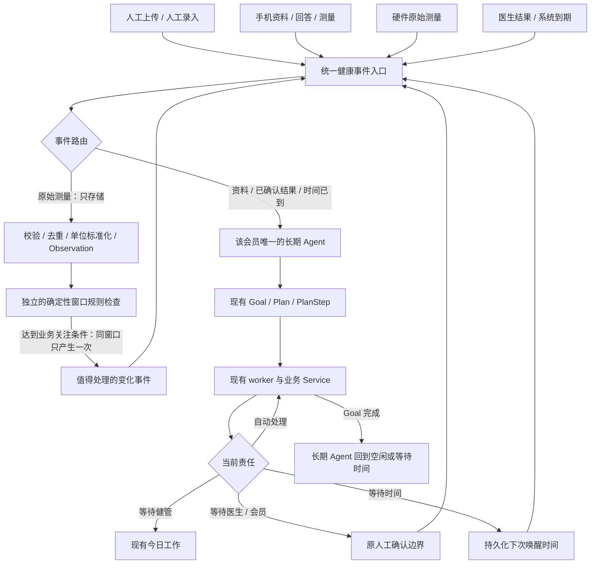

# AI Native Phase 1A：统一入口与会员长期主体

开始基线：`2e28cb7`。备份：`backup/pre-ai-native-phase1a`。

现在先记录“发生了什么”，再判断要不要处理。资料来源增加时，接入同一个入口，不再为每种设备建立一个 Agent。每位进入长期管理的会员有一个持久身份；它平时不占用执行线程，具体工作仍交给现有 Goal 和 worker。



## 复用关系

| 对象 | 本轮职责 | 没有替代什么 |
|---|---|---|
| HealthEvent | 扩展既有 `health_events` 为统一事实收件记录 | 既有手术、住院和生活事件全部保留 |
| MemberAgent | 每会员一个身份、当前 Goal、等待对象、下次唤醒时间、活动时间 | 不建立第二个执行引擎，不限制会员只能有一个业务 Goal |
| EventRouter | 只读选择 IGNORE / STORE_ONLY / WAKE_MEMBER_AGENT / RESUME_CURRENT_GOAL / CREATE_GOAL | 不解析文件、不作医学判断、不执行 LLM |
| HealthOpsAgentSupervisor | 继续执行已有受限业务策略 | 不建立通用 Planner |
| AgentEvent | 已有流程内部的兼容投递与审计收据 | 外部来源不能直接绕过统一入口唤醒已接入的流程 |
| AgentSchedulerService | 消费待处理事件、到期事件及已有执行工作 | 不增加第二个 worker |
| RawData / Observation | 设备及手机测量的原始数据和标准值 | 不复制 Health Record |

旧 HealthEvent 的 `event_category` 为 NULL，仍按原医学/生活历程展示；不自动回放为新事件。统一运行事件不混进普通会员的医学历史列表。医生意见、文件来源和原业务审计继续保留。

## 统一入口

`services.health_events.ingest_health_event(session, ...)` 是内部可信 Service 接口。人工、手机、设备、系统使用相同参数和事务契约。Phase 1A 不开放未经认证的公网接口，不连接设备厂商或手机健康平台。

必填：`member_id`、`event_type`、`event_category`、`source_type`、`source_id`。

可选：`occurred_at`（带时区）、`payload_ref`、`correlation_id`、`idempotency_key`、`dispatch`。事件生成 `event_id`、`received_at`、`status`；处理后记录 `route_action` 和实际 `goal_id`。`event_id/member_id/occurred_at` 分别兼容原表的 `id/patient_id/start_at`，没有平行事件表。

四种来源：MANUAL / MOBILE / DEVICE / SYSTEM。三个唤醒分类：NEW_INFORMATION / MEANINGFUL_CHANGE / TIME_DUE。未知但合法的信息类型只存储，不凭一个名称随意创建业务目标。

本轮实际接入：

| 业务事实 | 路由和能力 |
|---|---|
| HEALTH_DOCUMENT_UPLOADED | 统一事件 → 会员身份 → 原 Profile Intake；相同资料复用同一 Goal |
| CHECKUP_REPORT_UPLOADED | 统一事件 → 会员身份 → 原 Post-checkup |
| DOCTOR_REVIEW_COMPLETED | 必须是 SYSTEM、正式确认、同会员；按 review 关联找到原 Goal 并继续 |
| TIME_DUE | 未来时间只保存并更新 next_wake_at；到期由现有 worker 唤醒。既有 REVIEW_DUE 继续原目标；无已接业务目标的合成到期事件仅唤醒检查 |
| DEVICE_RAW_MEASUREMENT / MOBILE_RAW_MEASUREMENT | 原始数据 → 现有标准化 → Observation → STORE_ONLY，不创建 Goal/Task，也不增加唤醒次数 |
| MEANINGFUL_CHANGE | 确定性规则生成 SYSTEM 事件 → 唤醒一次。Phase 1A 只建立唤醒检查，不自动诊断或新建医学任务 |

现有上传和医生命令保留 AgentEvent 兼容收据；它们在创建或推进 Goal 前必须经过 HealthEvent 入口。尚未列出的旧业务事件暂不迁移，不宣称全平台已经完成事件化。

## 手机 / 设备适配契约

```python
event, created = ingest_health_event(
    session,
    member_id=member_id,
    event_type="DEVICE_RAW_MEASUREMENT",
    event_category="NEW_INFORMATION",
    source_type="DEVICE",
    source_id="bound-device:vendor-record:metric",
    payload_ref={"measurement": {
        "metric": "systolic_bp", "value": 145, "unit": "mmHg",
        "observed_at": "2026-09-29T08:00:00+09:00",
    }},
)
session.commit()
```

适配器必须先校验身份与会员绑定；`source_id` 需要包含稳定设备/厂商记录标识与指标，避免多个设备使用相同记录号。手机同样调用此入口，只替换来源和原始测量类型。原始测量不能把自身分类标成 MEANINGFUL_CHANGE。

标准化复用 `canonical_code`、`normalize_unit`、`quality_for`。无效质量的数值保留质量标记，不参与规则窗口；不支持的字段/单位拒收并回滚整个事件。确定性 `evaluate_window` 使用固定规则、时间窗口、指标和会员作为唯一业务来源，引用真实 Observation 作为依据。示例阈值仅用于合成业务关注条件，不是新增的医疗风险标准。

## 唯一性、生命周期与恢复

- 数据库唯一约束保护 `MemberAgent.member_id`。入组调用现有 `create_program` 时创建；事件处理也能补建旧会员身份。
- 事件同时按幂等键和 `(member_id, event_type, source_id)` 唯一。换一个幂等键重发同一事实也不能重复创建 Goal；不同会员不能复用同一幂等键。
- 同一事务内，事件从 PENDING 原子领取，记录路由、唤醒次数和实际 Goal。失败回滚全部副作用。无效排队事件记录 FAILED 与原因，不阻塞其他会员；非预期故障保留原 worker 日志和重试边界。
- MemberAgent 的七种状态来自原 Goal 状态和到期事件。Goal 完成后身份保留；若还有其他活跃 Goal，继续指向该 Goal。
- 原旧版医生复核通过 PlanStep 结果绑定 review，不再猜测“该会员最近的 Goal”。
- 重启后由原 worker 校准持久身份、处理 PENDING 和到期事件。不扫描并重放旧医学历史。
- 归档会员不再唤醒；已处理历史仍保留。

## 事务与 AI 边界

资料解析继续复用既有 `profile_execution`：短事务领取 → 提交 → 事务外解析/LLM → 短事务核对领取权并写回。

体检摘要和医生意见整理也交给同一个 worker 的 `post_checkup_execution` 阶段：固定任务、原 LocalLLMClient、原输出校验与确定性 fallback。网络请求期间不持有 Session 事务。执行租约和领取标识防止重复 worker 写回；处理期间取消或接管后，过期结果不能恢复旧流程。

正式风险仍由原 Risk Engine 决定。LLM 只能整理已有依据。没有新增 RAG、知识库、聊天、自由规划、真实设备集成或医疗自主决策。

## UI 与人工工作

V7 导航、表格、五个 Member360 Tab、例外处理与视觉不变。共享 AgentProgressPanel 只增加中文“触发原因 / 来源”。执行中的旧 PROCESSING 状态与 RUNNING 使用同一运行展示，不提前显示人工确认操作。

自动执行不新增健管待办；等待健管时使用已有 Today Work 投影。医学等待仍属于医生；原有失败/安全升级的人工处理入口继续保留。

## 验收证据

真实 Chromium：151.0.7922.34，1440×900，从普通首页点击会员、健康档案、今日工作、医生工作台。合成数据库独立于正式 Demo。

- A：已存在身份 → UI 上传问卷 → 统一事件 → RUNNING → WAITING_MANAGER → 今日工作。
- B：体检后 WAITING_DOCTOR → UI 提交医生判断 → SYSTEM 事件 → RESUME_CURRENT_GOAL → 同身份、同 Goal、等待健管。
- C：50 个原始设备事件、50 个 Observation、0 次原始唤醒；同窗口重复规则检查 50 次仍只有 1 个变化事件、1 次唤醒、0 个新 Goal/Task/正式 Risk。
- 迁移副本验证：升级 → 降级 → 升级，12 条原健康事件的全部旧字段完全一致。

截图及可核对的持久化结果：[`docs/images/ai-native-phase1a`](../images/ai-native-phase1a)。测试覆盖 `tests/test_health_event_runtime.py`，并运行全量回归。正式数据库迁移前备份位于本地忽略目录 `.runtime/ai-native-phase1a/pre-migration.db`，不提交健康数据库。
