# AI Native 实际界面

均来自真实 Chromium，1440 × 900；仅使用合成会员。不同图片对应同一故事的不同时间状态。

## 01 今日工作
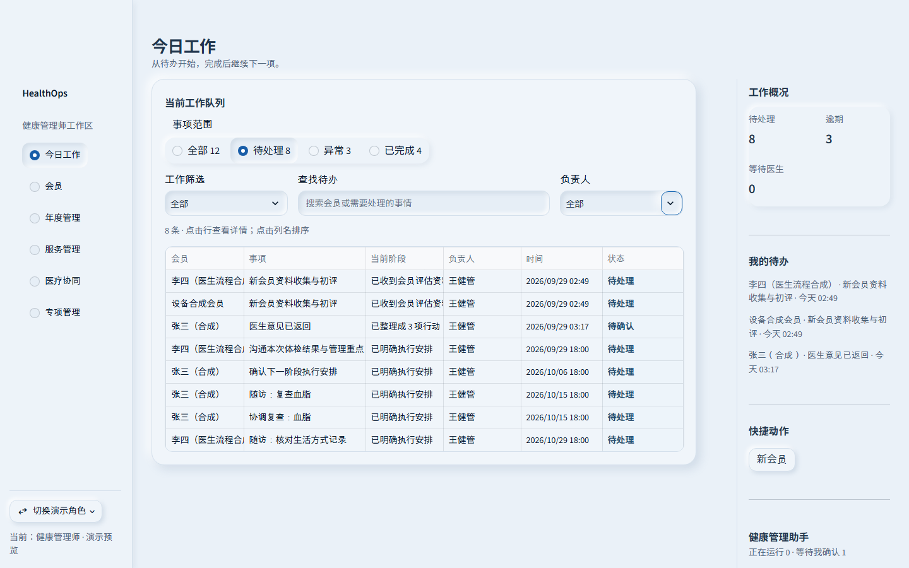

## 02 Member360
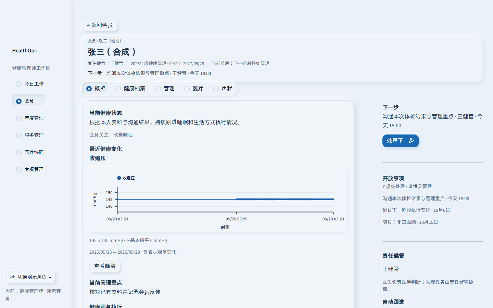

## 03 唯一健康资料入口
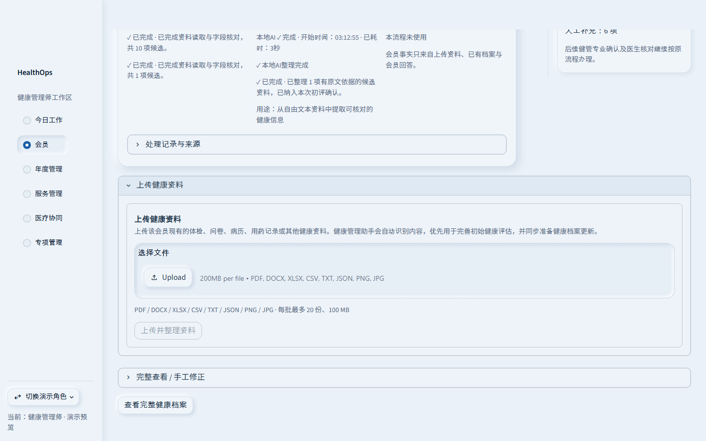

## 04 实际运行与文件进度
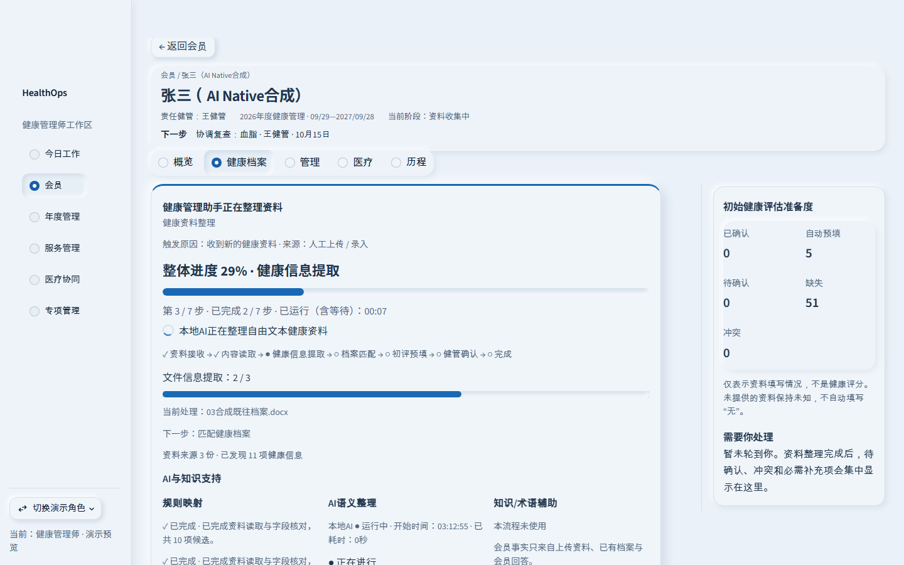

## 05 等待健管，停止旋转
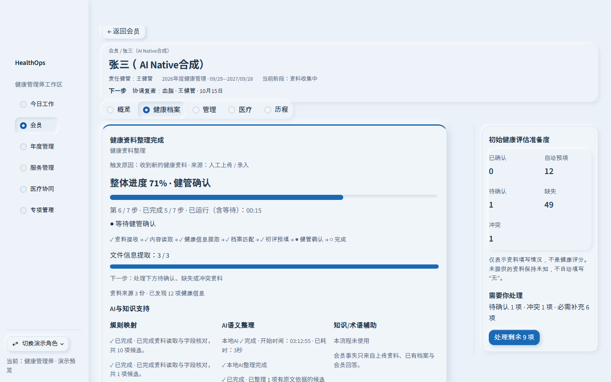

## 06 初评例外处理
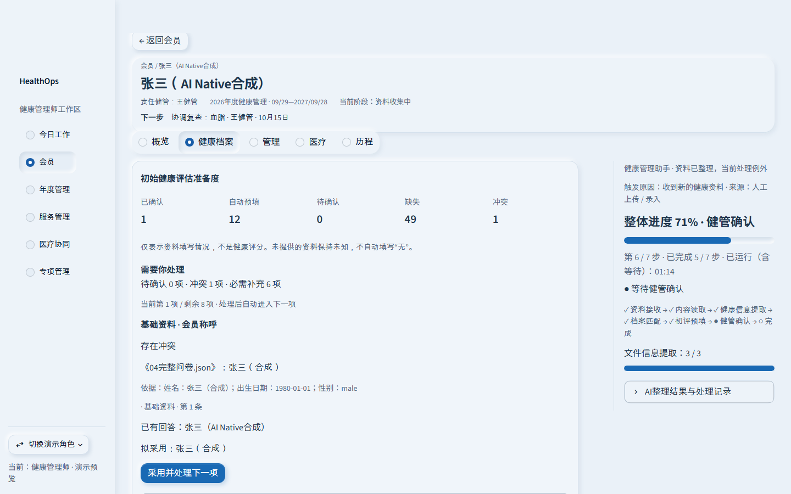

## 07 当前事项的一次自然语言输入
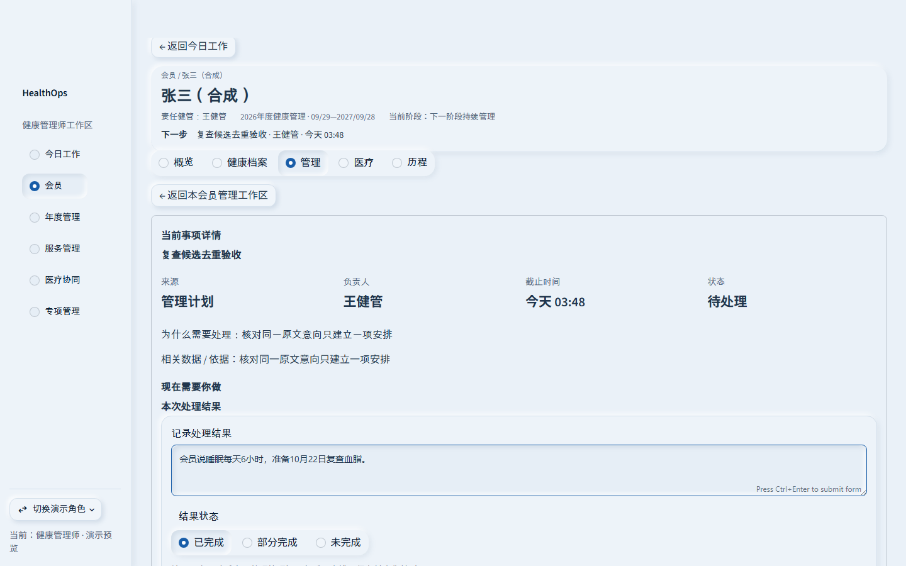

## 08 管理当前阶段
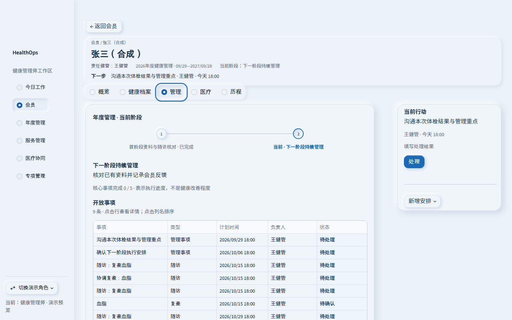

## 09 等待医生
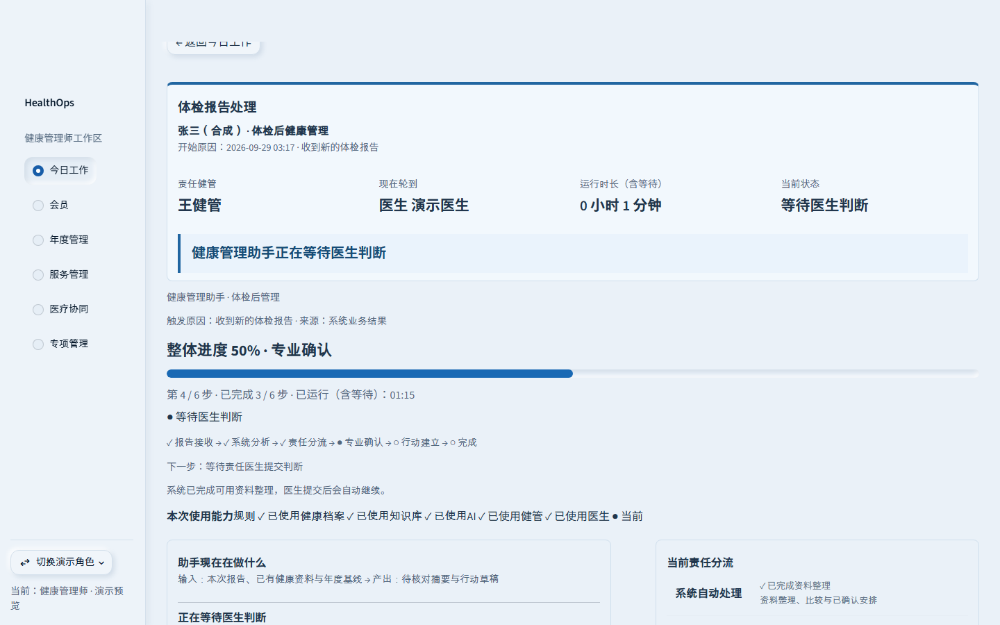

## 10 医生返回，继续原流程
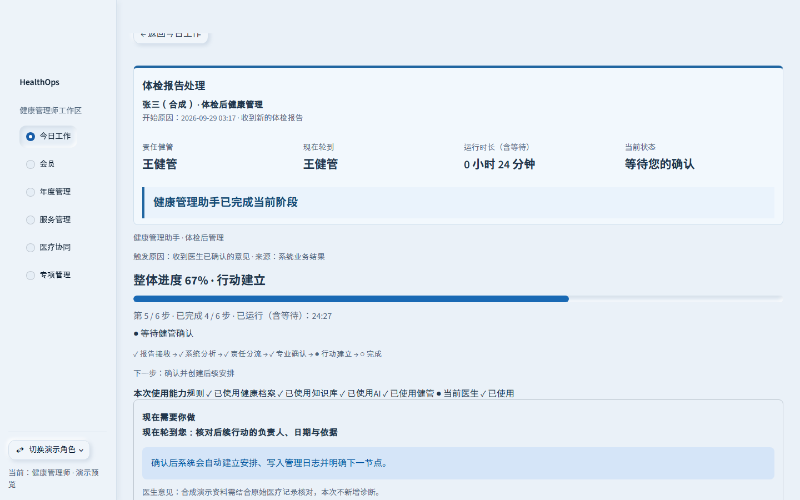

## 11 自动汇总阶段结果，等待确认
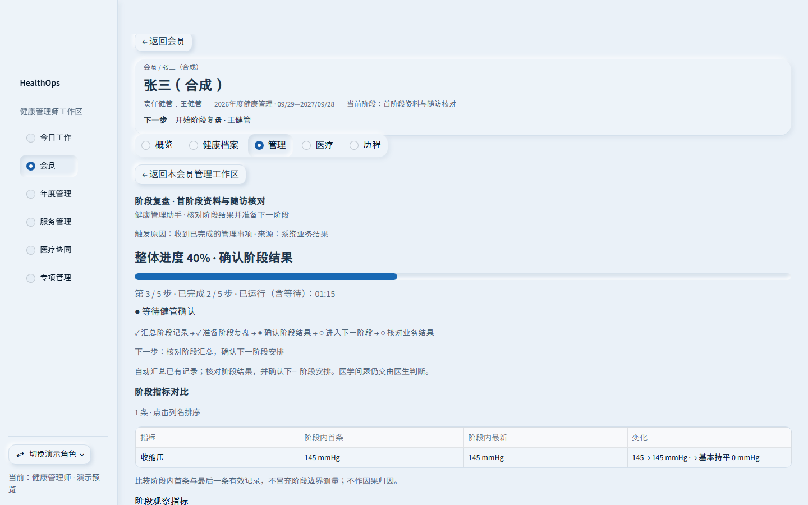

## 12 确认后进入下一阶段的第一件事
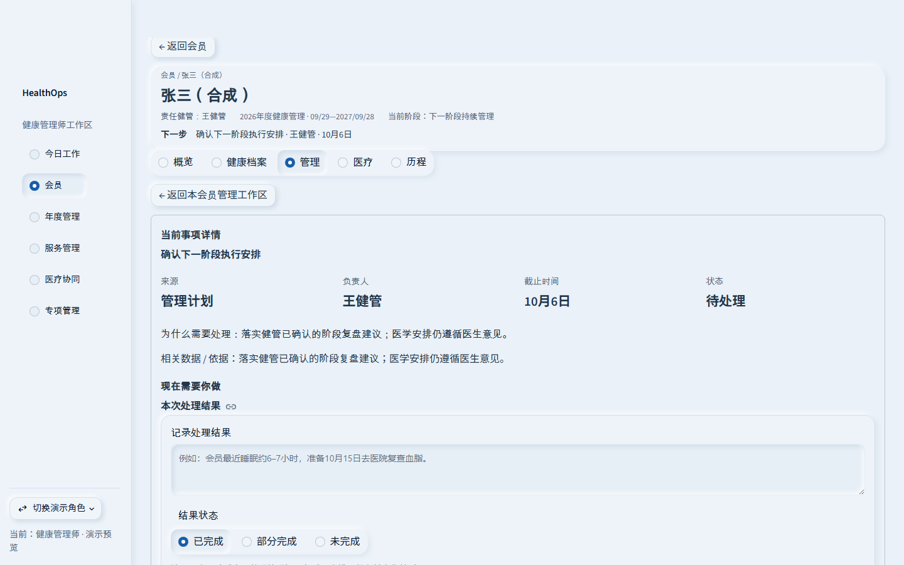

## 13 管理员持久化执行记录
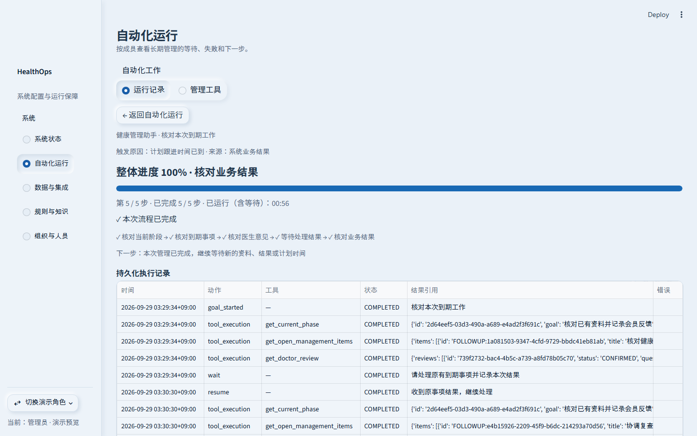

## 14 管理员工具权限与启用状态
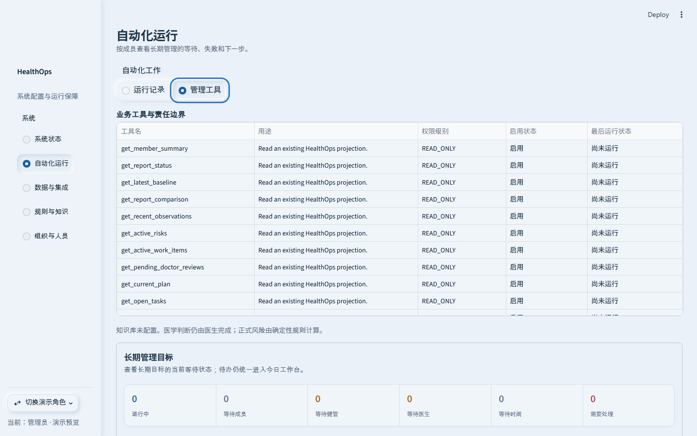
