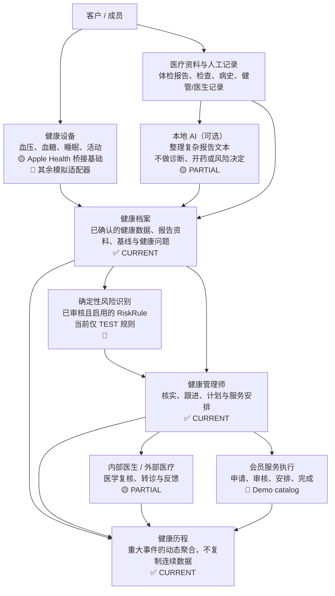

# Executive HealthOps：一页业务总览

> 审计结论：这是一个本地运行、以合成演示数据为主的健康运营原型。AI 仅参与可选的本地报告文本整理；正式风险由确定性规则执行，医疗判断仍由人工承担。

## 业务边界

- **AI 的职责**：当前 `LocalLLMClient` 只由报告解析的语义回退调用；解析候选仍必须人工确认后才会进入标准化健康数据。
- **风险的职责**：`RiskEvaluationService` 不调用 LLM；它仅执行 APPROVED + ACTIVE 的规则，并检查数据质量、设备类别、scope、窗口、去重和冷却期。
- **人的职责**：健康管理师处理 Yellow 事件、任务和服务；医生填写医学意见；外部医疗仅记录人工协调、预约和反馈。
- **时间轴的职责**：把已存在的重大记录投影为健康故事。连续设备读数先进入趋势，再生成月度健康数据总结节点。

## 当前不可误读为生产能力的部分

- 风险规则库当前数据库审计为 **3 条 TEST / 0 条 CLINICAL**；不能代表经过临床治理的规则库。
- Apple Health iOS Bridge 已具备授权、增量同步和上传源码；尚未在 Xcode 或真机验证，不能视为真实设备已连通。
- 服务目录由 `MemberServiceOperations.ensure_demo_plan()` 建立演示金卡计划；不是已接入的真实权益系统。
- 当前无面向成员、健管、医生的登录/RBAC；Streamlit 仅提供开发预览切换。
