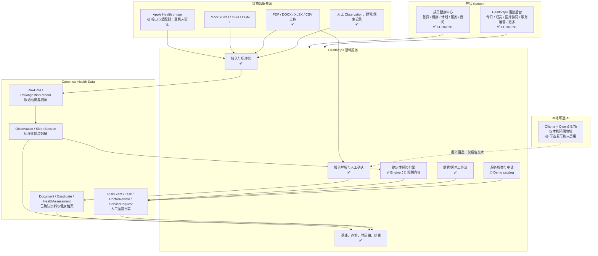
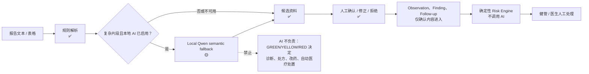

# Platform Overview

## 审计范围与当前证据

| 层 | CURRENT 证据 |
|---|---|
| 产品入口 | `streamlit_app.py` 的 `main()`、`_render_surface_switcher()`。 |
| API | `src/executive_health_ai/api.py` 的 FastAPI `create_app()`；当前注册成员、接入、报告、风险和工作流路由。 |
| 健康数据 | `Observation`、`RawData`、`RawIngestionRecord`、`IngestionJob`、`SleepSession`。 |
| 报告 | `ReportParsingService`、`ReportExtractionRun`、`ReportExtractionCandidate`、`Document`。 |
| 风险 | `RiskEvaluationService`、`RiskRule`、`RiskEvent`、`RiskOperationsService`。 |
| 长期运营 | `HealthAssessmentService`、`HealthTimelineService`、`TimelineV4Service`、`HealthProgram` 等。 |

本地 SQLite 审计快照（不包含个人内容）：1 名成员、5,673 条 Observation、6 份 Document、21 次 ReportExtractionRun、2 个 HealthAssessment、3 条 RiskRule、2 个 RiskEvent、1 条 ManagementSignal、1 个 DoctorReview、0 个 ServiceRequest。RiskRule：TEST=3、CLINICAL=0、APPROVED=3。

## 总架构

## AI 与医疗安全边界

`LocalQwenClient` 会清理常见直接标识并限制为本机环回 Ollama；这不是完整脱敏、访问控制或合规边界。
