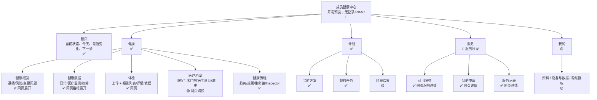
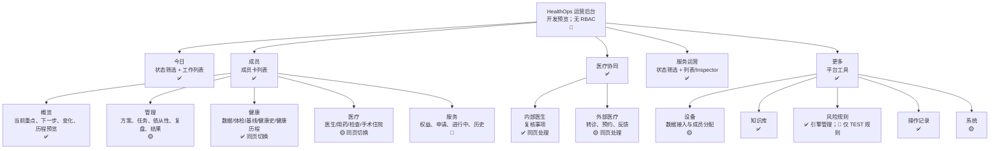

# Product / Page Architecture

来源：当前 `streamlit_app.py` 的 `main()`、`render_member_client_view()`、`render_member_detail()`、`render_more_workspace()`、`render_collaboration_workspace()` 和 `render_service_operations_workspace()`。状态只描述当前代码，不代表生产级身份认证或临床规则就绪。

## 成员健康中心

成员中心的一级导航固定为五项：`首页 / 健康 / 计划 / 服务 / 我的`。图中的第二行是同一业务页内的 Streamlit segmented radio；选中报告、指标、服务、依据或时间轴事件均在当前页面显示，不产生第三层路由。

## HealthOps 运营后台

运营后台的一级导航固定为五项：`今日 / 成员 / 医疗协同 / 服务运营 / 更多`。记录详情、报告依据和服务履约详情采用同页列表 + Inspector / 展开区，不属于新业务导航层。

## 可发现性与状态审计

| 页面/能力 | 代码状态 | 重要现实限制 |
|---|---|---|
| 两级导航约束 | ✅ | Streamlit session state 实现，不是 URL 路由或访问控制。 |
| 报告上传与同页详情 | ✅ | 解析候选确认仍限运营端；成员端可上传和查看已整理结果。 |
| 健康时间轴 | ✅ 动态聚合 | 连续设备读数先进入趋势，仅阶段健康数据摘要进入生命轴。 |
| 医疗协同 | ✅ 内外两类 | 外部医疗以登记、状态与反馈为主，无外部医院系统集成。 |
| 服务运营 | ✅ 同页队列 | 初始权益使用演示服务计划；当前不代表真实履约系统。 |
| 隐私与授权 | 🟡 文案与模型 | 未发现登录、访问控制或可操作授权管理流程。 |
