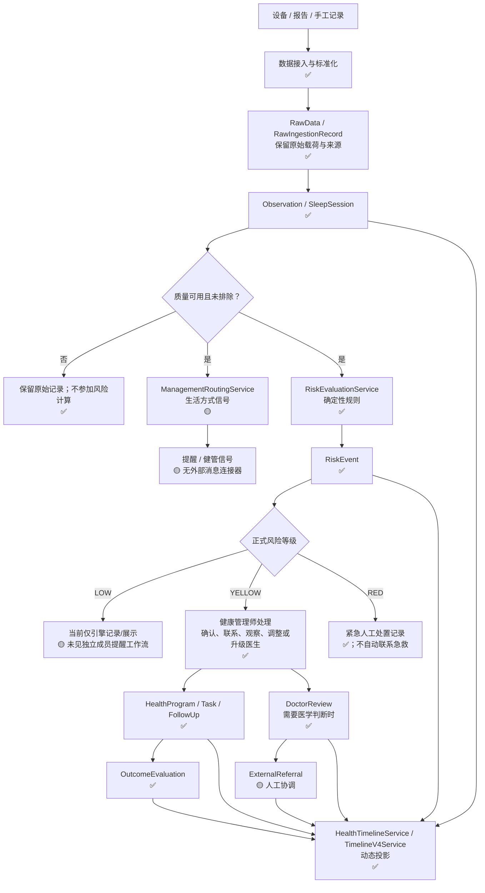
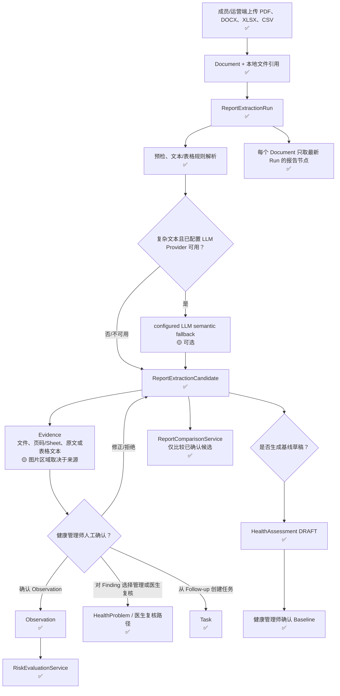
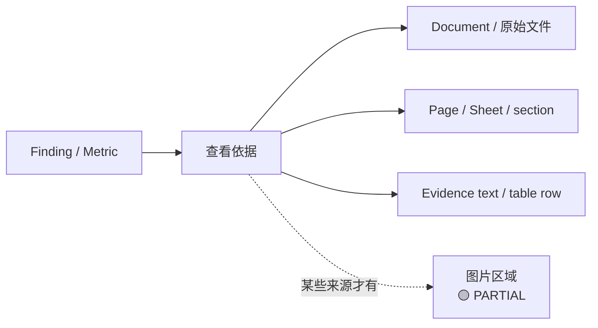
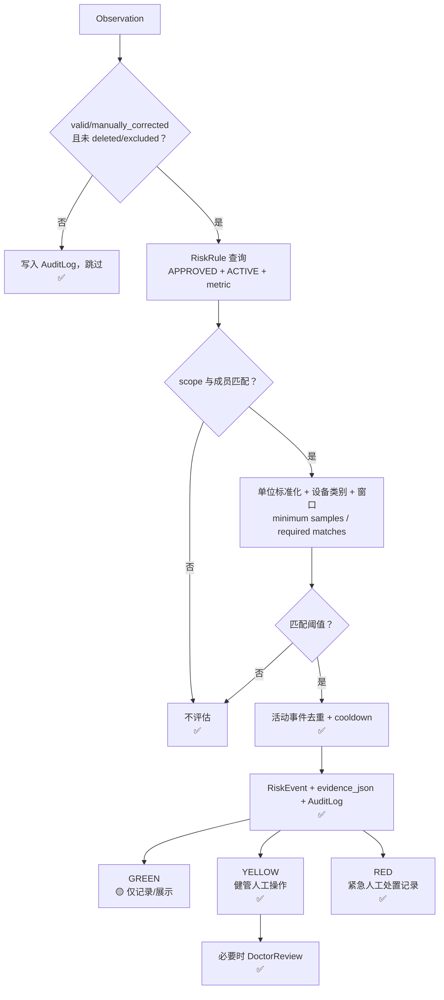
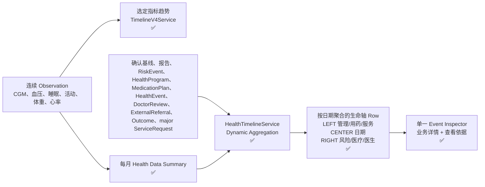
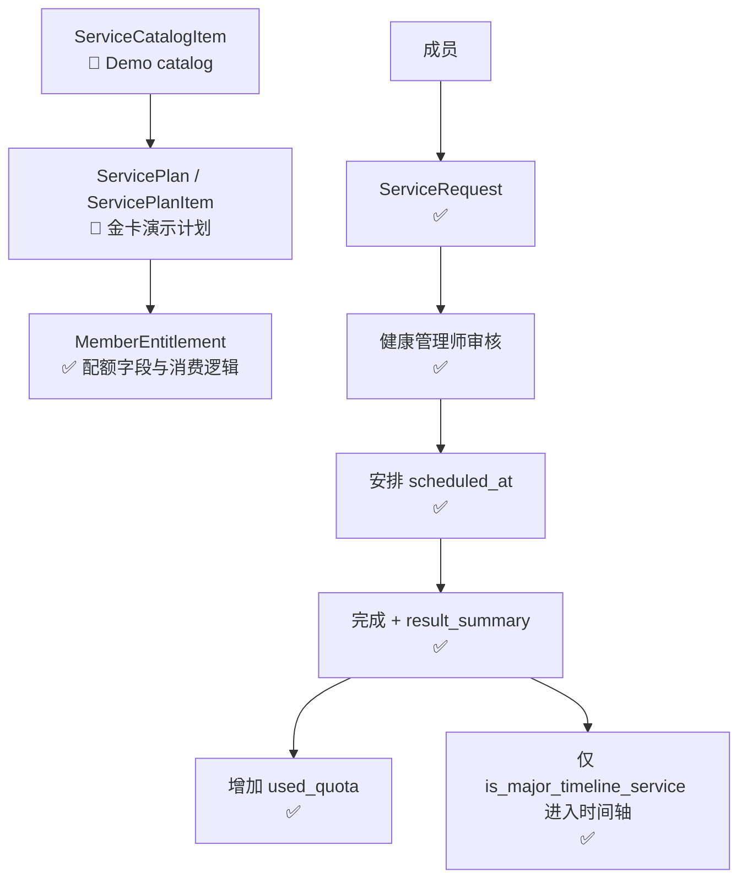
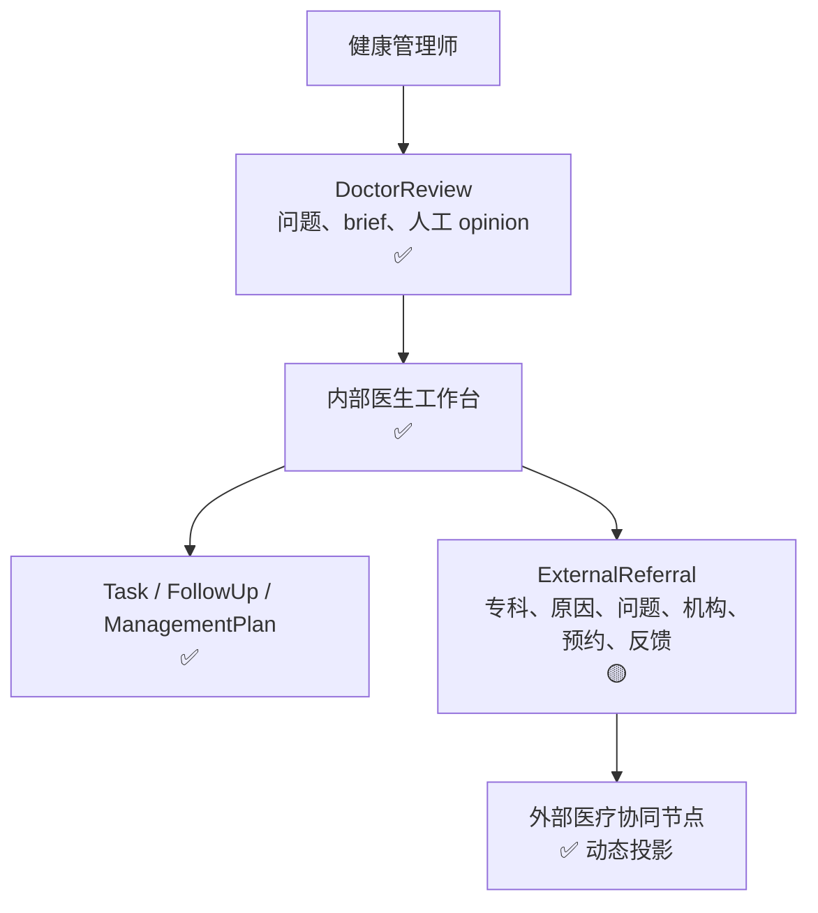

# Core HealthOps Workflows

## 1. 核心健康运营闭环

`ManagementSignal` 与 `RiskEvent` 是两条不同的路径：前者由 `ManagementRule` 路由生活方式管理，后者由 `RiskRule` 生成正式风险事件。二者都保留证据与 AuditLog，但都不是诊断。

## 2. Report Flow

### Report evidence 的真实范围

`ReportExtractionCandidate` 存储 `source_page`、`source_section` 和 `evidence_text`；当前模型没有独立的 bounding-box 列。UI 可显示 `image_region`，但它不是所有报告都能提供的已保证能力。

## 3. Risk Flow

### 规则现实快照

| 规则类别 | 当前 SQLite 审计数量 | 状态 |
|---|---:|---|
| TEST | 3 | 🧪 APPROVED，但只允许 demo/synthetic/test 成员命中。 |
| CLINICAL | 0 | ❌ 没有经临床治理的可用规则内容。 |
| Risk Engine | 1 个 `RiskEvaluationService` | ✅ 已实现确定性执行器。 |

**TEST rules ≠ CLINICAL rules。** 当前引擎有明确 scope check，不能把这 3 条 TEST 规则描述为生产临床规则。

## 4. Longitudinal Health Timeline

时间轴没有 `TimelineEvent` 数据表。`TimelineEvent` 是服务层 dataclass；`HealthTimelineService.get_timeline()` 每次从相关事实表投影，`TimelineV4Service` 再做时间窗口和语义聚合。旧 `services/timeline.py` 仍向 FastAPI `/members/{member_id}/timeline` 提供较早的逐条记录时间线，详见架构债务。

## 5. Service Operations

当前本地数据库 ServiceRequest=0；模型和操作服务存在，但目录通过 `ensure_demo_plan()` 创建，真实合同、支付、排班和第三方履约集成均未发现。

## 6. Doctor Collaboration

`RiskOperationsService` 明确实现 Yellow 风险的医生升级与完成复核。RED 事件的代码记录人工紧急处置，但没有自动急救/转诊/通知连接器。
