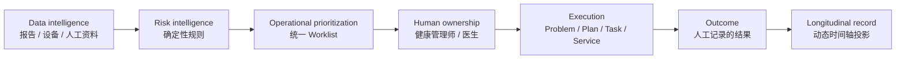
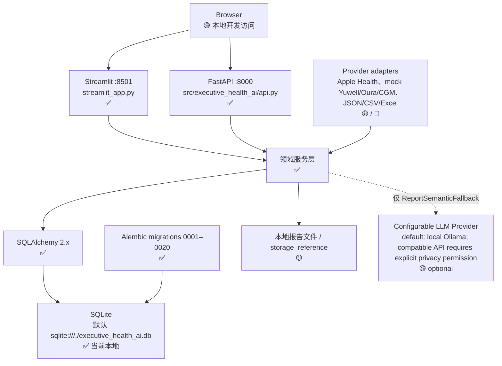
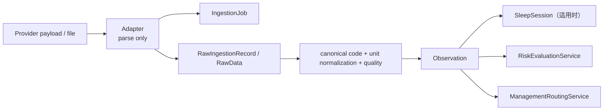
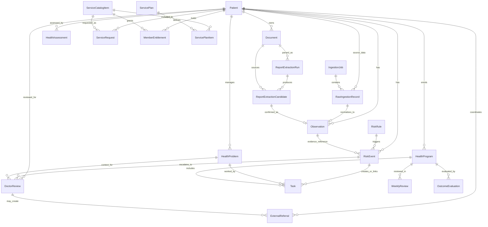
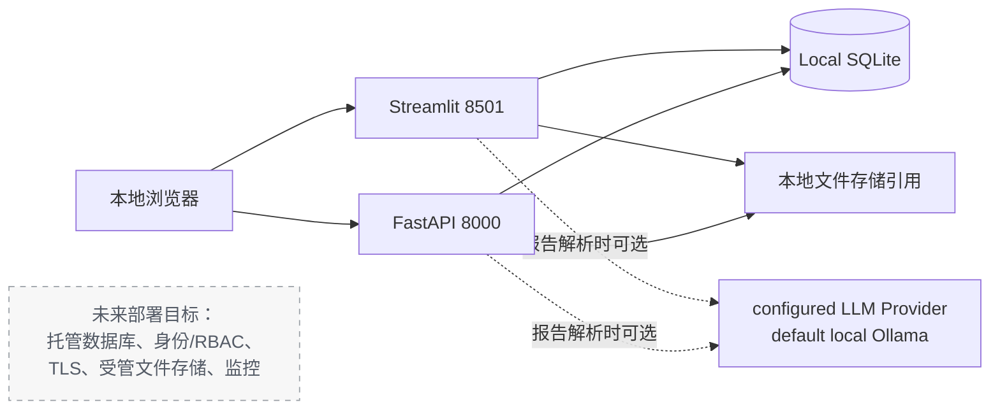
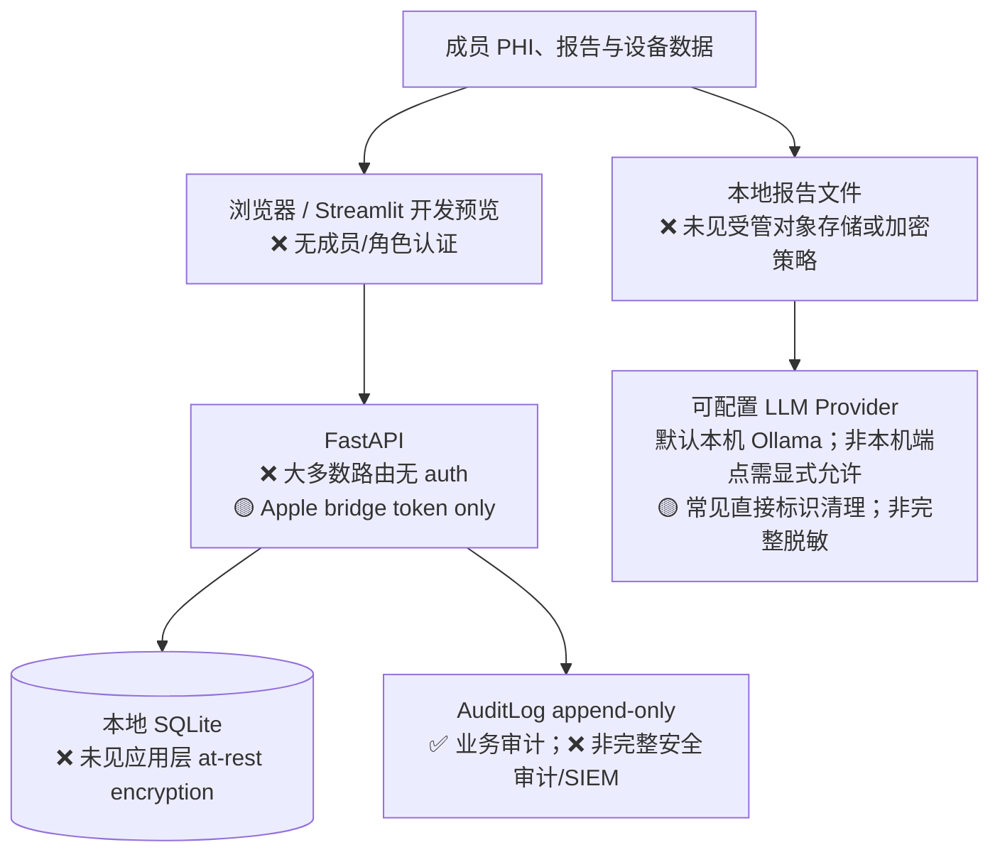

# Technical Architecture

## Product / Business Logic

- **AI** 是效率与语义辅助层，不决定 Risk，也不替代医生判断。
- **Risk Engine** 是确定性决策逻辑；当前作品集规则为 TEST scope。
- **OperationalWorklistService** 是运营优先级的统一应用层 contract。
- **Health Manager** 是运营责任人；**Doctor** 是医学判断责任人。
- **HealthTimelineService / TimelineV4Service** 从业务事实动态生成长期记录，不反向成为 source of truth。

这条分层也承担运营效率目标：报告结构化减少资料整理，确定性风险与 Worklist 减少人工排优先级，Evidence 减少查找依据，Task / Plan 减少依赖个人记忆，结构化 Doctor Review 降低跨角色交接成本，Timeline 减少重复整理长期历史。目标是让单个健康管理师稳定支持更大的成员组合，并降低单位成员运营开销；当前没有真实运营数据，因此不声明具体效率比例或 ROI。

## Source of Truth

| Domain | Source of truth | Derived / projection |
|---|---|---|
| Risk | `RiskRule` + `RiskEvent` | Operational Worklist、Dashboard、Timeline |
| Problem | `HealthProblem` | Member Overview、Timeline |
| Task | `Task`，状态变更经 `TaskTransitionService` | Operational Worklist、Timeline |
| Plan | `HealthProgram` / `ProgramPhase` / `ManagementPlan` | Program UI、Timeline |
| Doctor Review | `DoctorReview` | Operational Worklist、Timeline |
| Knowledge | `KnowledgeDocument` / `KnowledgeChunk` / `KnowledgeReviewAudit` | APPROVED-only retrieval、引用与使用记录 |
| Report evidence | `Document` / `ReportExtractionRun` / `ReportExtractionCandidate` | Evidence UI、人工确认后的 Observation |
| Timeline | 上述底层业务实体 | `HealthTimelineService` / `TimelineV4Service` 只读投影 |

Dashboard、Timeline、Streamlit `session_state`、LLM output 和 legacy `Alert` 都不是当前业务 source of truth。`Alert` 仅保留 V0.1 历史读取与显式 deprecated API 兼容。

## 当前运行形态

当前 `pyproject.toml` 定义 Python ≥3.11、Streamlit、FastAPI、SQLAlchemy、Alembic、pandas、pypdf、python-docx、openpyxl 与 requests。数据库工厂支持未来 PostgreSQL URL，但默认与本地审计实际都是 SQLite；PostgreSQL 不是 CURRENT 部署。

## 服务层（按领域，不逐文件罗列）

| 领域 | 当前核心实现 | 状态 |
|---|---|---|
| 数据接入 | `integrations.service.ingest`、provider adapters、单位标准化、原始记录、手工修正/删除排除 | ✅；provider 覆盖含 mock。 |
| 健康数据 | `HealthDataSummaryService`（即时、生活方式、睡眠、趋势） | ✅。 |
| 报告 | `ReportParsingService`、预检、规则解析、可选 `ReportSemanticFallback`、候选人工确认 | ✅ / 🟡 AI。 |
| 风险 | `RiskEvaluationService`、`RiskOperationsService`、`OperationalWorklistService` | ✅ 引擎；🧪 TEST rule 内容。 |
| 长期健康 | `HealthAssessmentService`、`ManagementRoutingService`、`ReportComparisonService`、`HealthTimelineService`、`TimelineV4Service`、结果服务 | ✅ / 🟡 管理信号。 |
| 健管/医生 | `RiskOperationsService`、`TaskTransitionService`、`chronic_care.py`、`doctor_brief_agent.py` | ✅ 当前人工工作流；`workflow.py` 仅 legacy Alert 兼容。 |
| 服务运营 | `MemberServiceOperations` | ✅ 状态迁移与配额；🧪 目录/计划。 |
| 知识 | `KnowledgeService`、`KnowledgeDocument`、`KnowledgeChunk`、`KnowledgeRetrievalService`、`KnowledgeUseRecord` | ✅ Portfolio 级来源、审核、分块、检索与使用追溯；不宣称正式临床知识治理。 |

## 图中模块的代码追溯

| 图中模块 | 当前实现位置 |
|---|---|
| Streamlit surfaces / router | `streamlit_app.py`：`main()`、`render_member_client_view()`、`render_member_detail()`。 |
| FastAPI | `src/executive_health_ai/api.py`：`create_app()`。 |
| ORM / database | `src/executive_health_ai/database.py`、`src/executive_health_ai/models/`。 |
| migrations | `alembic/versions/0001_*.py` 至 `0020_*.py`。 |
| ingestion / adapters | `src/executive_health_ai/integrations/service.py`、`adapters.py`、`apple_health.py`。 |
| report | `src/executive_health_ai/services/report_parsing.py`、`models/report_parsing.py`。 |
| configurable LLM | `src/executive_health_ai/llm/local_llm_client.py`（默认 Ollama，也支持兼容 API Provider）。 |
| risk | `src/executive_health_ai/services/risk_triage.py`、`risk_operations.py`、`models/risk.py`。 |
| timeline | `src/executive_health_ai/services/longitudinal.py`，旧版为 `services/timeline.py`。 |
| service operations | `src/executive_health_ai/services/member_services.py`、`models/member_service.py`。 |
| doctor workflow | `src/executive_health_ai/services/workflow.py`、`risk_operations.py`、`models/operations.py`、`models/longitudinal.py`。 |

## 数据接入调用方向

Apple Health 路由 `/integrations/apple-health/sync` 需要共享 Bearer bridge token；`/mock-sync` 和 mock provider 路由用于演示。iOS `ExecutiveHealthBridge` 已实现 HealthKit 授权、per-type anchored sync、Observer/background delivery 和 HTTPS 上传源码，但仍未编译或真机验证。

## Core Domain Model

以下是主要关系的简化图；省略非核心审计字段和部分旧 V0.1 表，不代表全部 schema。

### 动态聚合，不是表

- `TimelineEvent`、`TimelineViewModel`、`TimelineCluster` 是 `services/longitudinal.py` 的 dataclass/view model，**不是数据库表**。
- `HealthTimelineService.get_timeline()` 从 `HealthAssessment`、`RiskEvent`、`HealthProblem`、`MedicationPlan`、`HealthEvent`、`DoctorReview`、`HealthProgram`、`ExternalReferral`、`OutcomeEvaluation`、`ServiceRequest`、`ReportExtractionRun` 和月度 Observation summary 动态读取。
- `HealthTimelineService` 与较早的 `services/timeline.py` 同时存在；current API 使用 `/members/{id}/timeline/v2`，旧 `/members/{id}/timeline` 已标记 deprecated 并保留兼容。

## Data / Deployment Flow

未来目标单独以虚线表示，未计入 CURRENT。

## Security Boundary：当前现状

| 控制项 | 当前代码审计结果 |
|---|---|
| Authentication / RBAC | ❌ 未发现；成员/运营/医生均是本地预览或表单角色字段。 |
| Consent | 🟡 `Consent` 模型存在，未发现强制授权校验覆盖数据访问。 |
| TLS | ❌ 本地 `http://127.0.0.1` 运行；未见 TLS termination。 |
| Encryption at rest | ❌ SQLite 与本地文件未见应用层加密。 |
| Apple bridge auth | 🟡 仅该 sync route 读取 `APPLE_HEALTH_BRIDGE_TOKEN`。 |
| LLM egress | 🟡 默认允许本机环回 Ollama；兼容 API 的非本机端点必须显式设置 `ALLOW_EXTERNAL_PHI_LLM=true`。有简单 PII 清理，仍需正式隐私评估。 |
| Audit trail | ✅ `AuditLog` 有不可变更新监听；不等于访问审计或保留策略。 |
